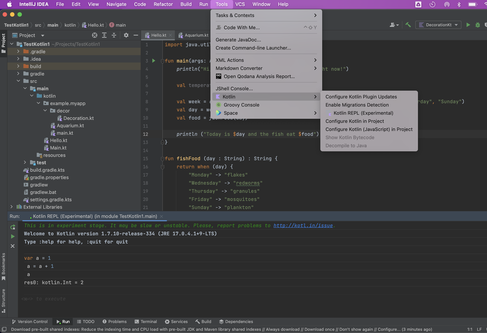

##### Basic features

- Distinguishes between nullable and non-nullable data types.
- Strongly typed, and it does a lot of type inference.
- Does have lambdas, coroutines, and properties.

##### Can works alongside Java

It allows compilation such thatJava and Kotlin code can be used side-by-side, and hence Java libraries can continue to be used.

##### How to run Kotlin code with InetlliJ

`JDK` should be installed to be able to run Kotlin programs. In fact `JRE (Java Runtime Engine)` is what is actually needed for running Kotlin programs, but JDK includes JRE in addition to other development tools. `JDK` can be installed by downloading the dmg from [Oracle](http://www.oracle.com/technetwork/java/javase/downloads/index.html).

Had to install JDK and then these things returned a version.
```
java -version
javac -version
```

> `javac` command is used to compile Java programs, it takes .java file as input and produces bytecode. `java` command is used to execute the bytecode of java. It takes byte code as input and runs it and produces the output.

##### Eveything has a value

In Kotlin, almost everything is an expression and has a value (even if that value is `kotlin.Unit`, i.e. void). Loops however are exceptions to 'everything has a value'. There's no sensible value for for loops or while loops, so they do not have values.


###### Kotlin REPL in IntelliJ

> A `read–eval–print loop (REPL)`, also termed an interactive toplevel or language shell, is a simple interactive computer programming environment that takes single user inputs, executes them, and returns the result to the user; a program written in a REPL environment is executed piecewise.

IntelliJ has a `Kotlin REPL` terminal console that can be used to do some basic REPL testing (inspite of proper code already being there in the standard editor). It can be accessed using `Tools > Kotlin > Kotlin REPL`.

Inside the REPL console code can be typed as usual, and can then be executed using `Cmd Enter`.



> On bring up the REPL, IntelliJ can show an alert asking to 'choose context module'. The one with no extension should be chosen there, but what is this 'context module'?

##### Misc.

Some of the test frameworks - JUnit, TestNG
