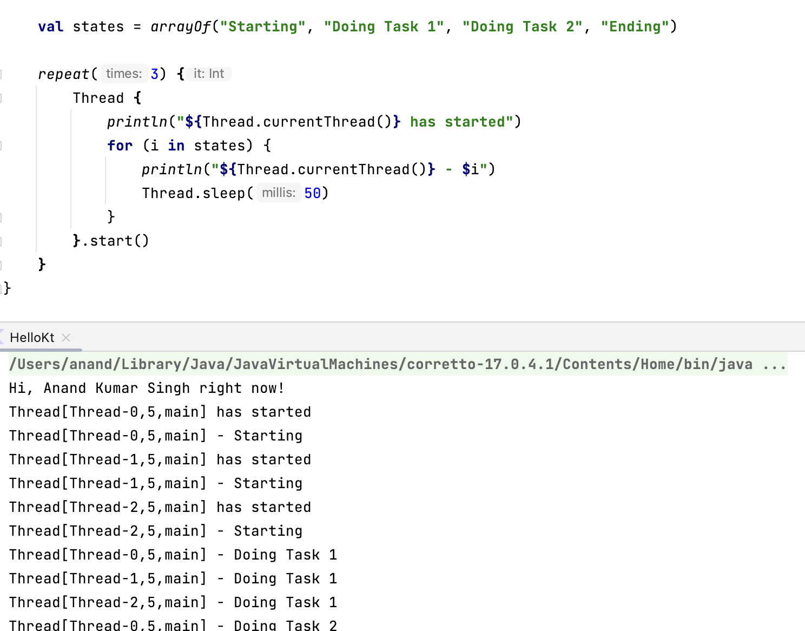

##### What is a `Thread`

A `Thread` is an abstraction for how a processor appears to handle multiple tasks at once. ([`Thread` reference](https://developer.android.com/reference/java/lang/Thread))

While a running app will have multiple threads, each app will have one dedicated thread, specifically responsible for your app's UI. This thread is often called the `main thread` or `UI thread`.

> In some cases, the `UI thread` and `main thread` may be different.

Current phones attempt to update the UI 60 to 120 times per second (60 at minimum). There's a short finite time to prepare and draw the UI (at 60 frames per second, every screen update should take 16ms or less). Android will drop frames, or abort trying to complete a single update cycle to attempt to catch up. Some frames drop and fluctuation is normal but too many will make your app unresponsive.

A number of problems can arise when if `Thread` is used directly in the code.

`Race Condition` is when multiple threads try to access the same value in memory at the same time.

##### Basic code

`Thread` instance when converted to its string representation returns the thread's name, priority, and thread group.

