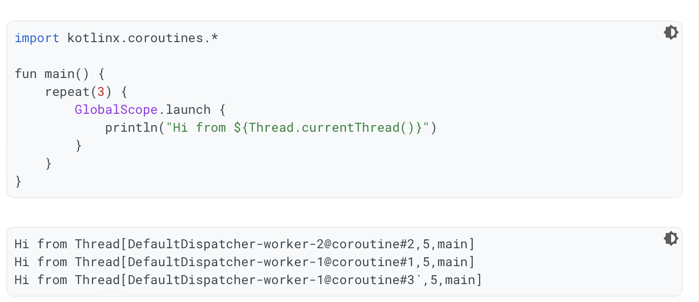
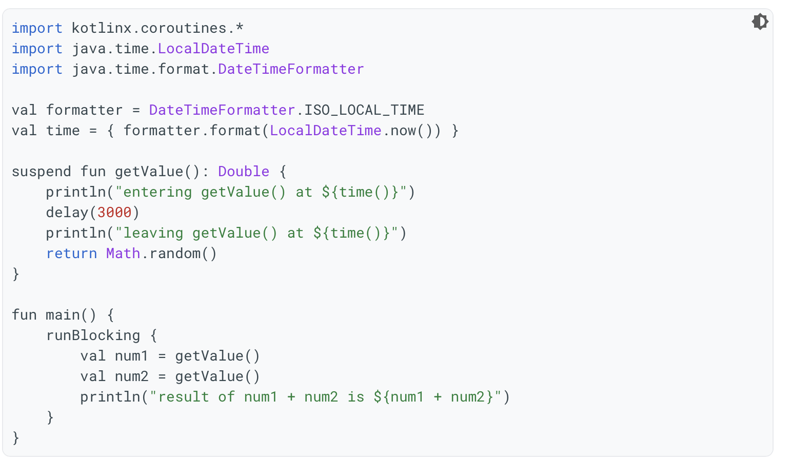
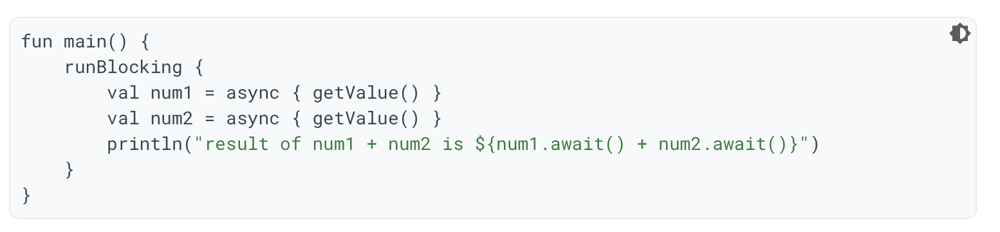

`Coroutines` provide a more flexible and easier way to manage concurrency.

##### Creating Coroutines using `launch()`

The `launch()` function creates a coroutine from the enclosed code and wraps it in a cancelable `Job` object. `launch()` should be used when a return value is not needed outside the confines of the coroutine.

There are three coroutines created in above example (one for every lambda) in the `GlobalScope` using the default `Dispatcher`. The `GlobalScope` allows any coroutines in it to run as long as the app is running.

> `GlobalScope` is not recommended outside example code. When you use coroutines in your apps, you will use other scopes.

##### Creating Coroutines using `runBlocking()`

`runBlocking()`, as the name implies starts a new coroutine and blocks the current thread until completion.

> Whenever a function calls another `suspend` function, then it should also be a `suspend` function.

##### Using `async {}`

Kotlin has an async function called `async {}` that's similar to launch. It returns a value of type `Deferred`. A `Deferred` is a cancelable `Job` that can hold a reference to a future value. It guarantees that a value will be returned to this object at a later time. It will not block or wait for execution by default.

> To indicate that the current line of code needs to wait for the output of a Deferred, you can call await() on it. It will return the raw value.

##### Basic constructs

`Dispatcher` - Determines the backing thread the coroutine will use. The `Main dispatcher` will always run coroutines on the main thread, while dispatchers like `Default`, `IO`, or `Unconfined` will use other threads.

`Job` - A cancelable unit of work, such as one created with the `launch()` function. Coroutines encompass the work in a `Job`, inside a `CoroutineScope`.

`CoroutineScope` - It is a context that enforces cancellation and other rules to its children and their children recursively.

> One key feature of coroutines is the ability to store state, so that they can be halted and resumed. A coroutine may or may not execute. The state, represented by `continuations`, allows portions of code to signal when they need to hand over control or wait for another coroutine to complete its work before resuming. This flow is called `cooperative multitasking`.

##### Misc.

[Google Android Bootcamp]()  
[Kotlin coroutines on Android reference](https://developer.android.com/kotlin/coroutines)  
[Improve app performance with coroutines](https://developer.android.com/kotlin/coroutines/coroutines-adv)  
