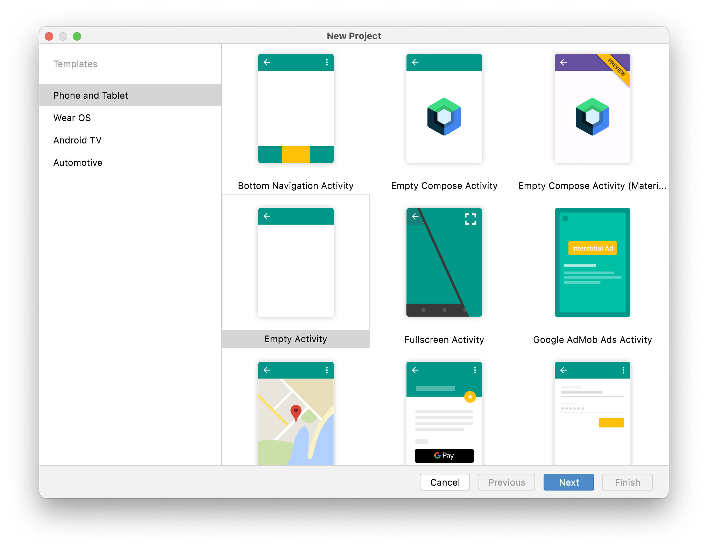
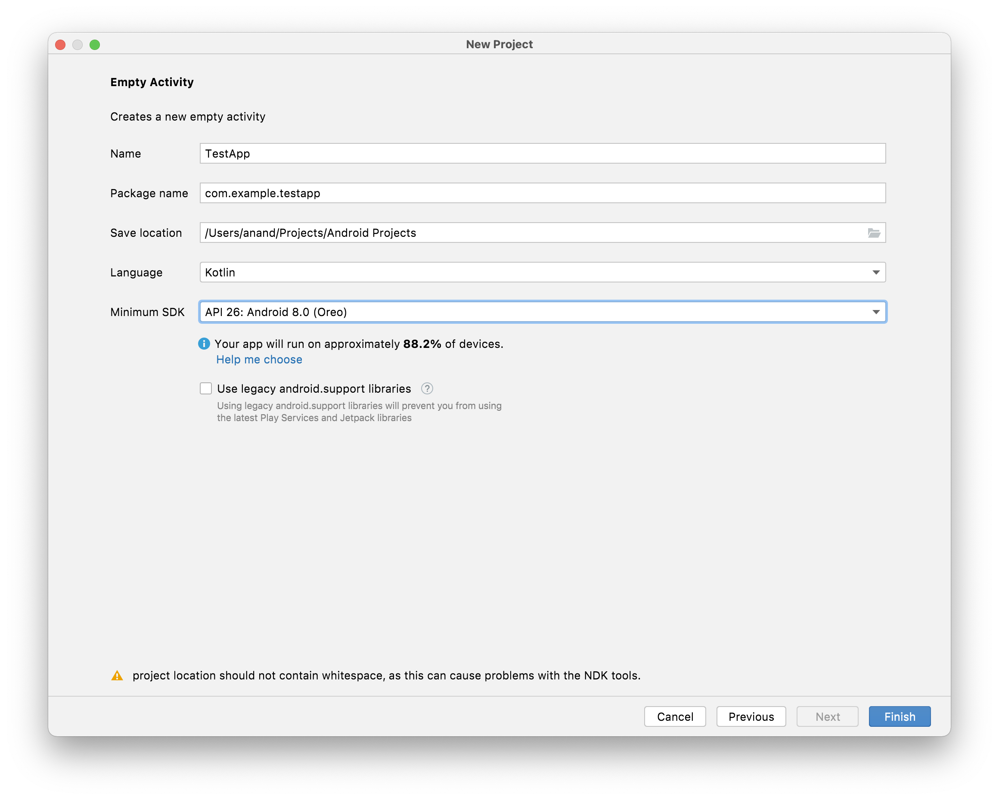
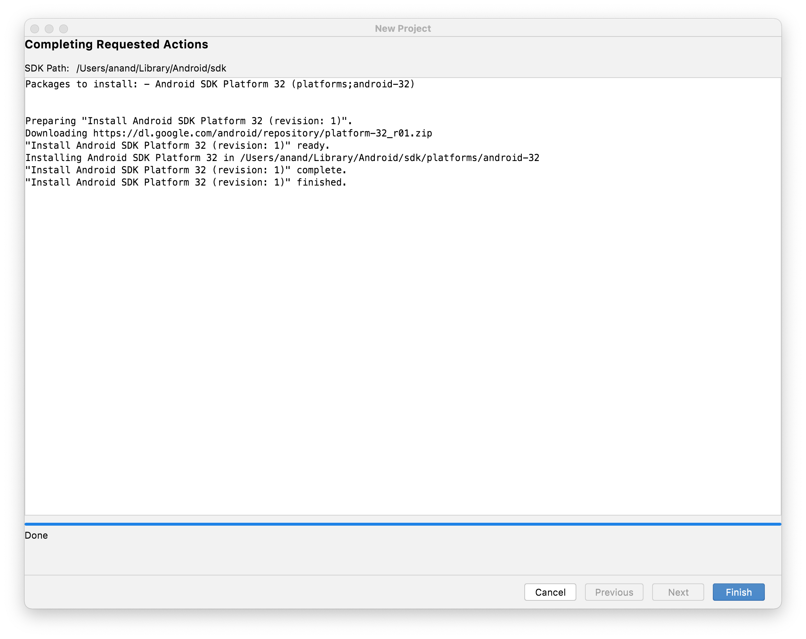
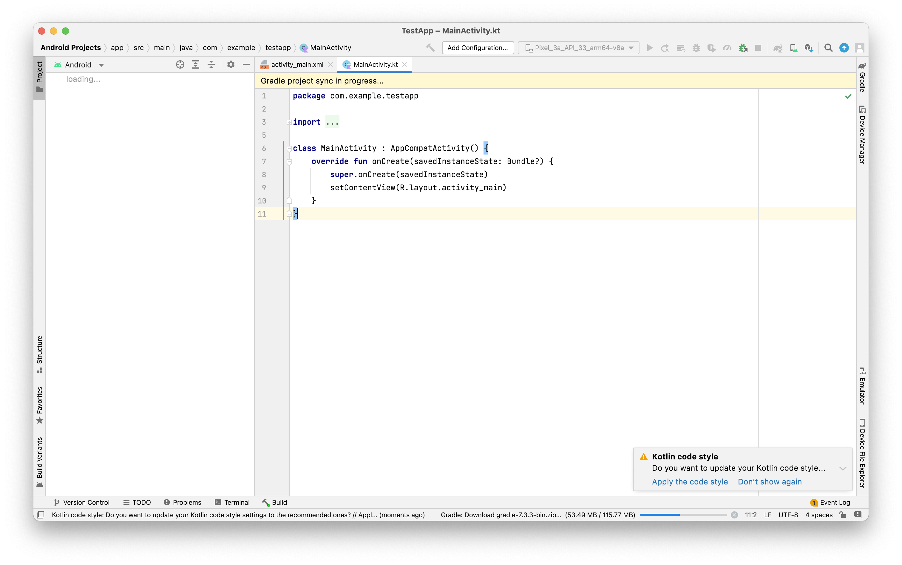
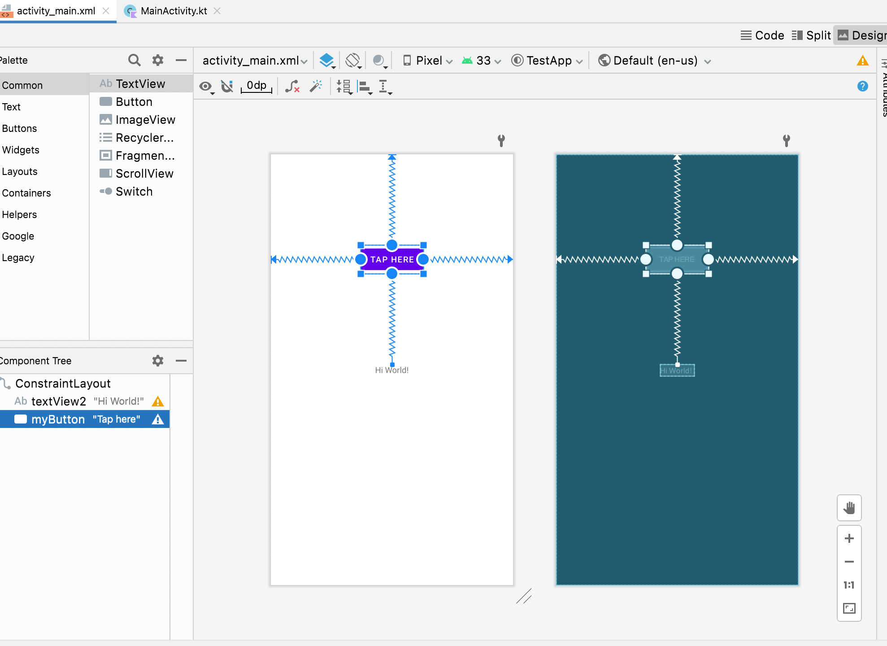
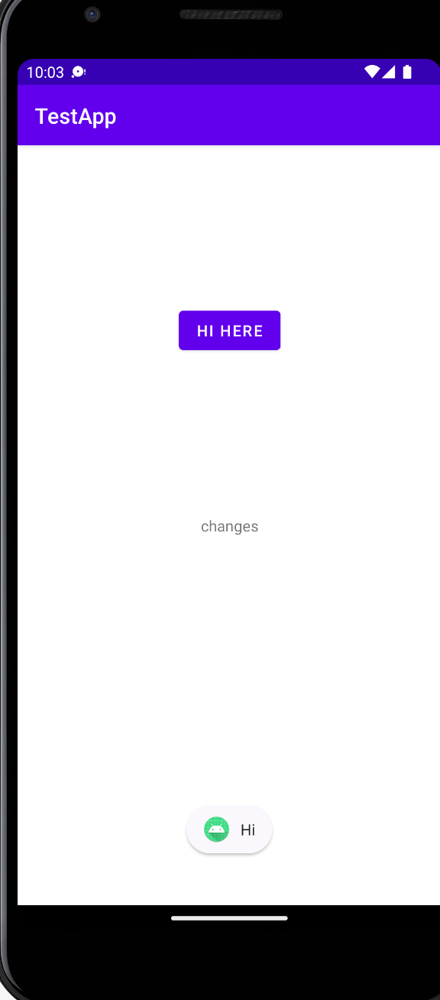

##### How to create a new project

1. Select a template (usually its `Empty Activity`).
2. Enter a Package Name (which is same thing as Bundle ID in iOS, i.e. reverse DNS style name, unique).
3. Select the `Minimum SDK`, i.e. the minimum Android OS version which the app is required to support.

Selecting Template | Package Name, Min SDK, etc.
--- | ---
 | 

Once a Minimum SDK is select, there is information shown underneath regarding what % of currently available devices will be able to support the app (this is likely also what is known as `AppCompat`).

> There is also a checkbox for 'Use legacy Android support libraries'. What does that give?



##### Basic code

`Activity` represents a screen.

The UI layout comes from `activity_main.xml`. This file is specified in code in the argument for `setContentView()`, the `R` there means the `res` folder (so look for the mentioned file in the res folder).



###### activity xml

The xml looks like this in `Design mode`. Constraints can be drawn by pressing option and then moving the cursor. There is an option towards the top called `Infer Constraints` which automatically creates constraints.

.

There is something known as `Constraint Bias`.

###### Toast

`Toast` shows a limited time alert can towards the bottom of the screen.
```
Toast.makeText(this, "Hi", Toast.LENGTH_LONG).show()
```


###### Usual packages that are specified and things that are imported.
```
package com.example.testapp

import androidx.appcompat.app.AppCompatActivity
import android.os.Bundle
```

Activity usually inherits `AppCompatActivity` ([reference](https://developer.android.com/reference/androidx/appcompat/app/AppCompatActivity)).

###### Individual UI elements need to be imported.
```
import android.widget.Button
import android.widget.TextView
```
