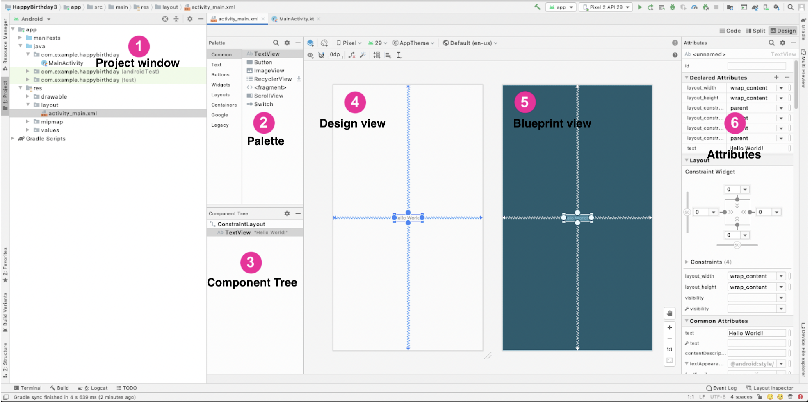
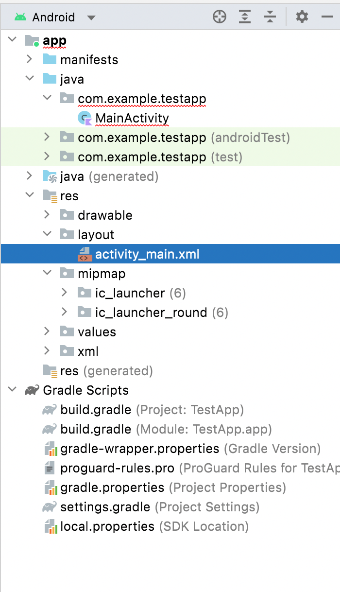
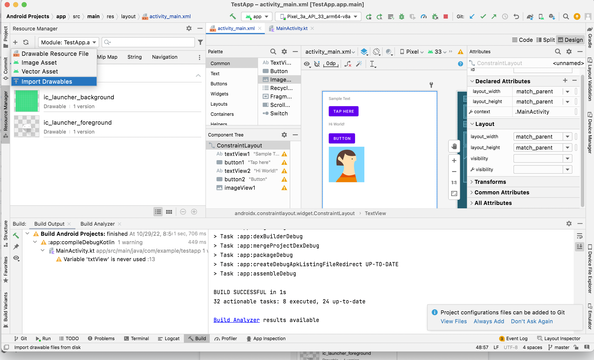
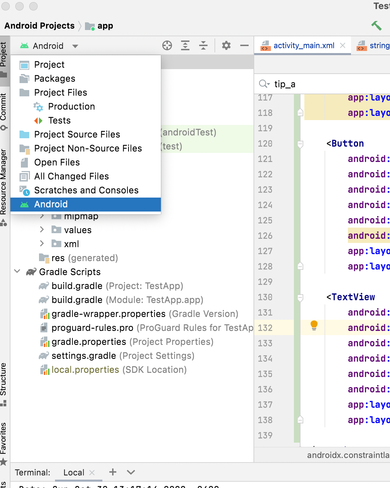

##### Various sections in Layout Editor

`Layout Editor` can be used to view and modify a UI xml. Its a visual design editor. ([reference](https://developer.android.com/studio/write/layout-editor))

`Project window` - Shows the list of files that make up the project.  
`Palette` - Shows a list of available views that can be added to a given screen.  
`Component Tree` - Shows a list of views added to a given screen.  
`Design View` - A close approximation of what your screen will look like when the app runs.  
`Blueprint View` - Layout of the app (what does it do different from design view? ) 
`Attributes` - Attributes of the selected view.  

##### Various folders

The `res` folder is for resources, such as images as well as screen layouts. The `layout` sub-folder there is for screen layouts.

##### Adding resources

Resources are added through `Resource Manager` tab (to the left of `Project Window`). Over there `Import Drawables` needs to be done.

##### Possible views on left navigator (i.e. `Project Window` pane)

