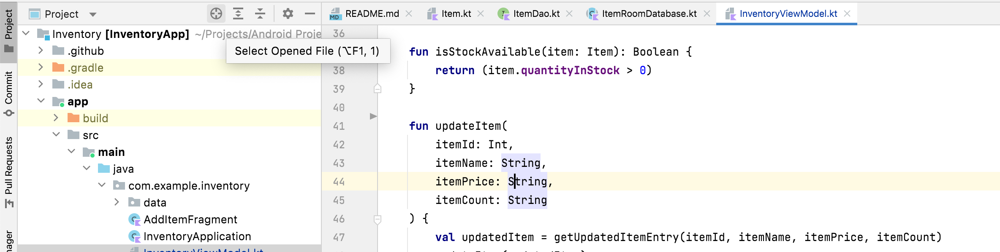

Run (i.e. Play button) - `Control R`  

Show current editor file in project window, etc. - `Option F1`  Alternately this button in the UI.

Open current editor tab in new window - `Shift F4`  
Search for file - `Double shift`  Seartch across entire project - `Cmd Shift F`  
See file structure (i.e. list of functions, etc.) - `Cmd + 7`  
