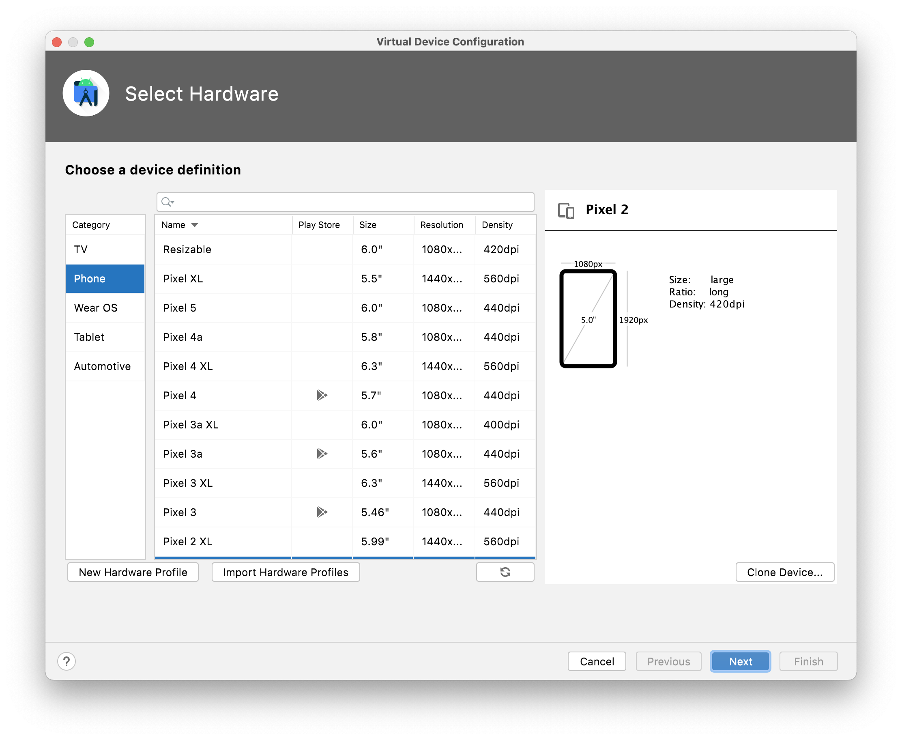
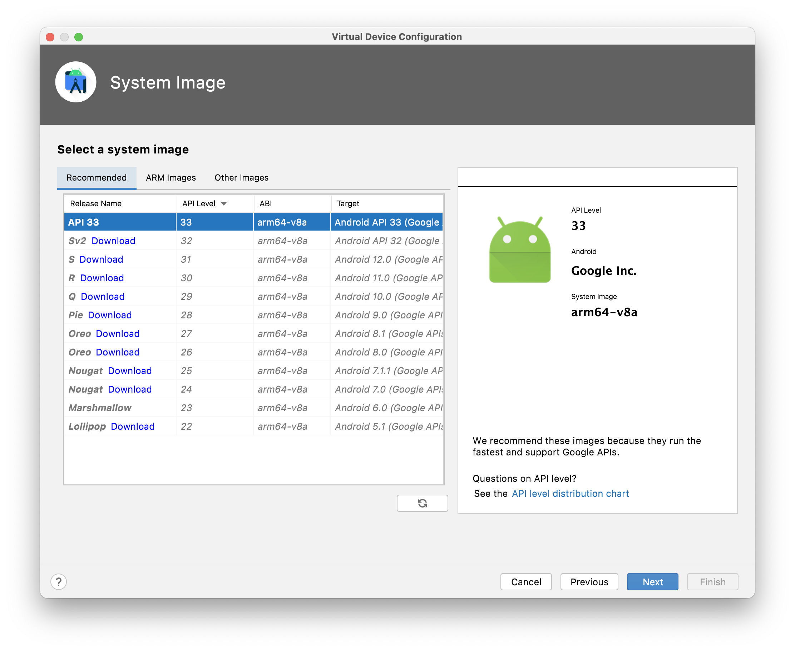
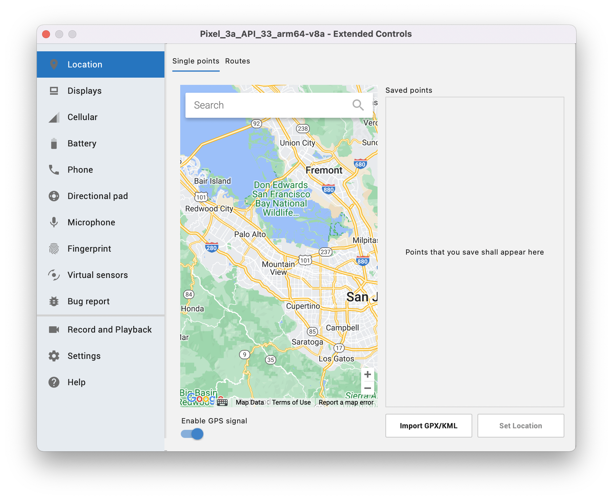

An `Android Virtual Device (AVD)` is a configuration that defines the characteristics of an Android phone, tablet, Wear OS, Android TV, or Automotive OS device that you want to simulate in the Android Emulator. So basically its something that describes the configuration of a given Emulator. Its accessed using a Toolbar(?) menu, and thereafter a new device (i.e. practically an Emulator) can be created.

Here are various configuration options.

Hardware | System Image (i.e. OS version?)
--- | ---
 | 

Graphics Performance, etc. | Location, Battery level, etc.
--- | ---
 | 

> Some emulators even have access to Play Store and actual apps can be installed from there? Also, can emulators use Mac camera?
