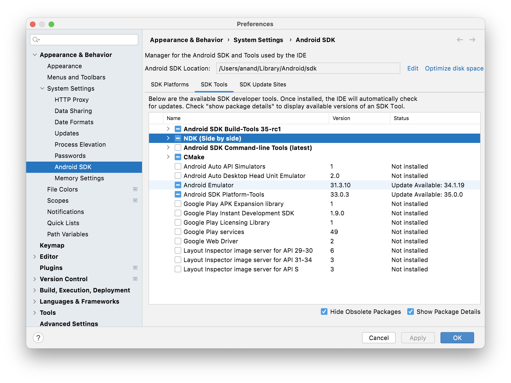
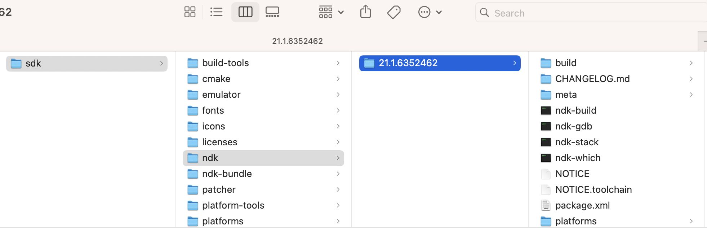

##### AndroidNDK

The `Android Native Development Kit (AndroidNDK)` is a set of tools that allows you to use C and C++ code with Android, and provides platform libraries you can use to manage native activities and access physical device components, such as sensors and touch input. its especially useful if you want to use your own or other developers' C or C++ libraries. ([Reference](https://developer.android.com/ndk/guides))

It can be installed using the [dmg](https://developer.android.com/ndk/downloads), but a more convenient way is to use AndroidStudio ([link](https://developer.android.com/studio/projects/install-ndk#default-version)). (It can probably also be installed using command line tool [https://developer.android.com/tools/sdkmanager](https://developer.android.com/tools/sdkmanager).)

Go to AS > Preferences > AndroidSDK > SDK Tools and install 'NDK (Side by side)' and 'CMake'. To install older version of NDK, select 'Show Package Details' and install the odler version.

Its then typically installed in the ndk folder in the AndroidSDK location (usually '/Users/anand/Library/Android/sdk').

| Install through Preferences                                  | Installation Location                                        |
| ------------------------------------------------------------ | ------------------------------------------------------------ |
|  |  |

> There is also AS > Project Structure > AndroidNDK Location, but that's empty. What is that and when is it not empty.

##### Android Atudio versions

[Wiki](https://en.wikipedia.org/wiki/Android_Studio#Version_history)

| Version                 | Release Date  |
| ----------------------- | ------------- |
| Jellyfish (2023.3.1)    | April 2024    |
| Iguana (2023.2.1)       | February 2024 |
| Hedgehog (2023.1.1)     | November 2023 |
| Giraffe (2022.3.1)      | July 2023     |
| Flamingo (2022.2.1)     | April 2023    |
| Electric Eel (2022.1.1) | January 2023  |

Listed only recent versions above.