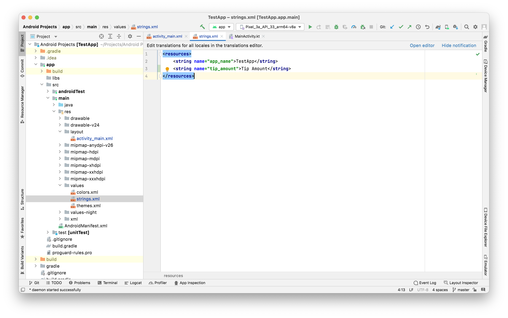

Strings should be put in a different resource xml file, they are usually put in the resources directory and the content looks like this.



In the code, it is then referred in the code using `@string`.

```
android:text="@string/tip_amount"
```
