`Gradle` is the automated build system used by Android Studio.

There are several gradle scripts (i.e. `.gradle` files) in the project. ([Reference](https://developer.android.com/studio/build#kts))

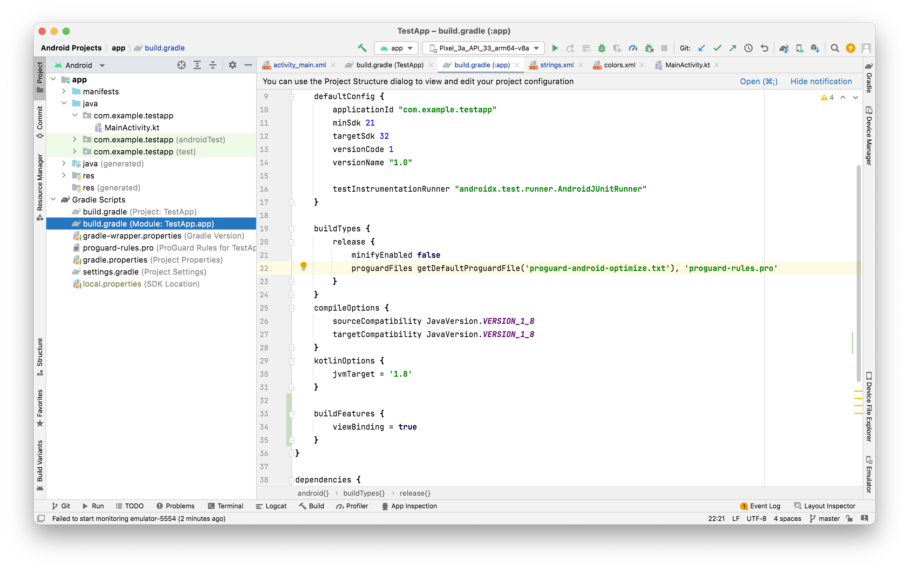

When the gradle script is changed, a new sync is usually needed for the project. A message is shown for that.

##### Enabling various features

For enabling `view bindings`, the `build.gradle (Module:..)` file needs to be updated with this (and not the `build.gradle (Project:..)`) file.

```
buildFeatures {
    viewBinding = true
}
```

##### Working with Gradle in an IDE like IntelliJ

Open the project (i.e. entire directory) in IntelliJ and it looks like this. The folder structure shows up in the left pane and Gradle specific things show up in the right pane. Any tasks defined in the build.gradle file show up there too and can be run just by double clicking.

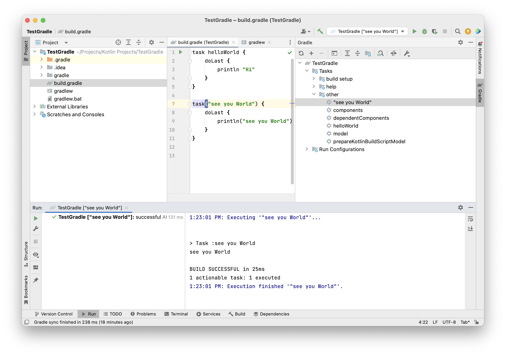

##### Code

The `doLast` function creates a task action that runs when the task executes. Without it, you’re running the code at configuration time on every build. So basically some code (i.e. action) that runs at the end of the specified action. ([Reference](https://docs.gradle.org/current/dsl/org.gradle.api.reporting.components.ComponentReport.html#org.gradle.api.reporting.components.ComponentReport:doLast(groovy.lang.Closure)))

```groovy
// Adds the given Action to the end of this task's action list.
Task doLast(Action<? super Task> action)
```

`````groovy
task helloWorld {
	doLast {
		println "Hi"
	}
}
`````

##### Misc.

`build.gradle` resides in the root directory of the project. There can be multiple such files in a workspace when there are several projects/modules in it. 

In case of a multi-project setup the projects are defined in a `settings.gradle` file.

`gradle projects` shows the projects in the workspace.

`gradle.properties` defines runtime properties. It can be also be put in Home directory in which case I thnk it will apply to all projects.

Gradle reference - Configuring the build environment ([link](https://docs.gradle.org/current/userguide/build_environment.html))

Gradle caches are stored in `~/.gradle/caches`.

##### Tasks

Ad-hoc tasks implement one-off simple actions through things like `doFirst` and `doLast`. More complex tasks can be define in a custom task, these are called `Typed tasks`. An example of such a task woykld be something that copies files to the disk.

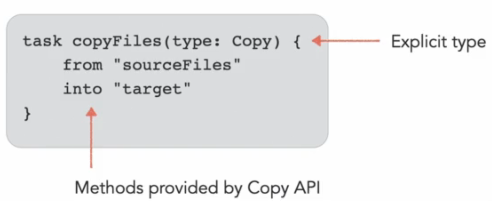


`dependsOn` function takes care of managing task dependencies.

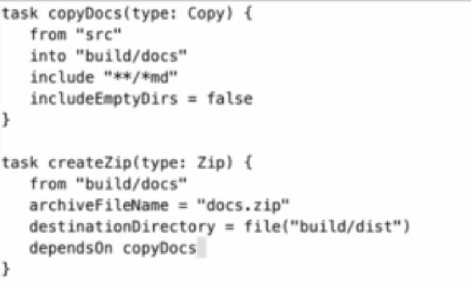

##### DAG and Build lifecycle phases

Tasks execution order are not deterministic unless configured properly. There are functions like `mustRunAfter` too. `Direct Acyclic Graph (DAG)` has the order of tasks to be run. Task dependency is represented as graph edge.

A graph should not have any cycle. `gradle <taskName> --dry-run` shows the order in which tasks will be run but does not run them. There is also an open source plugin named `gradle-task-tree` that generates a visual representation of the graph.

There are 3 lifeycle phases to a gradle build - Initialization phase > Configuration phase > Execution phase.

Initialization phase evaluates `settings.gradle` file. Configuration phase evaluates all the build scripts and runs configuration logic. Execution phase looks at the graph and actually runs all the tasks in the right order.

##### Plugins and Domain objects

Every guuld definition starts with a build script (i.e. build.gradle?). `plugins` are usuable scripts/functions. There are two kinds of plugins - `Script plugins` and `Binary plugins`. Script plugin is just another build script that can be included in the main build.gradle file. Binary plugin is more complicated things, things that can be used across multiple workspaces.

```
apply <ScriptPluginPath>
```

Binary plugins provided by Gradle are called Core plugins. There are 3rd party binary plugins too.

`````
apply plugin: "BinaryPluginName"
`````

Every build is reprsented by a domain object named `org.gradle.invocation.Gradle`.

Hierearchy of a project is represented by `org.gradle.api.Project`.

Task is represented by `org.gradle.api.Task`.

Action is represented by `org.gradle.api.Action`.

Plugin is represented by `org.gradle.api.Plugin`

Documentation for core types ([link](https://docs.gradle.org/current/dsl/org.gradle.api.Project.html).)

Official Gradle user manual ([link](https://docs.gradle.org/current/userguide/userguide.html))

##### Sample Java project

Code typically resides in main > java in tools that use Maven, Gradle, etc. Resources lie in resources folder.

Typically for compiling a java code `javac` has to be run, that will produce `.class` files, and then `jar cfv` command is run. It produces jar files, and then `java` command needs to be run to run the jar file. This entire process can be automated by Gradle.

There exists a Gradle Java Plugin (its a core Gradle plugin) for working with Java code. ([reference](https://docs.gradle.org/current/userguide/java_plugin.html))

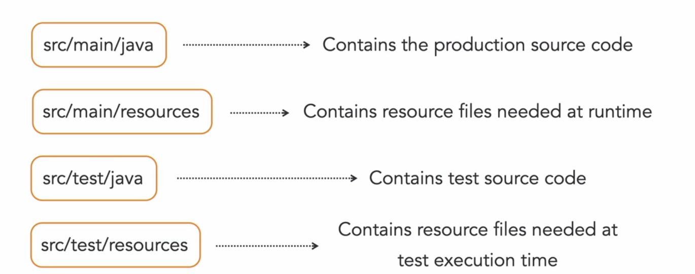

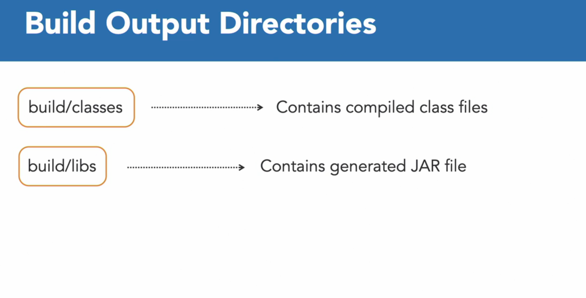


Compilation of Java code is done using `compileJava` task. The compiler available in `PATH` environment variable is used. `processResources` copies files from main > resources to build directory. `classes` action does both together.

jar is the most common packaging type (i.e. archive) for Java classes.

`jar` action creates the jar file.

Java application plugin can create applications that can be run by JVM. `run` task runs program without building a distribution. `installDist` task generates scripts for starting the app (what does that mean?). To bundle the distribution. `distZip` or `distTar` task can be used.

#### Dependency Management

Usually many open source libraries are available on [Maven Central](https://search.maven.org/) (something like Cocoapods online registry). Gradle can be used to define dependencies in Maven Central or any other online repository. They are downloaded at build time (but aren't they needed during development itself), caches them, and adds them to classpath of the project. For every dependncy, a `configuration` can be defined in gradle which basically specifies a `scope`. These can be things like whether  the dependency is needed for compilation as well as at runtime, or needed only at runtime, or needed for test compilation and execution.

Project dependencies when the code is split across multiple modules which can depend on each other.

Gradle also supports publishing Java libraries to Maven repositories.

###### Dependency Coordinates

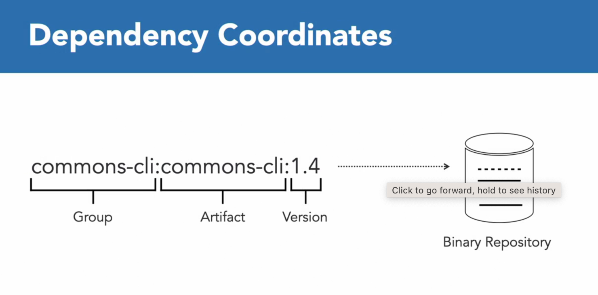

The dependencies are declared this way

```swift
repositories {
  maven()
}
dependencies {
  implementation 'xyz...'  // implementation is a certain scope
}
```

###### Dependency Tree

`./gradlew dependencies` prints the dependency tree.

`dependencyInsight` tasks prints information about why a dependency is bring used in a project.

To include another project as a dependency, enter this in the `settings.gradle` file

```swift
rootProject.name = 'rootProjectName'

include ':subProject1', ':subProject2'
```

And in `build.gradle` file

```swift
dependencies {
  implementation project(':subProject1')
}
```


`./gradlew projects` shows the project dependencies in the workspace.

###### Publishing libraries

Done using `maven-publish` plugin.

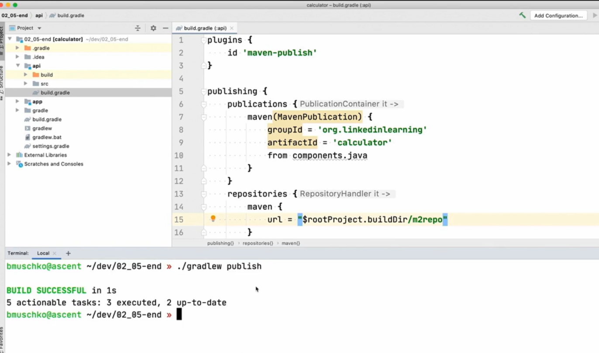

Once `./gradlew publish` is done the jar, pom, checksum files are there in the Target directory (build directory?). The publishing can also be done to a remote repository.

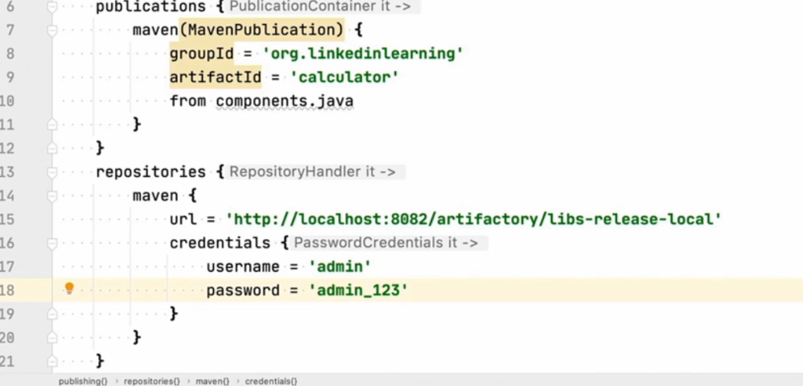

##### Java Project Testing

JUnit is the usual framework for testing Java project. Tests are usually in `src/test/java`. JUnit5's API is called Jupiter. If a test is using that, that needs to be a part of the compilation and runtime classpath for tests.

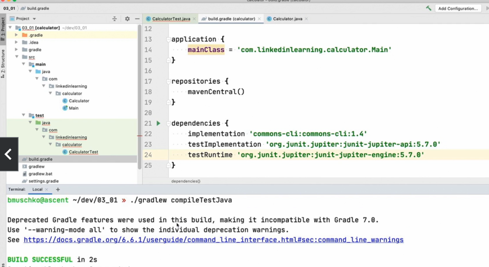

For more verbose logging

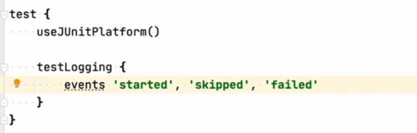

##### Resources

Udemy course - Gradle fundamentals ([link](https://capitalone.udemy.com/course/gradle-fundamentals/learn/lecture/27649528#overview))
