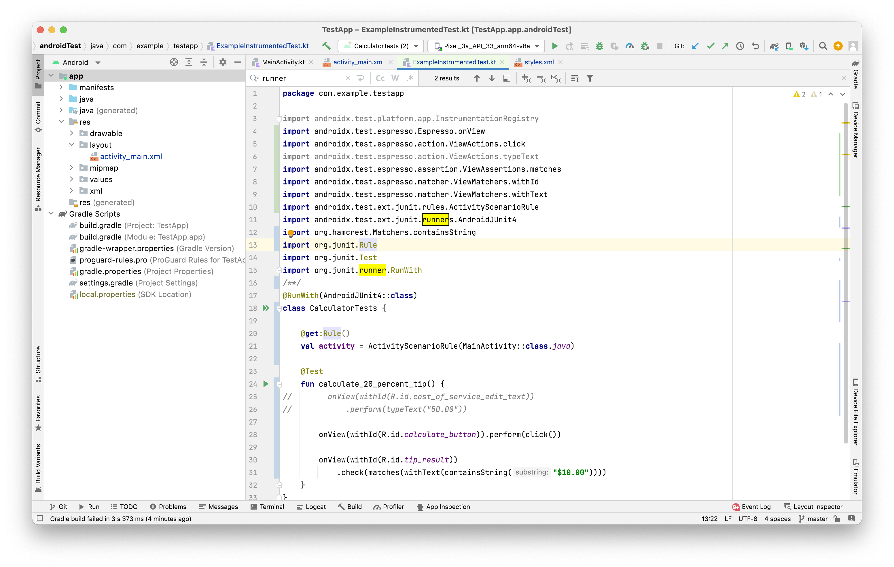
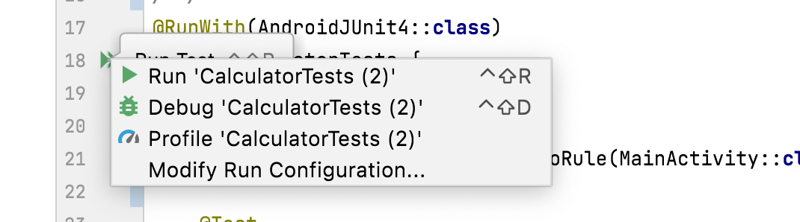

These are probably like UI tests.

Instrumentation tests require an `InstrumentationTestRunner` ([Reference](https://developer.android.com/reference/android/test/InstrumentationTestRunner)).

`Espresso` is a built-in library for instrumentation tests that  lets you interact with UI components through code.

Tutorial ([link](https://developer.android.com/codelabs/android-basics-kotlin-write-instrumentation-tests?continue=https%3A%2F%2Fdeveloper.android.com%2Fcourses%2Fpathways%2Fandroid-basics-kotlin-unit-2-pathway-2%23codelab-https%3A%2F%2Fdeveloper.android.com%2Fcodelabs%2Fandroid-basics-kotlin-write-instrumentation-tests#3))

Haven't quite been able to get it to work just yet, but the tests are supposed to look like this.

They are run using this button.

A StackOverflow [link](https://stackoverflow.com/questions/73323852/unknown-platform-error-occurred-when-running-the-utp-test-suite) for the error I see.
