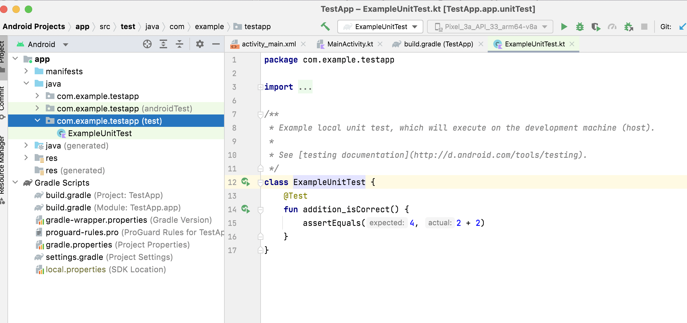
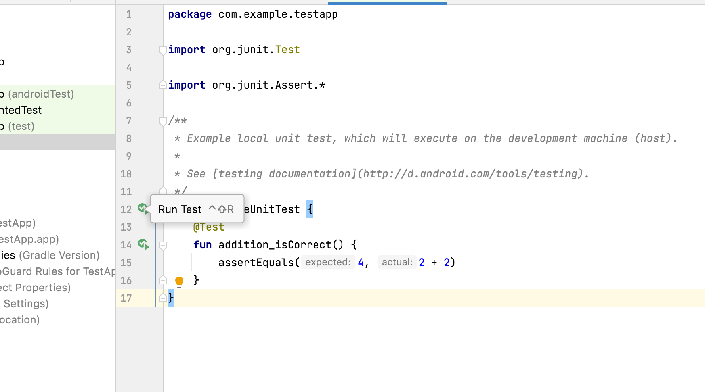
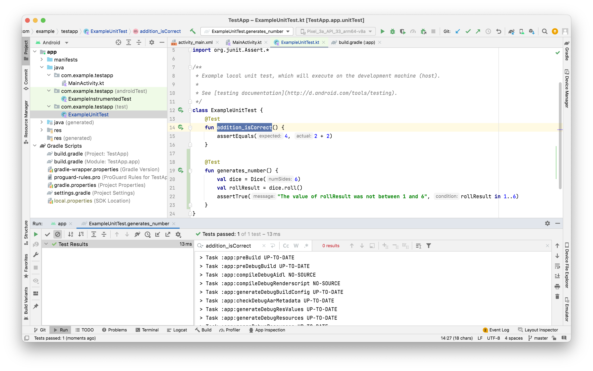

Unit tests are always located in the `test` directory.



> "Open the app/build.gradle file and look at the dependencies. You see some dependencies marked as testImplementation and androidTestImplementation, which correspond to unit and instrumentation tests". - Didn't see this in the `app/build.gradle` file.

`JUnit` library drives your unit tests.

A sample test.
```
class ExampleUnitTest {
    @Test
    fun addition_isCorrect() {
        assertEquals(4, 2 + 2)
    }
}
```

Test functions must first be annotated with the `@Test` annotation imported from the `org.junit.test` library.

Some common assertions in `JUnit` library - `assertEquals()`, `assertNotEquals()`, `assertThat()`, `assertTrue()`, `assertFalse()`, `assertNull()`, `assertNotNull()`.

The test are run using the play button on the sidebar.



The results become visible in the bottom pane.


