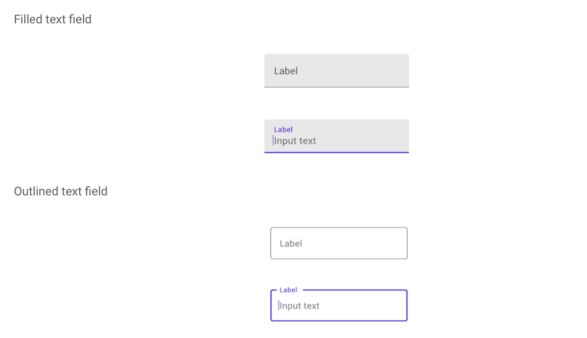

The UI for an Android app is built as a containment hierarchy of components (widgets).

##### Basic Views

Everything it seems is a `View`. It represents a rectangular area on the screen and is the basic building block of all UI components. It is also responsible for drawing and event handling.

Techically its a class ([reference](https://developer.android.com/reference/android/view/View)) and is the base class for `widgets`, which are used to create interactive UI components (buttons, text fields, etc.).

A `ViewGroup` ([reference](https://developer.android.com/reference/android/view/ViewGroup)) whereas is a special view that can contain other views (called children.) It is the base class for layouts and views containers.  Technically, its an abstract class. `ConstraintLayout` is one kind of `ViewGroup`. When there are `View`s within a `ViewGroup`, the `View`s are considered children of the parent `ViewGroup`. `ConstraintLayout` is actually a part of `Android Jetpack`.

`FrameLayout` - `FrameLayout` is designed to block out an area on the screen to display a single item. Generally, `FrameLayout` should be used to hold a single child view, because it can be difficult to organize child views in a way that's scalable to different screen sizes without the children overlapping each other. ([Reference](https://developer.android.com/reference/android/widget/FrameLayout)) Very often used to show RecycleViews.

`TextView` - Like a `UILabel` ([reference](https://developer.android.com/reference/android/widget/TextView)).

`Button` - A button, enough said. The below snippet shows how to respond to its clicks. ([reference](https://developer.android.com/reference/android/widget/Button))
```
val btnTapHere = findViewById<Button>(R.id.button1)
btnTapHere.setOnClickListener {
    btnTapHere.text = "hi here"
    txtView.text = "changes"
    Toast.makeText(this, "Hi", Toast.LENGTH_LONG).show()
}
```

`ImageView` - An image view. The image name is specified in `srcCompat` attribute in the design editor.
```
diceImage.setImageResource(R.drawable.dice_1)
```

`EditText` - Like a `UITextField`.

`RadioGroup` - A bunch of radio buttons.

`Switch` - Like a `UISwitch`.

Android automatically assigns ID numbers to the resources in your app. Resource IDs are of the form `R.<type>.<name>`.

`ScrollView` - Well, a scroll view. `ConstraintLayout` can be put inside it.

##### Material TextInputLayout, TextInputEditText

In Material, there are 2 kinds of text fields. `Filled text field` and `Outlined text field`.



For both of them, use a `TextInputLayout` with an enclosed `TextInputEditText`.

`SwitchMaterial` is the Material version of `Switch`, has some more animations, etc.
