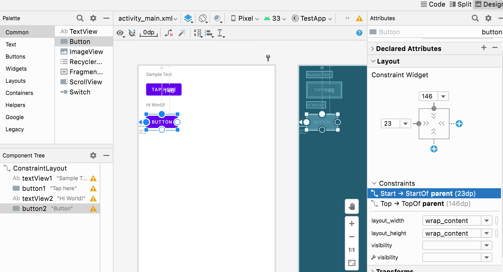
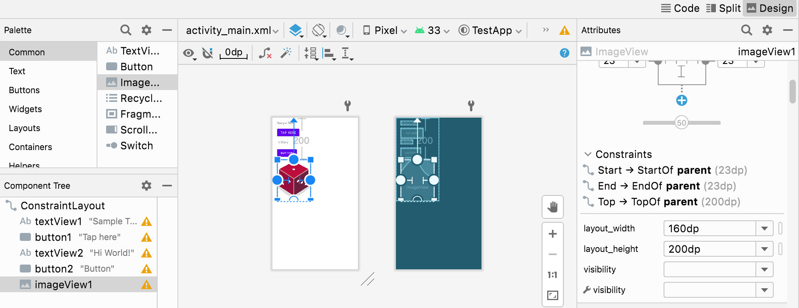
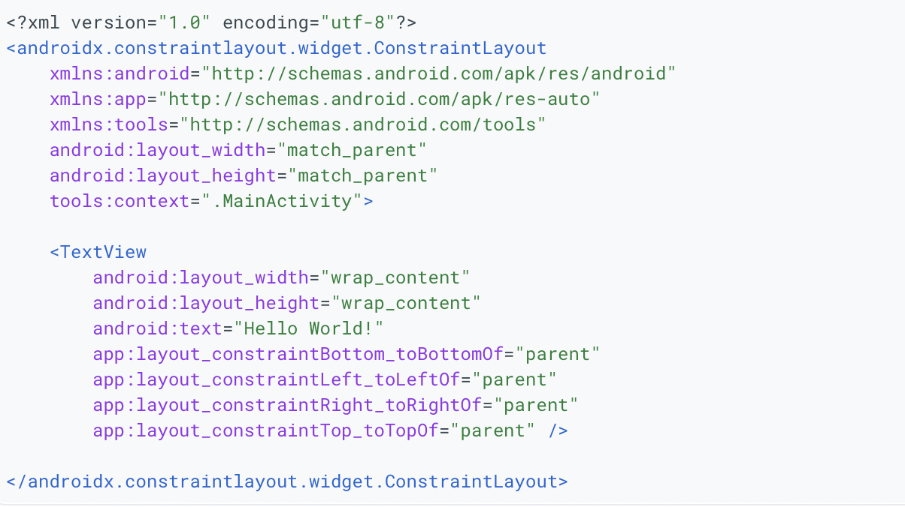

##### Constraints

For a usual xml created in an 'Empty Activity' app, the 'Layout Editor > Component Tree'  root is a `Constraint Layout`.

A margin specifies how far a View is from an edge of its container.

`Attributes > Layout > Constraints` can be used to set the constraints for a given view. Also, notice how the constraints are listed there too ('Start -> Start of parent', etc.).

Views need to be constrained horizontally and vertically within a `ConstraintLayout`.

When things like `layout_width` and `layout_height` are specified, specific values suffixed with `dp` should be used.

##### Typical xml structure

In the xml Jetpack elements (such as `ConstraintLayout`) start with `androidx`.

You cannot use `match_parent` for any view in a ConstraintLayout. Instead use 0dp, which means match constraints.
