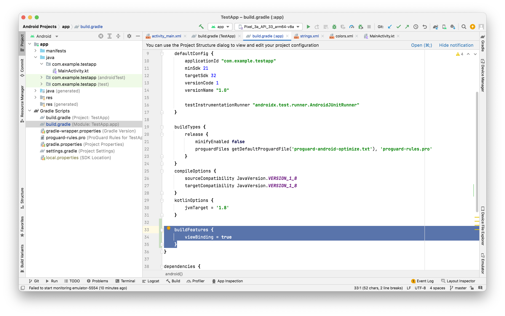

##### View Binding

([Reference](https://developer.android.com/topic/libraries/data-binding))

`findViewById()` is a common way to get views in code but it can be expensive if there are plenty of views in an activity.

```
val btnTapHere = findViewById<Button>(R.id.button1)
```

`View Binding` is a quicker way to get views in code. It however first needs to be enabled in `Gradle`.



One binding object keeps reference of all views with an ID.

lateinit - The lateinit keyword is something new. It's a promise that your code will initialize the variable before using it. If you don't, your app will crash.
layoutInflater

```
binding = ActivityMainBinding.inflate(layoutInflater)
setContentView(binding.root)

binding.button1.text = "From binding"
```

The name of the binding class is generated by converting the name of the XML file to Pascal case and adding the word "Binding" to the end. Similarly, the reference for each view is generated by removing underscores and converting the view name to camel case.
