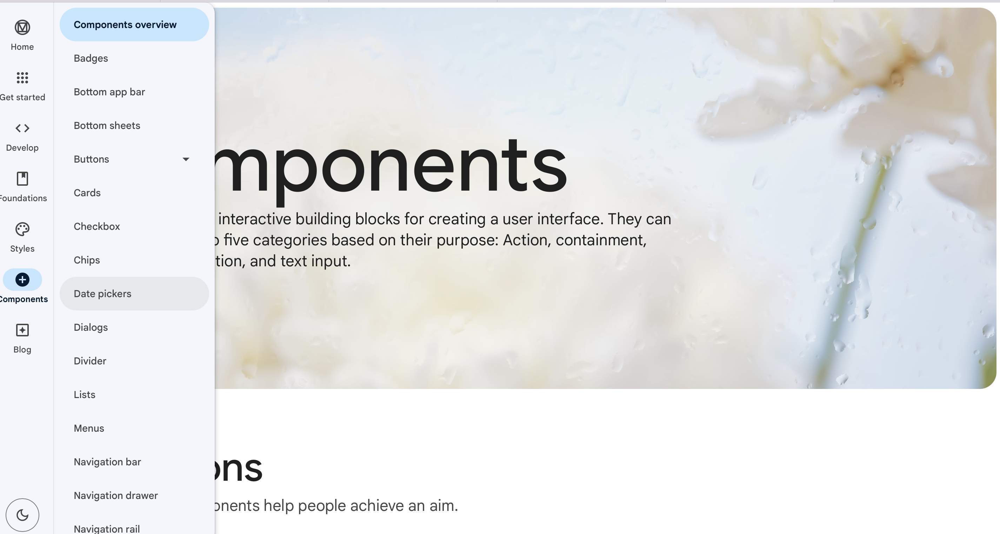

`Material` is a design system created by Google to help developers build high-quality digital experiences for Android and other platforms. The full Material system includes design guidelines on visual, motion, and interaction design for your app. ([Reference](https://m2.material.io/design/introduction))

`Material Components (MDC)` are common UI widgets ([Reference](https://m3.material.io/components)). It's recommended to use Material Components whenever possible (as opposed to the non-Material widgets)




The `Material Design Components (MDC)` library needs to be included as a dependency in your project (in your app's `build.gradle`).
```
dependencies {
    ...
    implementation 'com.google.android.material:material:<version>'
}
```

In order to use Material Components for Android, and the latest versions of the Support Libraries, you will have to install Android Studio 3.5 or higher to build with Android 10, and update your app's `compileSdkVersion` to 29. Ensure you are using `AppCompatActivity`.
