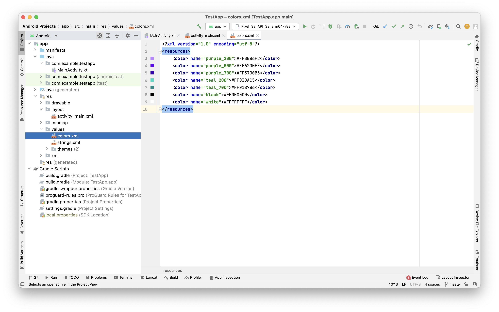
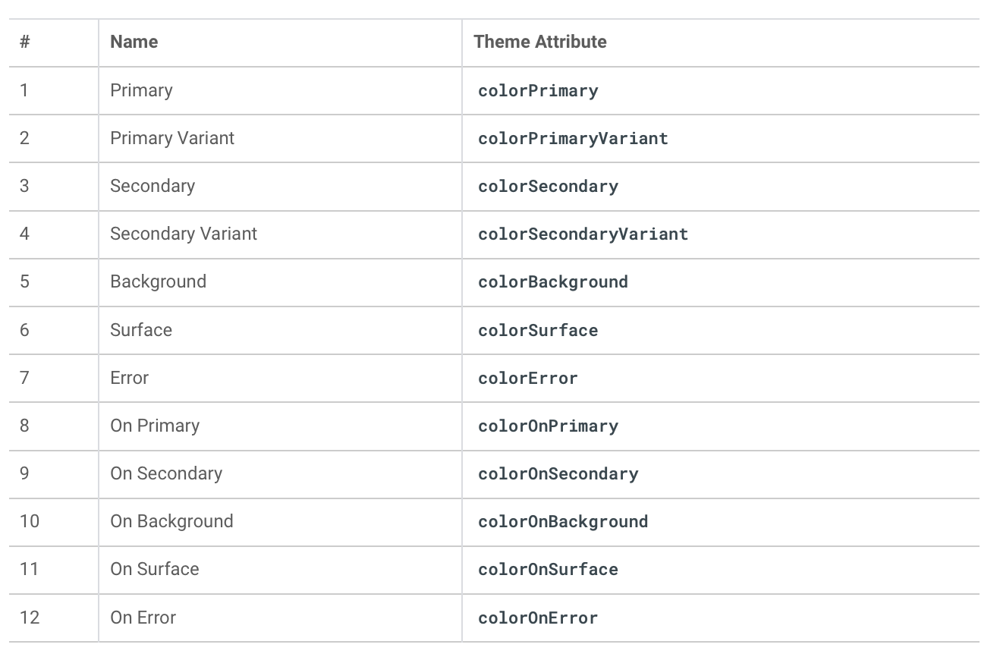
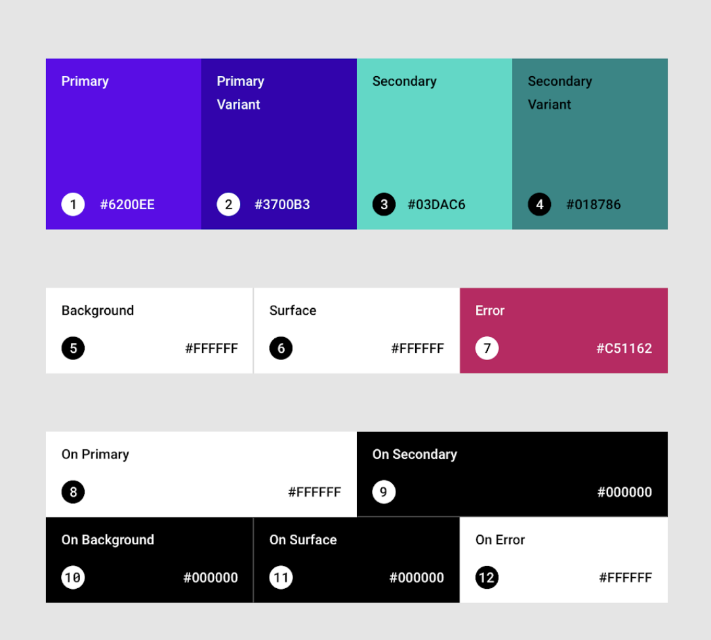
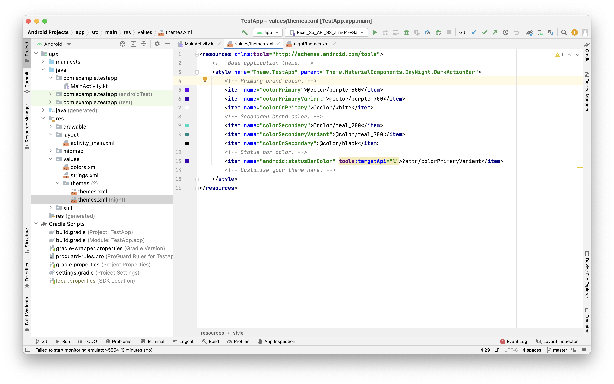
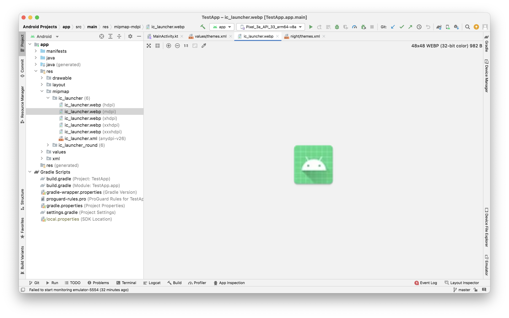
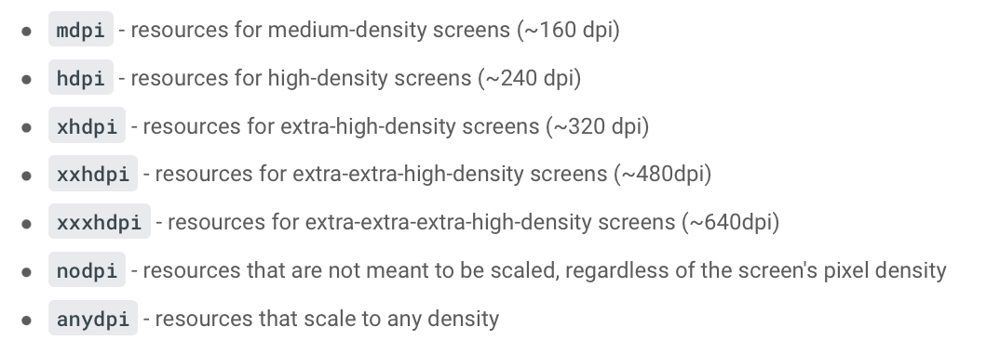
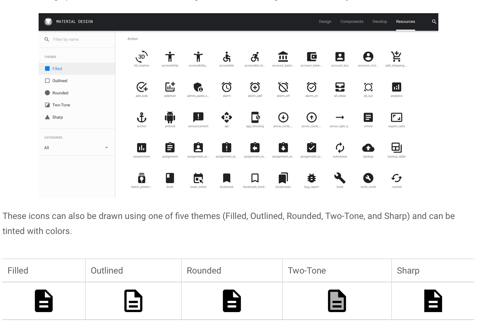
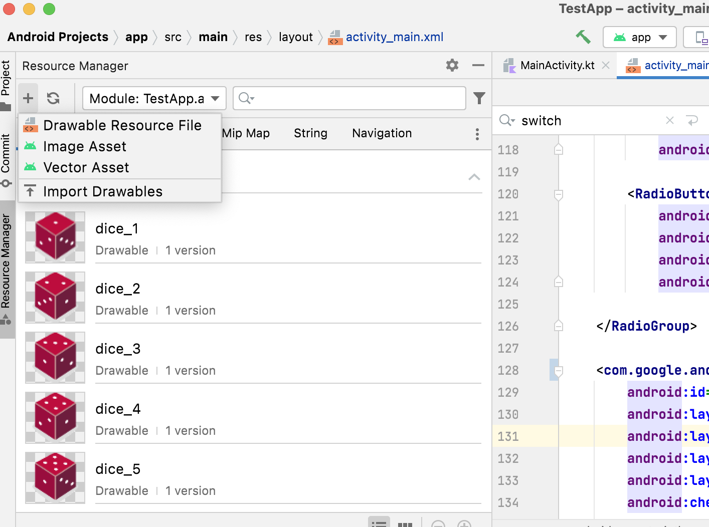
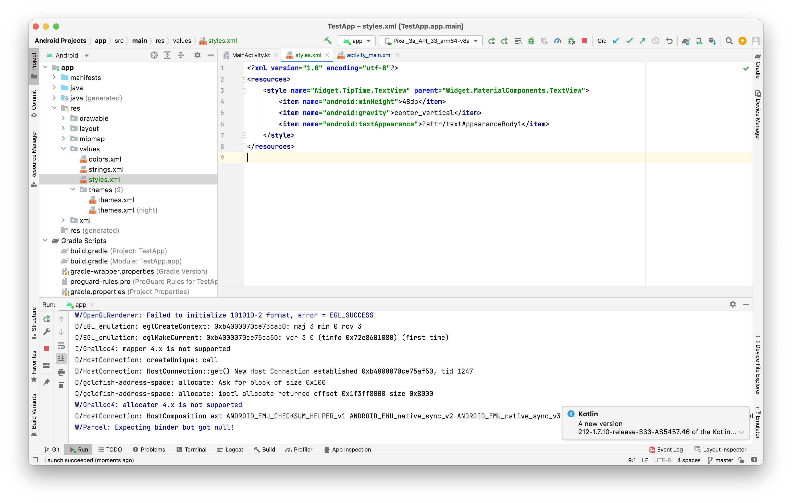

There is a `colors.xml` file in `res/values` that has various colors defined in it.



The leading #FF is the alpha value, and means the color is 100% opaque.

A `style` can specify attributes for a View, such as font color, font size, background color, and much more. A `theme` is a collection of styles that's applied to an entire app, activity, or view hierarchy—not just an individual View. When you apply a theme to an app, activity, view, or view group, the theme is applied to that element and all of its children. Themes can also apply styles to non-view elements, such as the status bar and window background.

To help you use color in a meaningful way in your app, and apply it consistently throughout, the theme system groups colors into 12 named attributes related to color to be used by text, icons, and more. Your theme doesn't need to specify all of them. ([Reference](https://m2.material.io/design/material-theming/implementing-your-theme.html#color))

Theme names | Sample Theme colors
--- | ---
 | 

There are also a couple of `themes.xml` files in which various themes are defined. It has a theme name that is based on the app name, such as `Theme.TestApp`. And then these themes also have apraent theme specified. Themes that are not defined are taken from the parent theme.



Android Studio also draws a small sample of the color in the left margin.

How various colors look can be checked in the [Color Tool](https://m2.material.io/resources/color/#!/?view.left=0&view.right=0&primary.color=2196F3) provided by Material Design.

There is a separate theme file for dark theme. You can see what your theme looks like in dark mode by enabling dark mode on your device. Switch to the Settings app.
In the Battery section, find the Battery Saver, turn it on. Dark theme can reduce power usage and make your app easier to read in low light.

> Doing an app-wide migration by changing your app theme to inherit from a `Material Components` theme is the recommended approach.

-----

screen pixel density refers to how many pixels per inch (or dpi, dots per inch) are on the screen. For a medium-density device (mdpi), there are 160 dots per inch on the screen while an extra-extra-extra-high-density device (xxxhdpi) has 640 dots per inch on the screen.

Launcher icons (i.e. app icons) are placed in `app > src > main > res> mipmap` folders.



mdpi, hdpi, xhdpi, etc.. are density qualifiers that you can append onto the name of a resource directory (like mipmap) to indicate that these are resources for devices of a certain screen density.
Here's a list of [density qualifiers](https://developer.android.com/training/multiscreen/screendensities#TaskProvideAltBmp) on Android.



As of the Android 8.0 release (API level 26), there is support for adaptive launcher icons, which allows for more flexibility and interesting visual effects when it comes to app icons. For developers, that means that your app icon is made up of two layers: a foreground and a background layer.
Adaptive icons were added in API level 26 of the platform, so the adaptive icons should be declared in a mipmap resource directory that has the -v26 resource qualifier on it. That means the resources in this directory will only be applied on devices that are running API 26 (Android 8.0) or higher.

##### Vector Drawable and Bitmap Image

While a `vector drawable` and a `bitmap image` both describe a graphic, there are important differences.

A `bitmap image` doesn't understand much about the image that it holds, except for the color information at each pixel.

On the other hand, a `vector graphic` knows how to draw the shapes that define an image. These instructions are composed of a set of points, lines, and curves along with color information. The advantage is that a `vector graphic` can be scaled for any canvas size for any screen density, without losing quality. <br>
A `vector drawable` is Android's implementation of vector graphics, intended to be flexible enough on mobile devices. You can define them in XML. ([Reference](https://developer.android.com/reference/kotlin/android/graphics/drawable/VectorDrawable))

The app icons are placed in `res > drawable > ic_launcher_foreground.xml` and `ic_launcher_background.xml`.  A new Image Asset can be added by right click on the res directory and choose New > Image Asset. Or you can click on the Resource Manager tab, click the + icon, and select Image Asset. ([Steps](https://developer.android.com/codelabs/basic-android-kotlin-training-change-app-icon?continue=https%3A%2F%2Fdeveloper.android.com%2Fcourses%2Fpathways%2Fandroid-basics-kotlin-unit-2-pathway-2%23codelab-https%3A%2F%2Fdeveloper.android.com%2Fcodelabs%2Fbasic-android-kotlin-training-change-app-icon#5))

For icons in your app, instead of providing different versions of a bitmap image for different screen densities, the recommended practice is to use vector drawables. Vector drawables are represented as XML files that store the instructions on how to create an image rather than saving the actual pixels that make up that image.

`Material Design` also provides a number of icons arranged in common categories.



A Vector Drawable icon can be added using `Vector Asset` through `Resource Manager tab > + Vector Asset`.



In case of icons, the `Clip Art` radio button must be selected. In layout editor, they get added in usual `ImageView`.

To make your app work on these older versions of Android (known as backwards compatibility), add the vectorDrawables element to your app's build.gradle file. This enables you to use vector drawables on versions of the platform less than API 21, versus converting to PNGs when the project is built.

```
defaultConfig {
  ...
  vectorDrawables.useSupportLibrary = true
 }
```

##### Creating a new styles file

Create a new file named styles.xml in the res > values directory if one doesn't already exist. Create it by right-clicking on the values directory and selecting New > Values Resource File. Its contents will eventually look like this.



And then such a custom style can be specified for applicable views.

```
<TextView
    android:id="@+id/textView3"
    style="@style/Widget.TipTime.TextView"
```
