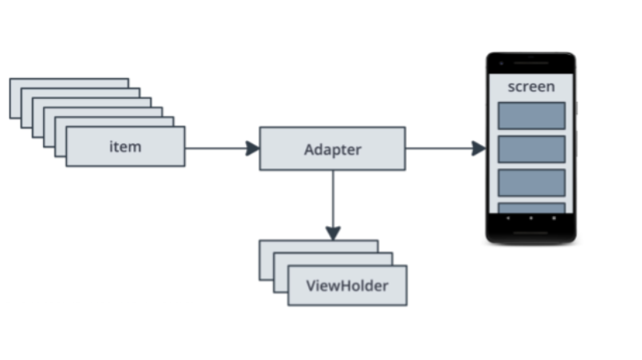
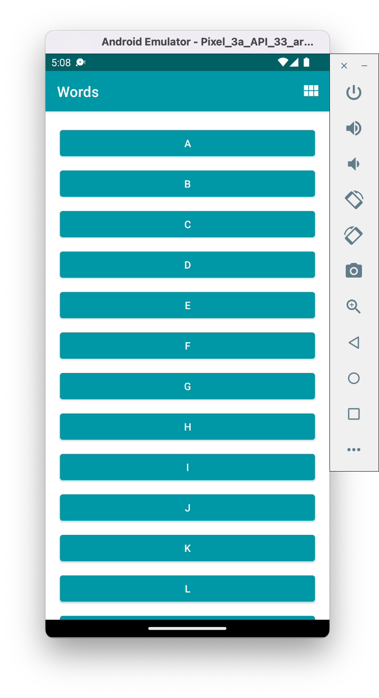
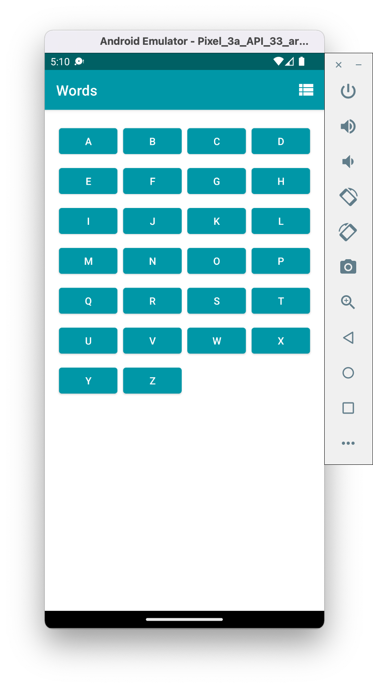
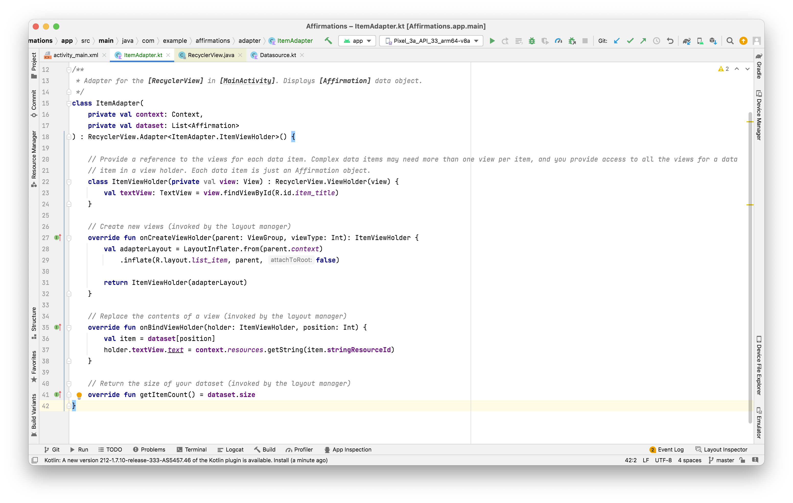
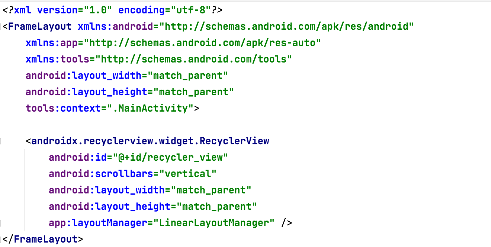
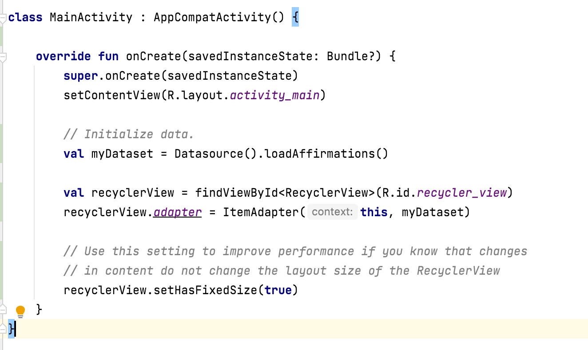

`RecyclerView` ~ Its like a `UITableView` in iOS.

Shows lists. It is designed to be very efficient, even with large lists, by reusing, or recycling, the views that have scrolled off the screen.

##### Basic components



`RecyclerView` - The table view. <br>

`Adapter` - Takes data and prepares it for RecyclerView to display. Like a `datasource` in `UITableView`. <br>

`ViewHolder`s - A pool of views for `RecyclerView` to use and reuse to display data. Every item has one mapping
`ViewHolder`. <br>

`Item` - One data item of the list to display. <br>

`RecyclerView` supports displaying items in different ways, such as a linear list or a grid. Arranging the items is handled by a `LayoutManager`. For a linear layout, it should be `LinearLayoutManager`. For a grid layout, it should be `GridLayoutManager`.

```
app:layoutManager="LinearLayoutManager"
android:scrollbars="vertical"
```

`LinearLayoutManager` | `GridLayoutManager`
--- | ---
 | 

##### Sample code

([Reference](https://developer.android.com/codelabs/basic-android-kotlin-training-recyclerview-scrollable-list?continue=https%3A%2F%2Fdeveloper.android.com%2Fcourses%2Fpathways%2Fandroid-basics-kotlin-unit-2-pathway-3%23codelab-https%3A%2F%2Fdeveloper.android.com%2Fcodelabs%2Fbasic-android-kotlin-training-recyclerview-scrollable-list#3))

Here is a sample adapter code.



The RecycleView has to be assigned an adapter which in turn should have the below specs. It needs to have the mentioned methods.

```
RecyclerView.Adapter<ItemAdapter.ItemViewHolder> -

onCreateViewHolder(parent: ViewGroup, viewType: Int)

onBindViewHolder(holder: ItemViewHolder, position: Int)

getItemCount()
```

The `onCreateViewHolder()` method is called by the layout manager to create new view holders for the `RecyclerView` (when there are no existing view holders that can be reused).

The `layout inflater` knows how to inflate an XML layout into a hierarchy of view objects.

`onBindViewHolder()` method is called by the layout manager in order to replace the contents of a list item view.

`getItemCount()` is called to get the number of items in the RecyclerView.

Here is the sample code to put the ReyclerView in an activity.

In design layout | Setting adapter |
--- | ---
 | 

##### Misc.

ViewHolder has a property named `itemView` which in turn has a property named `context`. The `context` returns the context the view is running in, through which it can access the current theme, resources, etc.
