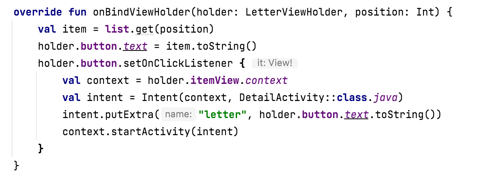
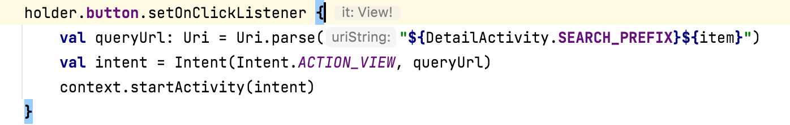
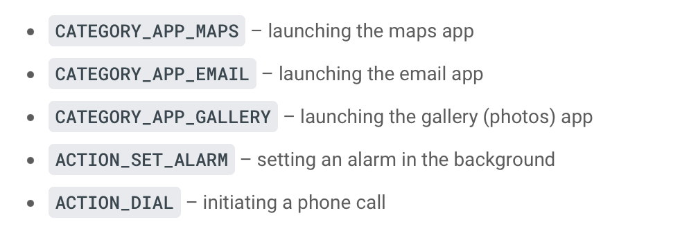

An `intent` is an object representing some action to be performed. The most common use for an intent is to launch an activity.  An `explicit intent` is highly specific, where you know the exact activity to be launched, often a screen in your own app. An `implicit intent` is a bit more abstract, where you tell the system the type of action, such as opening a link. You commonly use implicit intents for performing actions involving other apps and rely on the system to determine the end result.

Creating an `Intent`. A context and the class name of the destination activity need to be passed to it. Call the `startActivity()` method on the context object, passing in the intent. `putExtra()` adds extended data to the intent. In the below code snippet when the button is tapped, the user is navigated to `DetailActivity` screen with some text passed to it. The navigation then actually gets performed by calling `context.startActivity()`.



This passed argument can then be accessed by destination activity through its `intent?.extras`.
```
val letterId = intent?.extras?.getString("letter").toString()
```

Setting an explicit intent.



`ACTION_VIEW` is a generic intent that takes a URI, in your case, a web address. The system then knows to process this intent by opening the URI in the user's web browser. Here are some other intent types.


