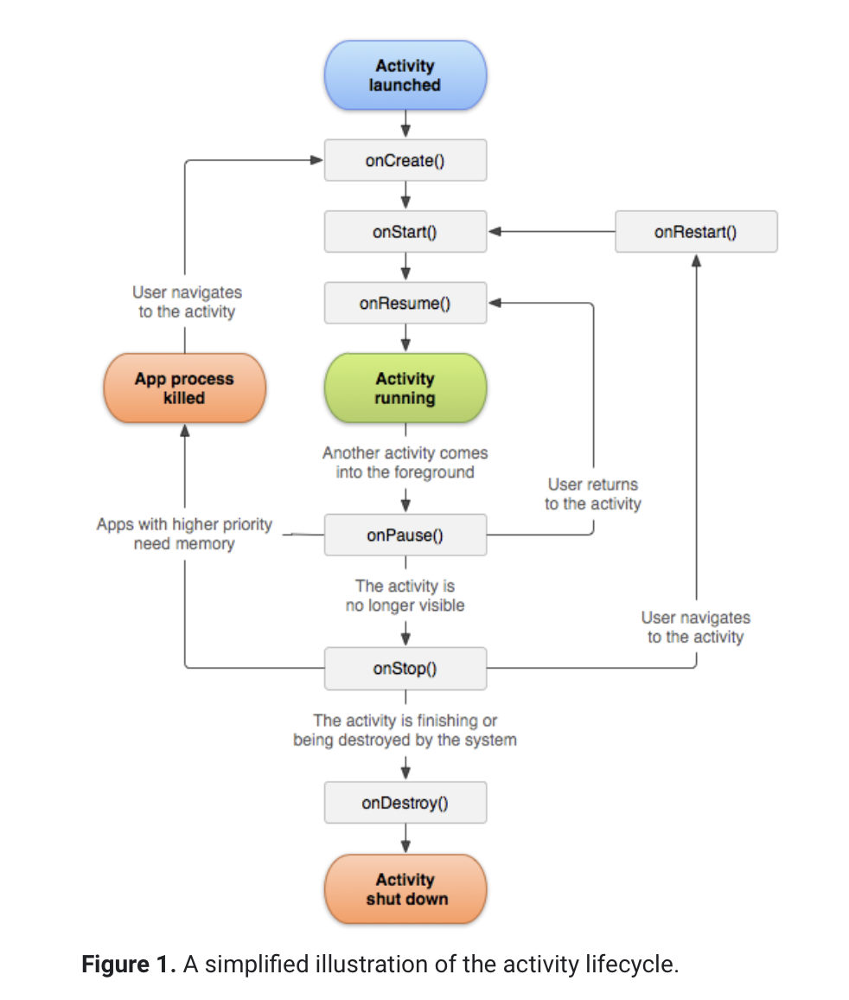
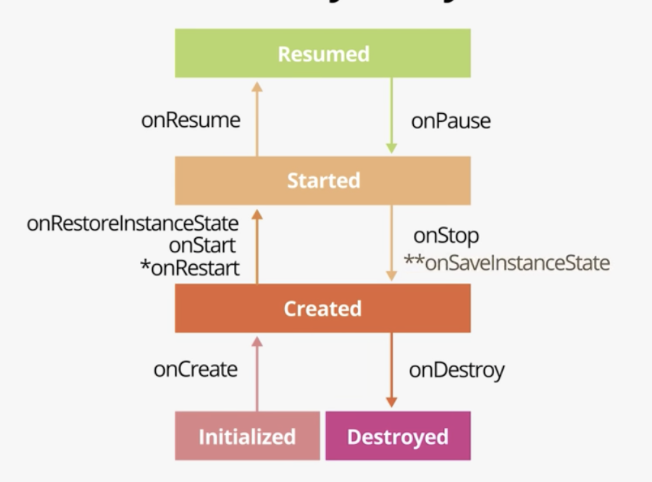
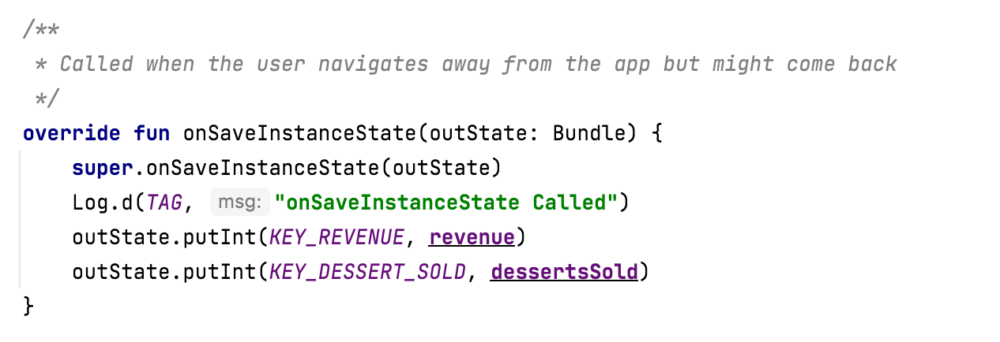
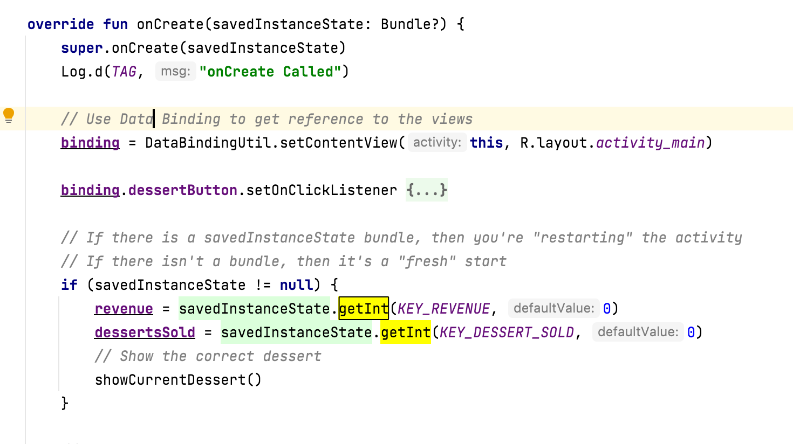

Activity Lifecycle ([Reference](https://developer.android.com/guide/components/activities/activity-lifecycle))

[Bootcamp tutorial](https://developer.android.com/codelabs/basic-android-kotlin-training-activity-lifecycle?continue=https%3A%2F%2Fdeveloper.android.com%2Fcourses%2Fpathways%2Fandroid-basics-kotlin-unit-3-pathway-1%23codelab-https%3A%2F%2Fdeveloper.android.com%2Fcodelabs%2Fbasic-android-kotlin-training-activity-lifecycle#3)

`onCreate()` - On activity creation, the activity enters the Created state. In the onCreate() method, you perform basic application startup logic that should happen only once for the entire life of the activity. You must implement this callback, which fires when the system first creates the activity. This is where one-time initializations are done. Its called once, just after the activity is initialized. After it runs, the activity is considered created.

`onStart()` - The onStart() lifecycle method is called just after onCreate(). After onStart() runs, your activity is visible on the screen. It can be called many times in the lifecycle of your activity.

`onResume()` - Its called to give the activity focus and make it ready for the user to interact with it. Despite the name, the onResume() method is also called at startup, even if there is nothing to resume.

Tap the Back button on the device. `onPause()`, `onStop()`, and `onDestroy()` are called.

`onDestroy()` - The execution of the onDestroy() method means that the activity was fully shut down and can be garbage-collected. Garbage collection refers to the automatic cleanup of objects that you'll no longer use. After onDestroy() is called, the system knows that those resources are discardable, and it starts cleaning up that memory.

`finish()` - Your activity may also be completely shut down if your code manually calls the activity's finish() method, or if the user force-quits the app.

##### Navigating away from and back to the activity

As users interact with their Android devices, they switch between apps, return home, start new apps, and handle interruptions by other activities such as phone calls.

When your activity is no longer visible on screen, this is known as putting the activity into the `background`. (The opposite of this is when the activity is in the `foreground`, or on screen.)

When the user returns to your app, that same activity is restarted and becomes visible again. This part of the lifecycle is called the app's `visible` lifecycle.

`onRestart()` - The onRestart() method is much like onCreate(). Either onCreate() or onRestart() is called before the activity becomes visible. The onCreate() method is called only the first time, and onRestart() is called after that. The onRestart() method is a place to put code that you only want to call if your activity is not being started for the first time.

When the app goes into the background, the focus is lost after `onPause()`, and the app is no longer visible after `onStop()`.

Whatever code runs in onPause() blocks other things from displaying, so keep the code in onPause() lightweight. For example, if a phone call comes in, the code in onPause() may delay the incoming-call notification.

##### Configuration changes

A `configuration change` happens when the state of the device changes so radically that the easiest way for the system to resolve the change is to completely shut down and rebuild the activity.

For example, if the user changes the device language, the whole layout might need to change to accommodate different text directions and string lengths. If the user plugs the device into a dock or adds a physical keyboard, the app layout may need to take advantage of a different display size or layout. And if the device orientation changes—if the device is rotated from portrait to landscape or back the other way—the layout may need to change to fit the new orientation.

`onSaveInstanceState()` - A callback you use to save any data that you might need if the Activity is destroyed. In the lifecycle callback diagram, onSaveInstanceState() is called after the activity has been stopped. It's called every time your app goes into the background.

To put data into the bundle, use the bundle methods that start with put, such as `putInt()`. You can get data back out of the bundle in the `onRestoreInstanceState()` method, or more commonly in `onCreate()`. The onCreate() method has a savedInstanceState parameter that holds the bundle. (When Android shuts down an app because of a configuration change, it restarts the activity with the state bundle that is available to `onCreate()`)

Saving state | Retrieving state
--- | ---
 | 
