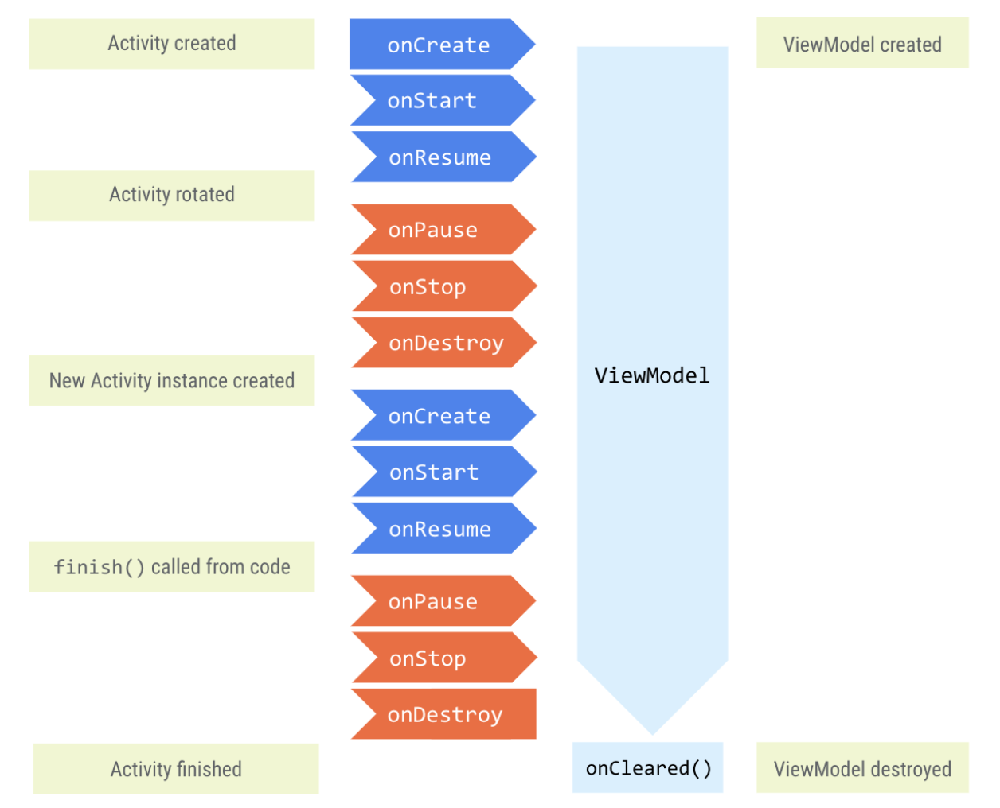

[`Android Architecture Components`](https://developer.android.com/topic/architecture) are part of [Android Jetpack libraries](https://developer.android.com/jetpack).
[`ViewModel`](https://developer.android.com/topic/libraries/architecture/viewmodel) is one of the Architecture components to store app data (esp. through configuration changes). The main classes or components in Android Architecture are `UI Controller` (activity/fragment), `ViewModel`, `LiveData`, and `Room`.

##### What is a `ViewModel`

The `ViewModel` stores the app related data that isn't destroyed when activity or fragment is destroyed and recreated by the Android framework. ViewModel objects are automatically retained (they are not destroyed like the activity or a fragment instance) during configuration changes.

The framework keeps the `ViewModel` alive as long as the scope of the activity or fragment is alive. A `ViewModel` is not destroyed if its owner is destroyed for a configuration change, such as screen rotation. The new instance of the owner reconnects to the existing `ViewModel` instance.



> Even screen rotation is a configuration change, and causes the fragment to be destroyed and recreated, view models help there.

##### Adding ViewModel dependency in gradle


`ViewModel` dependency should be specified in gradle file.
```
implementation 'androidx.lifecycle:lifecycle-viewmodel-ktx:2.3.1'
```

##### Misc.

Handling configuration changes ((link)[https://developer.android.com/guide/navigation/navigation-config-changes])
