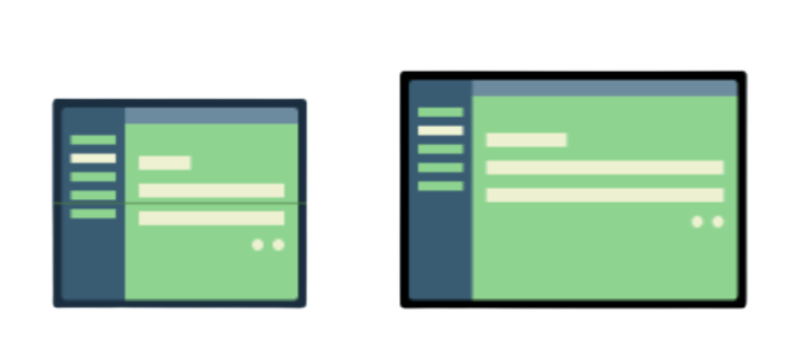

 An `adaptive layout` changes based on the screen space available to it. These changes range from simple layout adjustments to fill up space, to changing layouts completely to make use of additional room.

`SlidingPaneLayout` is one way to make adaptive layouts possible across various device sizes. It provides a horizontal, multi-pane layout for use at the top level of a UI. A left (or start) pane is treated as a content list or browser, subordinate to a primary detail view for displaying content. ([SlidingPaneLayout reference](https://developer.android.com/reference/androidx/slidingpanelayout/widget/SlidingPaneLayout))

An `item-detail pattern`, also called a `master-detail pattern`, shows a list of items on one side of the layout, and the detail is shown next to it when you tap an item. Usually, these views are displayed only on large screens such as tablets, since they have more room to display more content.



[Bootcamp tutorial](https://developer.android.com/codelabs/basic-android-kotlin-training-adaptive-layouts?continue=https%3A%2F%2Fdeveloper.android.com%2Fcourses%2Fpathways%2Fandroid-basics-kotlin-unit-3-pathway-5%23codelab-https%3A%2F%2Fdeveloper.android.com%2Fcodelabs%2Fbasic-android-kotlin-training-adaptive-layouts#1) <br>
[Android developer reference](https://developer.android.com/jetpack/compose/layouts/adaptive) <br>
[Migrate your UI to responsive layouts](https://developer.android.com/guide/topics/large-screens/migrate-to-responsive-layouts?continue=https%3A%2F%2Fdeveloper.android.com%2Fcourses%2Fpathways%2Fandroid-basics-kotlin-unit-3-pathway-5%23article-https%3A%2F%2Fdeveloper.android.com%2Fguide%2Ftopics%2Flarge-screens%2Fmigrate-to-responsive-layouts) <br>


##### Gradle dependency

Gradle dependency that's needed.
```
dependencies {
...
    implementation "androidx.slidingpanelayout:slidingpanelayout:1.2.0-beta01"
}
```

##### Supporting Back navigation

You should ensure that the system back button takes the user back from the detail pane back to the list pane. You can do this by providing custom back navigation and connecting an OnBackPressedCallback to the current state of the SlidingPaneLayout. ([Bootcamp tutorial link](https://developer.android.com/codelabs/basic-android-kotlin-training-adaptive-layouts?continue=https%3A%2F%2Fdeveloper.android.com%2Fcourses%2Fpathways%2Fandroid-basics-kotlin-unit-3-pathway-5%23codelab-https%3A%2F%2Fdeveloper.android.com%2Fcodelabs%2Fbasic-android-kotlin-training-adaptive-layouts#8))

##### Locking detail pane

When the list and detail panes overlap on smaller screens like phones, users can swipe in both directions by default, freely switching between the two panes even when not using [gesture navigation](https://developer.android.com/develop/ui/views/touch-and-input/gestures/gesturenav?hl=PL). You can lock or unlock the details pane by setting the lock mode of the SlidingPaneLayout.

```
slidingPaneLayout.lockMode = SlidingPaneLayout.LOCK_MODE_LOCKED
```

##### Misc.

> On tablets, an app might be running in multi-window mode, which means the app shares the screen with another app. On Chrome OS, an app might be in a resizable window. There can even be more than one physical screen, such as with a foldable device or a device that has multiple displays. In all of these cases, the physical screen size isn't relevant for deciding how to display content. Avoid locking your app to a specific orientation or aspect ratio. Also, avoid trying to determine whether the device is a phone or tablet.
