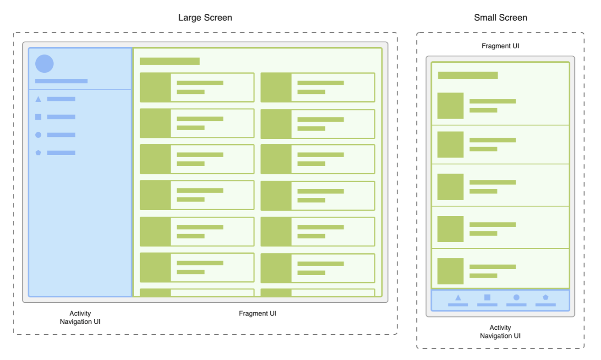
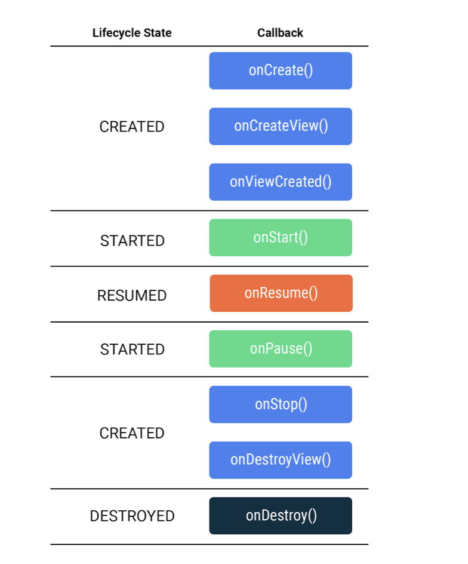
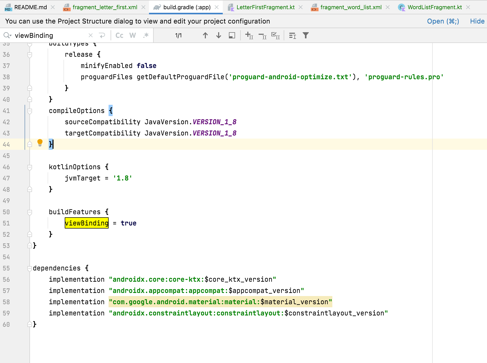
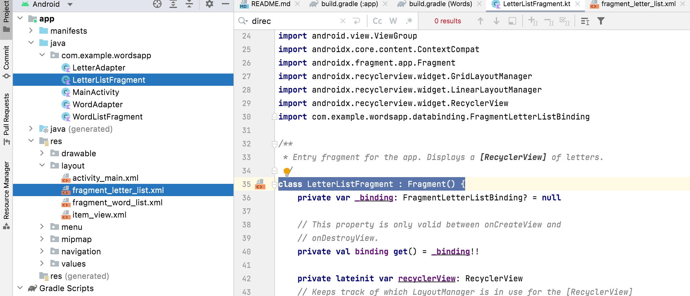
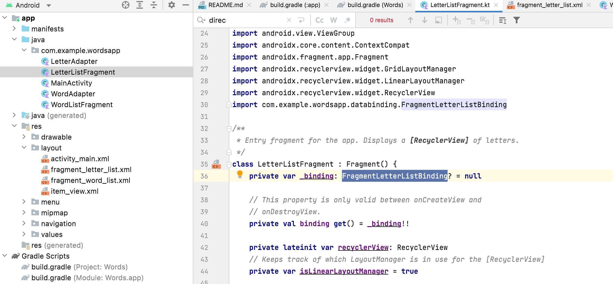
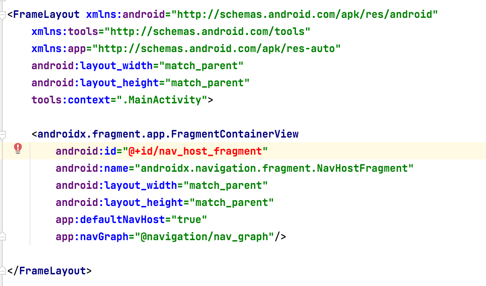
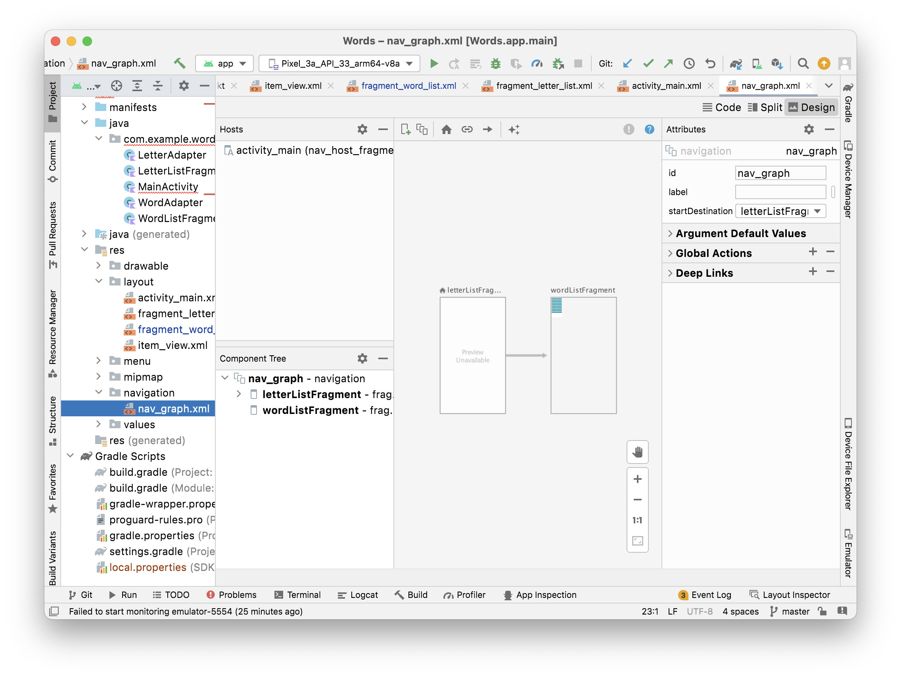
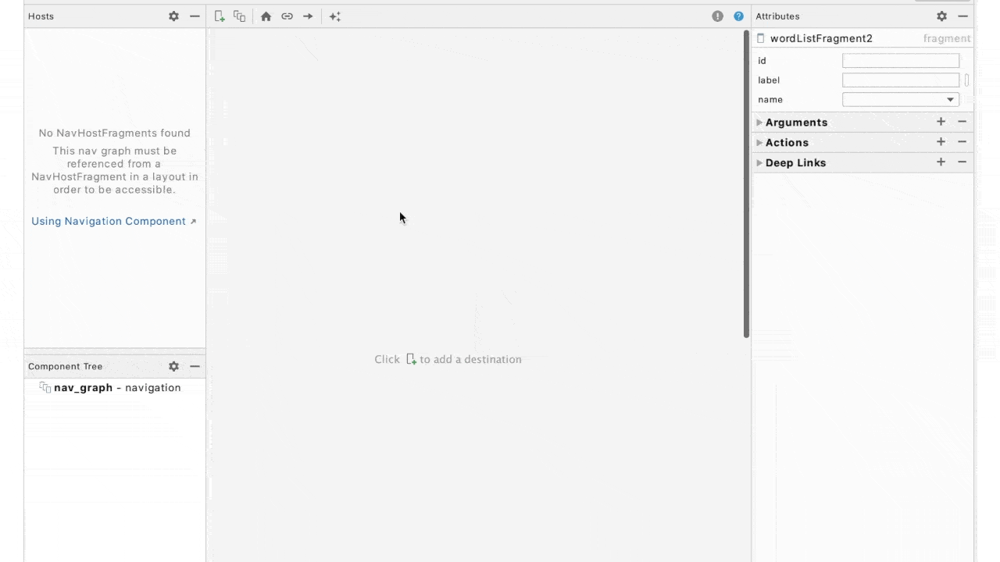
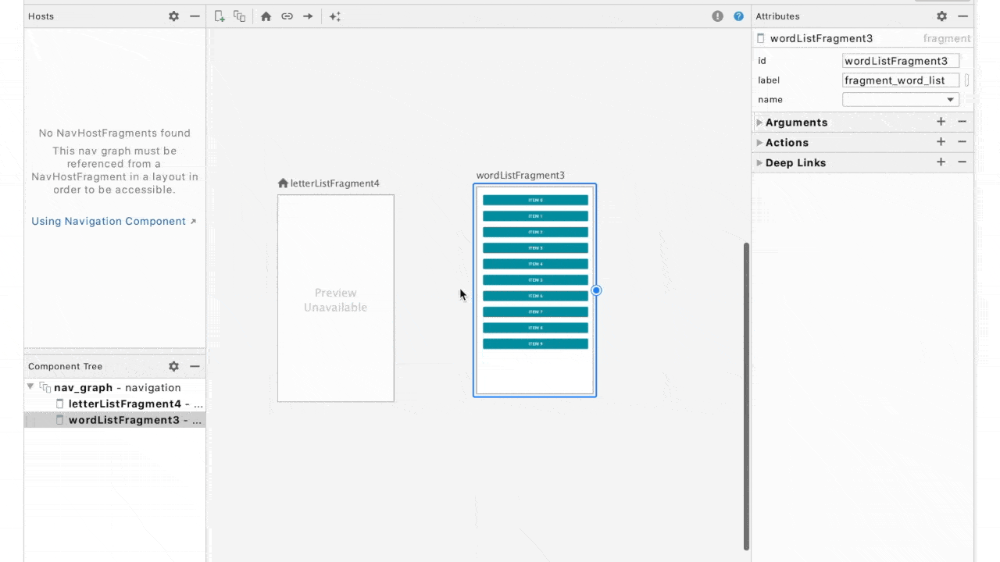

[Screenshot] Creating new package
[Screenshot] New Kotlin File/Class

In order to use the classes from other packages, you need to define them in your build system's dependencies. It's also a standard practice to import them in your code so you can use their shortened names (eg, TextView) instead of their fully-qualified names (eg, android.widget.TextView).

-------

NavigationComponent YouTube intro ([link](https://www.youtube.com/watch?v=Y0Cs2MQxyIs)) <br>
Jetpack NavigationComponent guide ([link](https://developer.android.com/guide/navigation/navigation-getting-started)) <br>
Developer Bootcamp tutorial ([link](https://developer.android.com/codelabs/basic-android-kotlin-training-fragments-navigation-component?continue=https%3A%2F%2Fdeveloper.android.com%2Fcourses%2Fpathways%2Fandroid-basics-kotlin-unit-3-pathway-2%23codelab-https%3A%2F%2Fdeveloper.android.com%2Fcodelabs%2Fbasic-android-kotlin-training-fragments-navigation-component#2)) <br>

Many common UI patterns, such as tabs, exist within a single activity, using something called fragments.

A fragment is a reusable piece of UI; fragments can be reused and embedded in one or more activities. You can even show multiple fragments at once on a single screen, such as a master-detail layout for tablet devices. In the example below, both the navigation UI on the left and the content on the right can each be contained in a separate fragment.



Like activities, fragments have a lifecycle and can respond to user input. A fragment is always contained within the view hierarchy of an activity when it is shown on screen. It's even possible for multiple fragments to be hosted simultaneously by a single activity.

The fragment lifecycle has five states, represented by the `Lifecycle.State` enum.

`INITIALIZED`: A new instance of the fragment has been instantiated.

`CREATED`: The first fragment lifecycle methods are called. During this state, the view associated with the fragment is also created.

`STARTED`: The fragment is visible onscreen but does not have "focus", meaning it can't respond to user input.

`RESUMED`: The fragment is visible and has focus.

`DESTROYED`: The fragment object has been de-instantiated.

`Fragment` class too provides many methods that you can override to respond to lifecycle events.

`onCreate()`: The fragment has been instantiated and is in the CREATED state. However, its corresponding view has not been created yet.

`onCreateView()`: This method is where you inflate the layout. The fragment has entered the CREATED state.

`onViewCreated()`: This is called after the view is created. In this method, you would typically bind specific views to properties by calling findViewById().

`onStart()`: The fragment has entered the STARTED state.
onResume(): The fragment has entered the RESUMED state and now has focus (can respond to user input).

`onPause()`: The fragment has re-entered the STARTED state. The UI is visible to the user.

`onStop()`: The fragment has re-entered the CREATED state. The object is instantiated but is no longer presented on screen.

`onDestroyView()`: Called right before the fragment enters the DESTROYED state. The view has already been removed from memory, but the fragment object still exists.

`onDestroy()`: The fragment enters the DESTROYED state.



Keep in mind the difference with the onCreate() method. With activities, you would use this method to inflate the layout and bind views. However, in the fragment lifecycle, onCreate() is called before the view is created, so you can't inflate the layout here.

When a new fragment is created, both a Kotlin file and an xml file are created.

------

Binding classes like this are generated by Android Studio for each layout file, when the viewBinding property is enabled under the buildFeatures section of the build.gradle file.



As with activities, you need to inflate the layout and bind individual views.  you can't inflate the layout until onCreateView(), and hence the binding property should be nullable.

There's a period of time in-between when the instance of LetterListFragment is created (when its lifecycle begins with onCreate()) and when this property is actually usable. Also keep in mind that fragments' views can be created and destroyed several times throughout the fragment's lifecycle. For this reason you also need to reset the value in another lifecycle method, onDestroyView().

---

When a fragment is created there is a `Fragment` subclass and a layout xml file that are created. The xml file has name that is basically underscore separated version of the class name.




Its as if every fragment automatically gets a binding class. I didn't create the `FragmentLetterListBinding` class here, its nowhere in the 'Project Window' either.



With fragments, the layout is inflated in `onCreateView()`.

----

`Android Jetpack` provides the `Navigation component`. It has three key parts.

1. `Navigation Graph (NavGraph)` - The navigation graph is an XML file that provides a visual representation of navigation in your app. It consists of destinations which correspond to individual activities and fragments as well as actions between them which can be used in code to navigate from one destination to another

2. `NavHost` - It is used to display destinations from a navigation graph within an activity. When you navigate between fragments, the destination shown in the NavHost is updated. You'll use a built-in implementation, called NavHostFragment, in your MainActivity. (So it is something like 'currently active fragment'?)

3. `NavController` - The NavController object lets you control the navigation between destinations displayed in the NavHost. When working with intents, you had to call startActivity to navigate to a new screen. With the Navigation component, you can call the NavController's navigate() method to swap the fragment that's displayed. The NavController also helps you handle common tasks like responding to the system "up" button to navigate back to the previously displayed fragment.

---

Had to add all of these these in gradle file to be able to use Navigation (along with Jetpack Compose).
```
implementation "androidx.navigation:navigation-fragment-ktx:$nav_version"
implementation "androidx.navigation:navigation-ui-ktx:$nav_version"
implementation "androidx.navigation:navigation-compose:$nav_version"
```

Also, in project level gradle file a nav_version needs to be set.
```
buildscript {
    ext {
        ....
        nav_version = '2.5.2'
      }
}
```
`SafeArgs` is a Gradle plugin that ensures type safety when passing data between fragments.

In top level `build.gradle`, in in `buildscript > dependencies`, add the following classpath.
```
classpath "androidx.navigation:navigation-safe-args-gradle-plugin:$nav_version"
```

In the app-level build.gradle file, within plugins at the top, add `androidx.navigation.safeargs.kotlin`.
```
plugins {
    id 'com.android.application'
    id 'kotlin-android'
    id 'kotlin-kapt'
    id 'androidx.navigation.safeargs.kotlin'
}
```

Behind the scenes, there is actually a new instance of the `NavGraph` class. However, destinations from the navigation graph are displayed to the user by the `FragmentContainerView`.

A `FragmentContainerView` is put in the MainActivity's layout xml. The name should be `androidx.navigation.fragment.NavHostFragment`. `defaultNavHost` should be set as true. And there needs to be an attribute named `app:navGraph` which points to the XML file that defines how your app's fragments can navigate to one another. This xml file should then have all the destinations (i.e. screens) added to it. The connection between the screens can then be created between them.









One of the screens can also be made the 'Start destination'.

Performing the naavigation action.
```
val action = LetterListFragmentDirections.actionLetterListFragmentToWordListFragment(letter = holder.button.text.toString())

holder.view.findNavController().navigate(action)
```

When navigation is performed using nav_graph and safe arguments are used, there are no intents, so trying to access intent extras is simply not going to work. Arguments are received using `arguments?.let`.
```
override fun onCreate(savedInstanceState: Bundle?) {
    super.onCreate(savedInstanceState)

    arguments?.let {
        letterId = it.getString(LETTER).toString()
    }
}
```

What exactly is a `Bundle`? Think of it as a key-value pair used to pass data between classes, such as activities and fragments.

Fagments have a property called "label" where you can set the title which the parent activity will know to use in the app bar.
