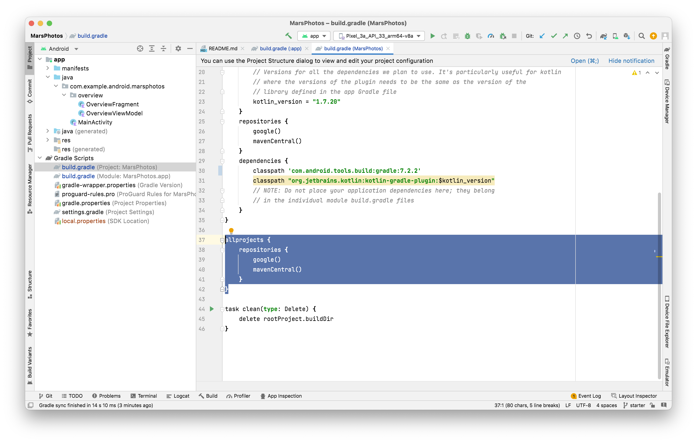
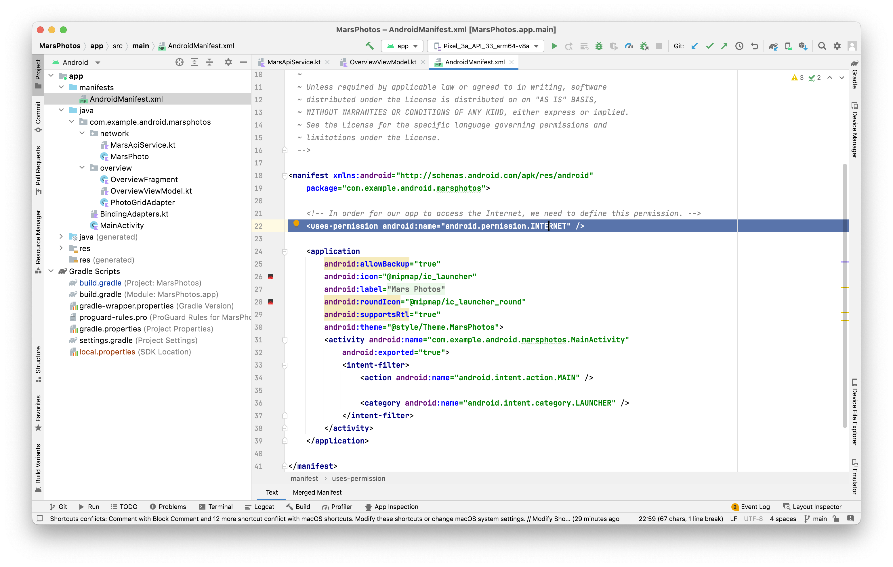

##### Gradle dependencies

Specifying gradle dependency. `converter-scalars` enables `Retrofit` to return the JSON result as a String.
```
implementation "com.squareup.retrofit2:retrofit:2.9.0"
implementation "com.squareup.retrofit2:converter-scalars:2.9.0"
```

The Google libraries such as ViewModel and LiveData from the Jetpack library are hosted in the Google repository. The majority of community libraries like Retrofit are hosted on `Google` and `MavenCentral` repositories. These repositories are specified in the project level Gradle file.




##### Manifest specification

In order for the app to access the Internet, it needs the INTERNET permission in `manifests/AndroidManifest.xml` file.



##### Basic code

[Bootcamp tutorial link](https://developer.android.com/codelabs/basic-android-kotlin-training-getting-data-internet?continue=https%3A%2F%2Fdeveloper.android.com%2Fcourses%2Fpathways%2Fandroid-basics-kotlin-unit-4-pathway-2%23codelab-https%3A%2F%2Fdeveloper.android.com%2Fcodelabs%2Fbasic-android-kotlin-training-getting-data-internet#10) <br>
Sample project name - MarsPhotos <br>

Configuring Retrofit
```
private val retrofit = Retrofit.Builder()
   .addConverterFactory(ScalarsConverterFactory.create())
   .baseUrl(BASE_URL)
   .build()
```

Creating a Service interface.
```
interface MarsApiService {
    @GET("photos")
    suspend fun getPhotos(): List<MarsPhoto>
}
```

Providing a singleton object for getting the service interface instance. This is needed as the Retrofit `create()` invocation is expensive.
```
object MarsApi {
    val retrofitService: MarsApiService by lazy { retrofit.create(MarsApiService::class.java) }
}
```

Can be invoked this way.
```
try {
    _photos.value = MarsApi.retrofitService.getPhotos()
    _status.value = MarsApiStatus.DONE
} catch (e: Exception) {
    _status.value = MarsApiStatus.ERROR
    _photos.value = listOf()
}
`
