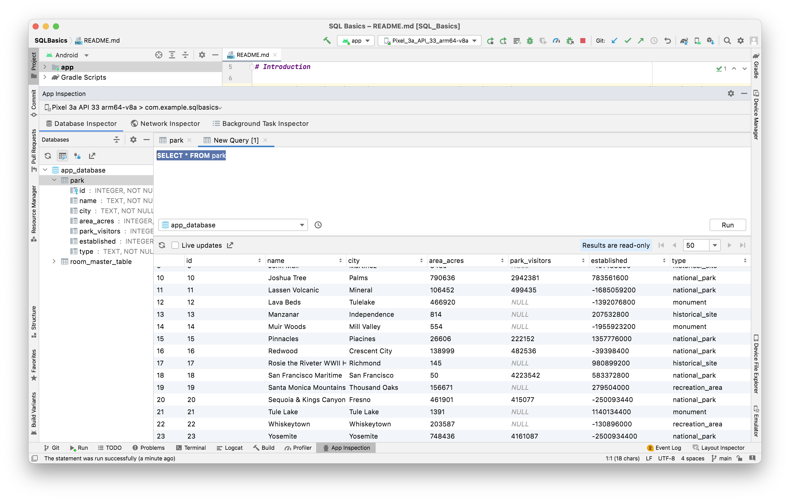
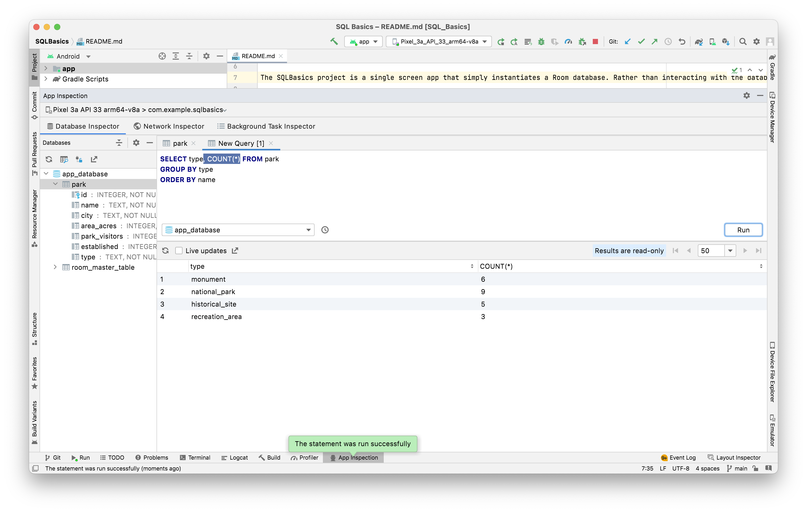
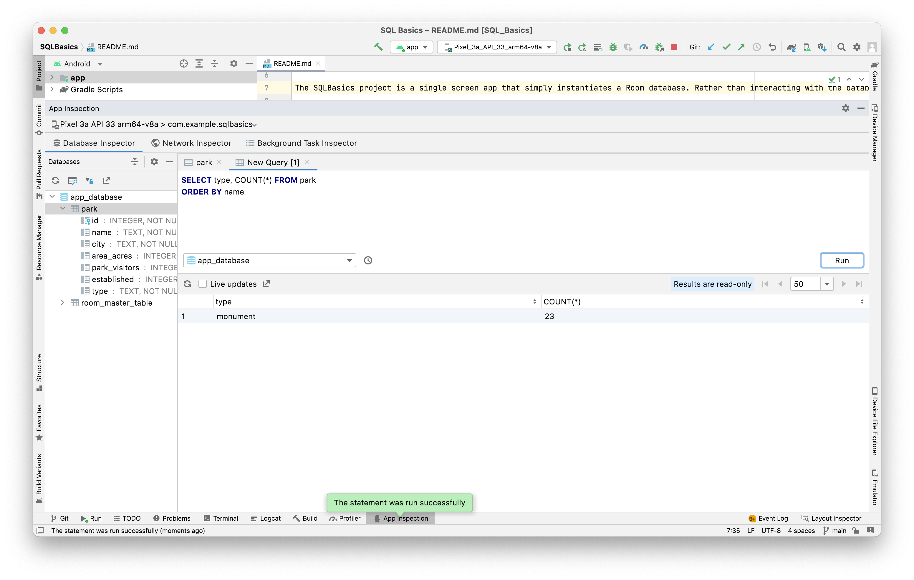

[Android Bootcamp link](https://developer.android.com/codelabs/basic-android-kotlin-training-sql-basics?continue=https%3A%2F%2Fdeveloper.android.com%2Fcourses%2Fpathways%2Fandroid-basics-kotlin-unit-5-pathway-1%23codelab-https%3A%2F%2Fdeveloper.android.com%2Fcodelabs%2Fbasic-android-kotlin-training-sql-basics#3) <br>
Sample project - SQLBasics <br>

-----

A `primary key` is unique to each row in the table.

A column can represent a character, string, number (with or without a decimal), or binary data. Other data like dates and times could either be represented numerically or as a string depending on the use case.

The most common SQL statements - <br>
`SELECT` - Query a table and sort results. <br>
`INSERT` - Adds a new row to a table. <br>
`UPDATE` - Updates an existing row (or rows) in a table. <br>
`DELETE` - Removes an existing row (or rows) from a table. <br>

##### Database Inspector in Android Studio

If you are using Android Studio Arctic Fox | 2020.3.1 then Database Inspector is under App Inspection. The app first needs to be run and its process selected there.


Select table and then 'new query tab'.


##### SELECT statements

`SELECT * FROM park` - Select all rows from 'park' table <br>
`SELECT city FROM park` - Select only 'city' column from all rows of 'park' table <br>
`SELECT name, established, city FROM park` <br>

`LIMIT` allows you to set a limit on the number of rows returned.  <br>
`SELECT name FROM park LIMIT 5`

A `WHERE` clause lets you filter results based on one or more columns. <br>
`SELECT name FROM park WHERE type = "national_park"` <br>

There are `operators` like `=`, `!=`, etc. <br>
`SELECT name FROM park WHERE type != "recreation_area" AND area_acres > 100000`

A `function` used in a statement (count of all matching rows here). <br>
`SELECT COUNT(*) FROM park` <br>
`SELECT SUM(park_visitors) FROM park WHERE type = "national_park"` <br>

`DISTINCT` returns only unique values. <br>
`SELECT DISTINCT type FROM park` <br>

Returning sorted results using `ORDER BY`. <br>
```
SELECT name FROM park ORDER BY name
SELECT name FROM park ORDER BY name DESC
```

Before the `ORDER BY` clause (if any), you can optionally specify a `GROUP BY` clause and a column. This basically groups the results into a subset specific to the column in the GROUP BY. `GROUP BY` can in fact exist even without a succeeding `ORDER BY` being there, its likely a concept independent of it. `GROUP BY` basically creates a preliminary bucket.




##### INSERT statements

```
INSERT INTO table_name
VALUES (column1, column2, ...)
```

##### UPDATE statements

```
UPDATE table_name
SET column1 = ...,
column2 = ...,
...
WHERE column_name = ...
...
```

##### DELETE statements

```
DELETE FROM table_name
WHERE <column_name> = ...
```
