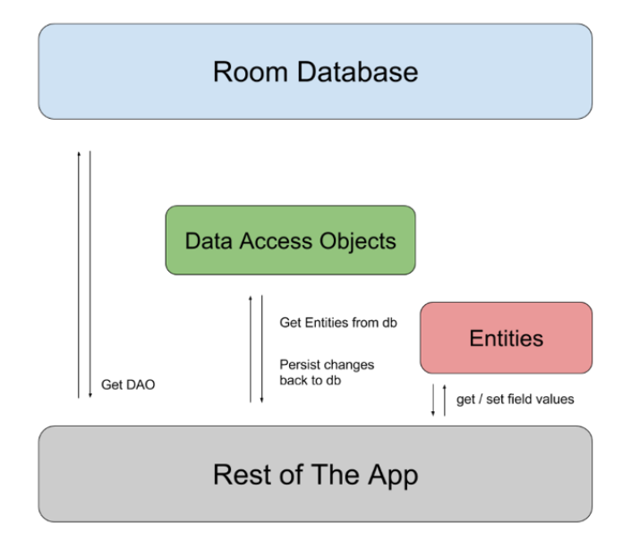

`Room` is a library that allows apps to read and write from a local database.

##### Gradle dependencies

These need to be added in the `dependencies` block of the module level gradle file.

```
implementation "androidx.room:room-runtime:$room_version"
kapt "androidx.room:room-compiler:$room_version"
implementation "androidx.room:room-ktx:$room_version"
```

##### Major Components

There are three major components in `Room`.

`Data entities` - Represent tables.

`Data access objects (DAOs)` - Provide methods to retrieve, update, insert, and delete data in the database.

`Database class` - Holds the database and is the main access point for the underlying connection to your app's database.


