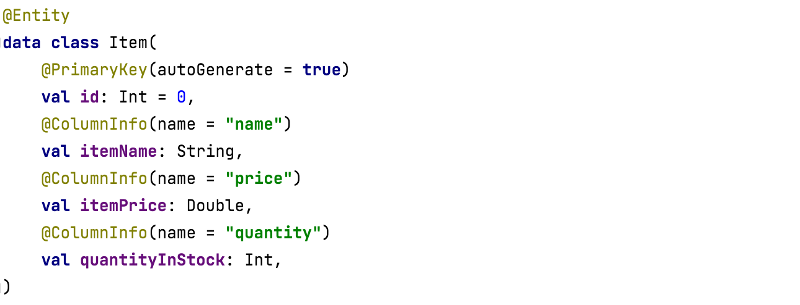
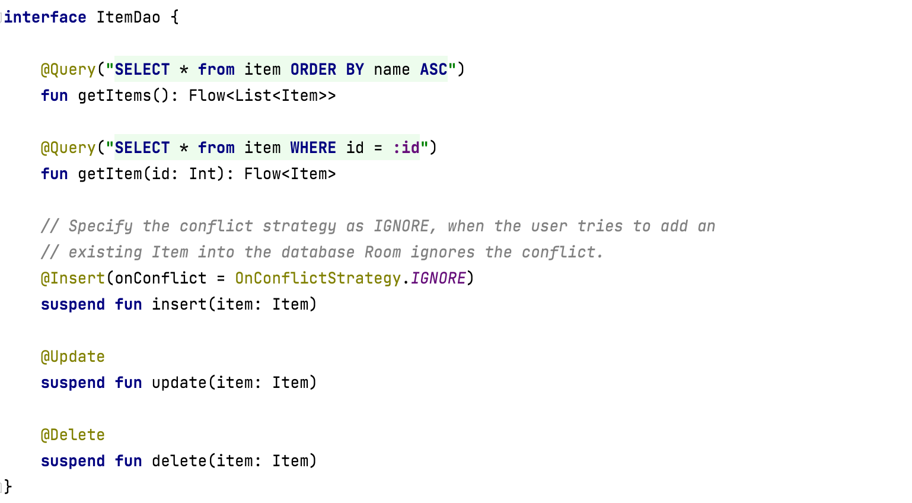
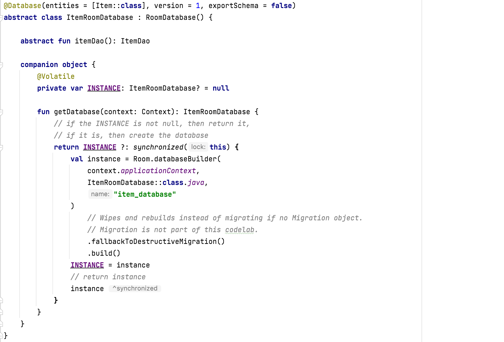

Bootcamp Tutorial [link](https://github.com/google-developer-training/android-basics-kotlin-inventory-app.git)  
Sample code - Inventory ([GitHub link](https://github.com/google-developer-training/android-basics-kotlin-inventory-app.git))  

#### Creating Entity

`Entity` ([reference](https://developer.android.com/reference/androidx/room/Entity)) class defines a table, and each instance of this class represents a row in the database table. For each `Entity` class a database table is created to hold the items. Once assigned, the `primary key` cannot be modified, it represents the entity object as long as it exists in the database.

Declare a `data class` and annotate it with `@Entity`. 1 annotation has several possible arguments. By default, the table name will be the same as the class. The tableName argument let's you give a different or a more helpful table name. This argument for the tableName is optional, but highly recommended.

To identify the id as the primary key, annotate the id property with `@PrimaryKey`. Set the parameter autoGenerate to true so that Room generates the ID for each entity.

The `@ColumnInfo` annotation is used to customise the column associated with the particular field.

#### Creating Data Access Object

The `Data Access Object (DAO)` is a pattern used to separate the persistence layer with the rest of the application by providing an abstract interface.

For common database operations, the Room library provides convenience annotations, such as `@Insert`, `@Delete`, and `@Update`. For everything else, there is the `@Query` annotation. You can write any query that's supported by `SQLite`.

Use `@Dao` annotation for the class that is the Data Access Object.

Insert functions should be annotated with `@Insert`, the argument `OnConflict` tells the entity what to do in case of a conflict. The `OnConflictStrategy.IGNORE` strategy ignores a new item if it's primary key is already in the database ([reference](https://developer.android.com/reference/androidx/room/OnConflictStrategy.html)).

Update functions should be annotated with `@Update`, delete functions should be annotated with `@Delete`.

There is no convenience annotation for the remaining functionality, so you have to use the `@Query` annotation and supply SQLite queries.

#### Creating a database instance

The database class provides your app with instances of the DAOs you've defined. In turn, the app can use the DAOs to retrieve data from the database as instances of the associated data entity objects.

Annotate the class with `@Database`. In the arguments, list the entities for the database and set the version number. Define an abstract method or property that returns a dao Instance and the entity class will generate the implementation for you. You typically only need one instance of the database class for the whole app, so make it a singleton. Use the entity class's `databaseBuilder` to create your (item_database) database only if it doesn't exist. Otherwise, return the existing database.

##### Adding a `ViewModel`

The  ViewModel interacts with the database via the DAO, and provide data to the UI. All database operations will have to be run away from the main UI thread, you'll do that using coroutines and `viewModelScope`.
