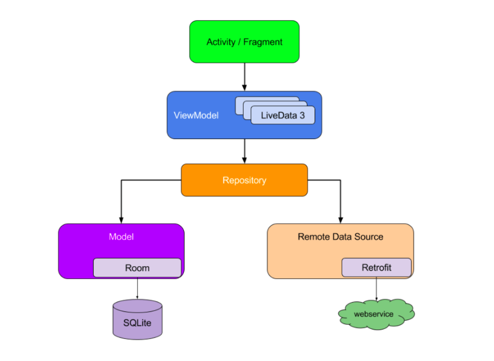

Bootcamp tutorial ([link](https://developer.android.com/codelabs/basic-android-kotlin-training-repository-pattern?continue=https%3A%2F%2Fdeveloper.android.com%2Fcourses%2Fpathways%2Fandroid-basics-kotlin-unit-5-pathway-2%23codelab-https%3A%2F%2Fdeveloper.android.com%2Fcodelabs%2Fbasic-android-kotlin-training-repository-pattern#3))  

The `repository pattern` is a design pattern that isolates the data layer from the rest of the app. A repository can resolve conflicts between data sources (such as persistent models, web services, and caches) and centralize changes to this data. The diagram below shows how app components such as activities might interact with data sources by way of a repository.

