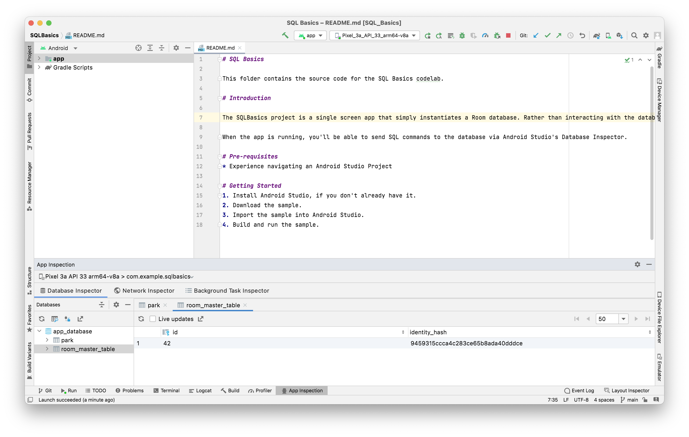

`Room` - A library that allows apps to read and write from a local database.

A `primary key` is unique to each row in the table.

A column can represent a character, string, number (with or without a decimal), or binary data. Other data like dates and times could either be represented numerically or as a string depending on the use case.

The most common SQL statements -
`SELECT` - Query a table and sort results.  
`INSERT` - Adds a new row to a table.  
`UPDATE` - Updates an existing row (or rows) in a table.  
`DELETE` - Removes an existing row (or rows) from a table.  

If you are using Android Studio Arctic Fox | 2020.3.1 then Database Inspector is under App Inspection. The app first needs to be run and its process selected there.

