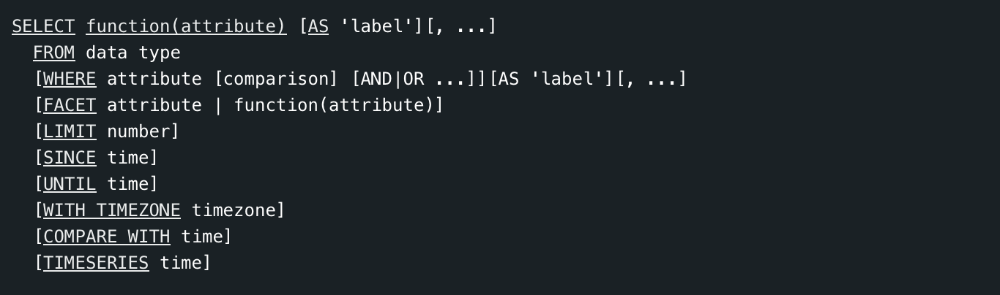
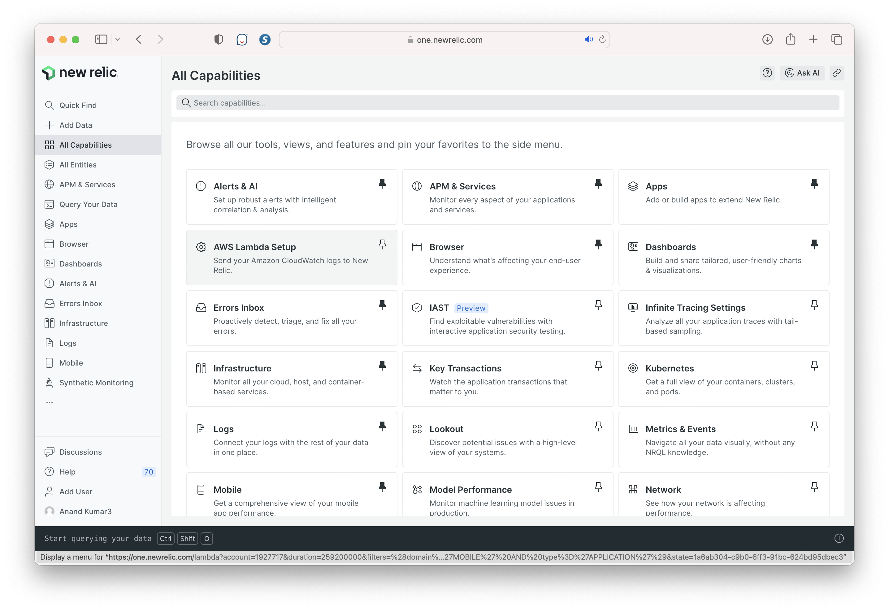
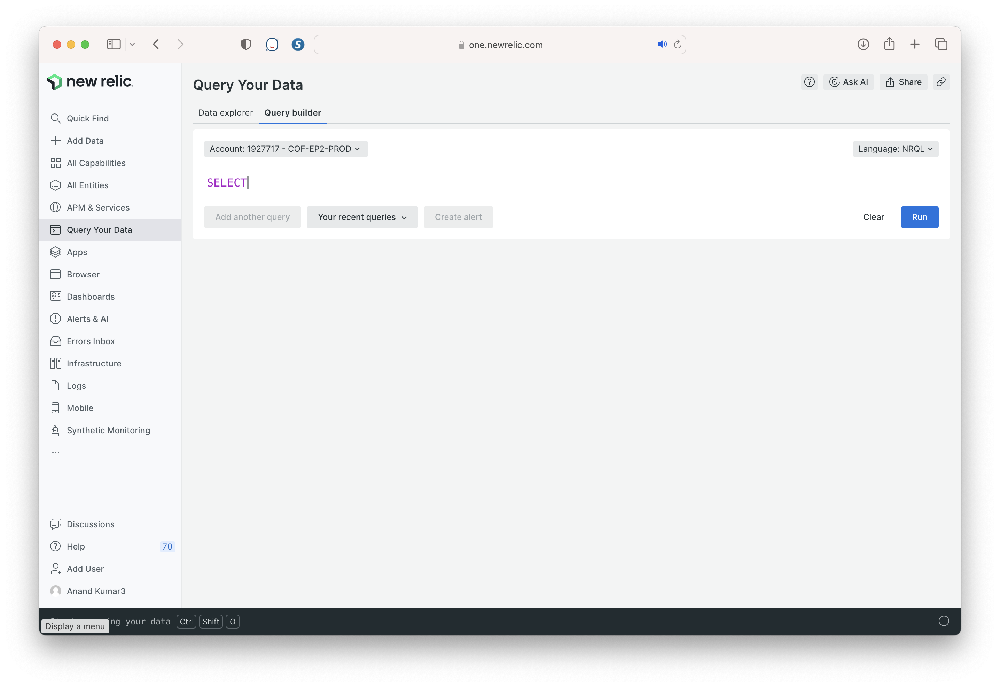

Dashboard  Query Builder  NRQL reference ([link](https://docs.newrelic.com/docs/query-your-data/nrql-new-relic-query-language/get-started/nrql-syntax-clauses-functions/))  One Chart  

Create a new chart, Set up NRQL-based alerts, Make API queries using NerdGraph API.

Event Data - APM events, Browser monitoring events, Mobile monitoring events, etc.  Metric timeslice data (metrics reported by APM)

NRQL syntax -

 Two kinds of APIs -

1. Data Ingest APIs: APIs for the four core data types: metrics, events, logs, and traces.
2. NerdGraph (GraphQL-format API): Used for everything except data ingest, from querying data to configuring New Relic features. 

Various kinds of monitoring - ?

1. Infrastructure monitoring
2. Application monitoring (APM, OpenTelemetry, etc.)
3. Browser monitoring
4. Mobile monitoring

##### Capabilities

##### Query Builder

