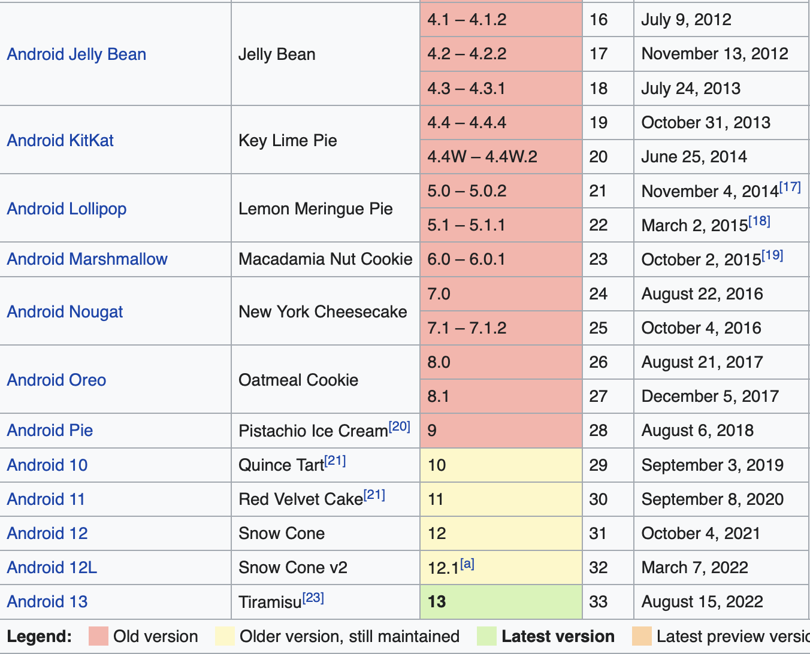
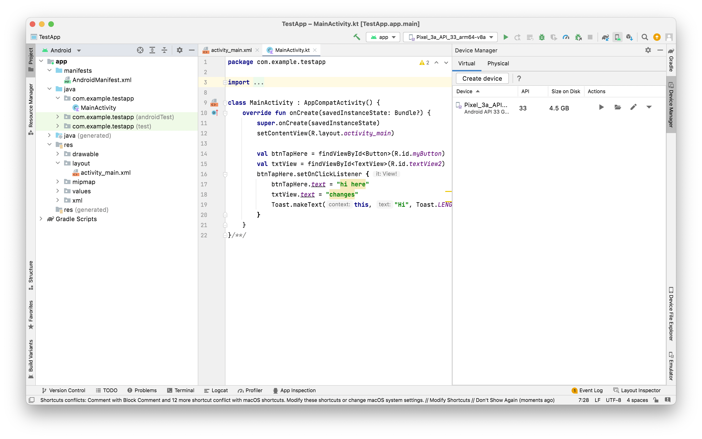
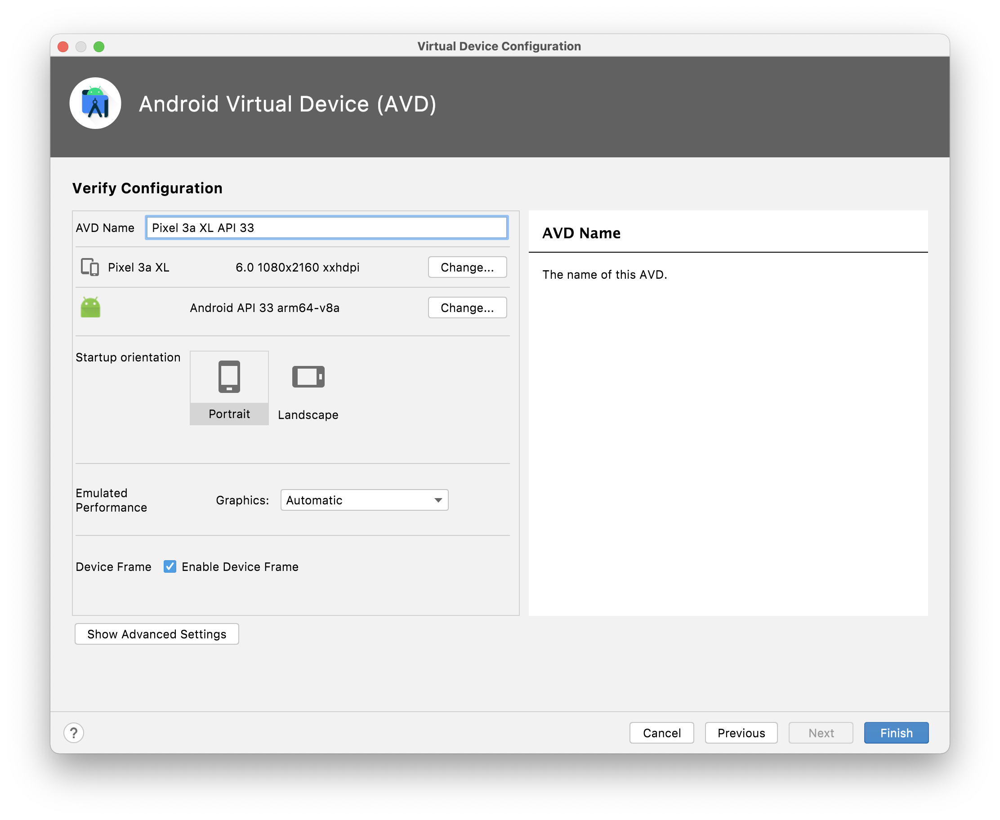

##### Ecosystem

Here are the Android versions. As of Sep 5, 2022 the latest available version is 'Android 13/Tiramisu'.

2008 - 2011 | 2012 - Now
--- | ---
 | 

##### Steps while creating a new project

1. Select a template (usually its `Empty Activity`).
2. Enter a Package Name (which is same thing as Bundle ID in iOS, i.e. reverse DNS style name, unique).
3. Select the `Minimum SDK`, i.e. the minium Android OS version which the app is required to support.

Selecting Template | Package Name, Min SDK, etc.
--- | ---
 | 

Once a Minimum SDK is select, there is information shown underneath regarding what % of currently available devices will be able to support the app (this is likely also what is known as `AppCompat`).

> There is also a checkbox for 'Use legacy Android support libraries'. What does that give?

##### Keyboard shortcuts

Run (i.e. Play button) - `Control R` <br>

##### Android Virtual Device (AVD)

An `Android Virtual Device (AVD)` is a configuration that defines the characteristics of an Android phone, tablet, Wear OS, Android TV, or Automotive OS device that you want to simulate in the Android Emulator. So basically its something that describes the configuration of a given Emulator. Its accessed using a Toolbar(?) menu, and thereafter a new device (i.e. practically an Emulator) can be created.


Here are various configuration options.

Hardware | System Image (i.e. OS version?)
--- | ---
 | 

Graphics Performance, etc. | Location, Battery level, etc.
--- | ---
 | 

> Some emulators even have access to Play Store and actual apps can be installed from there? Also, can emulators use Mac camera?

-----

initially says 'gradle project sync in progress'

##### Basic code

`Activity` represents a screen.

The UI layout comes from `activity_main.xml`. This file is specified in code in the argument for `setContentView()`, the `R` there means the `res` folder (so look for the mentioned file in the res folder).


`Toast` shows a limited time alert can towards the bottom of the screen.
```
Toast.makeText(this, "Hi", Toast.LENGTH_LONG).show()
```


Usual packages that are specified and things that are imported.
```
package com.example.testapp

import androidx.appcompat.app.AppCompatActivity
import android.os.Bundle
```

Activity usually inherits `AppCompatActivity` ([reference](https://developer.android.com/reference/androidx/appcompat/app/AppCompatActivity)).

Individual UI elements need to be imported.
```
import android.widget.Button
import android.widget.TextView
```

The xml looks like this in `Design mode`. Constraints can be drawn by pressing option and then moving the cursor. There is an option towards the top called `Infer Constraints` which automatically creates constraints.

.

There is something known as `Constraint Bias`.

-----
