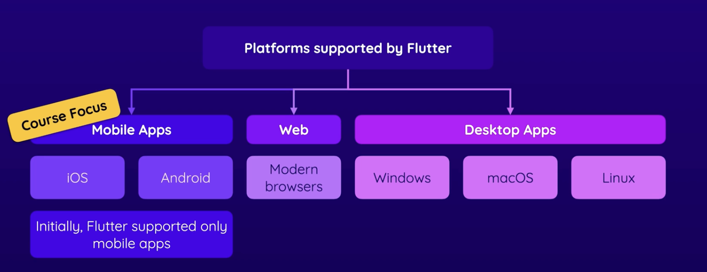
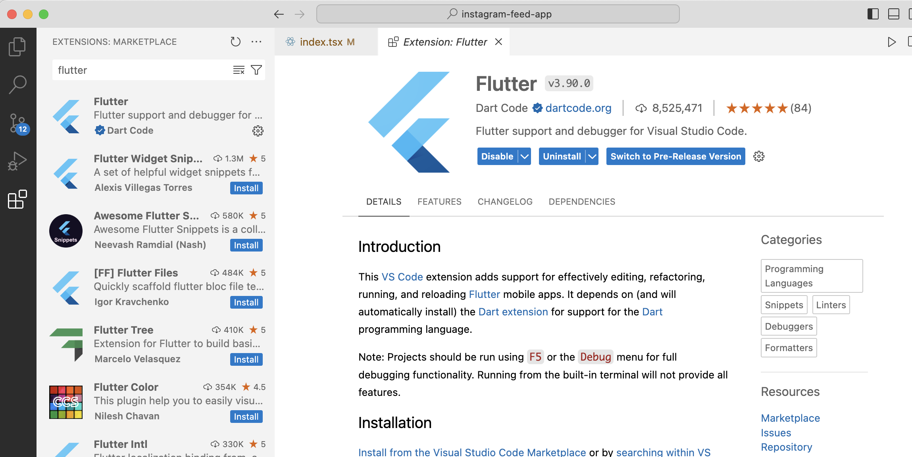
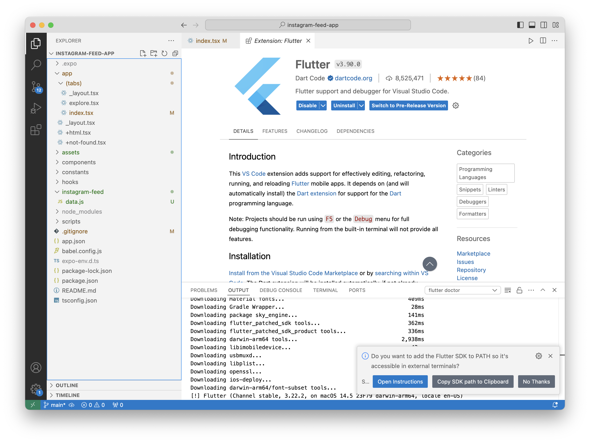
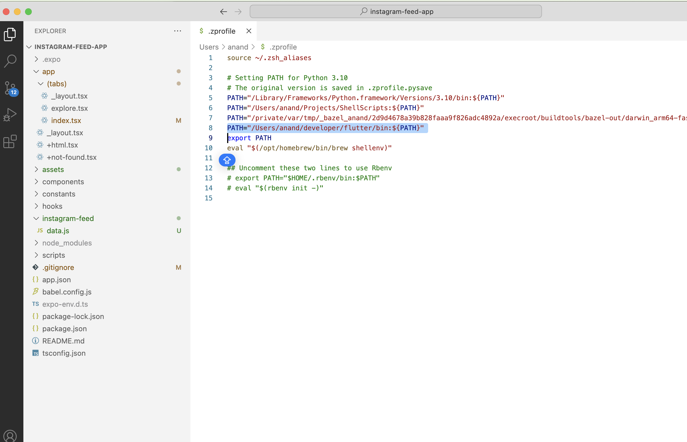
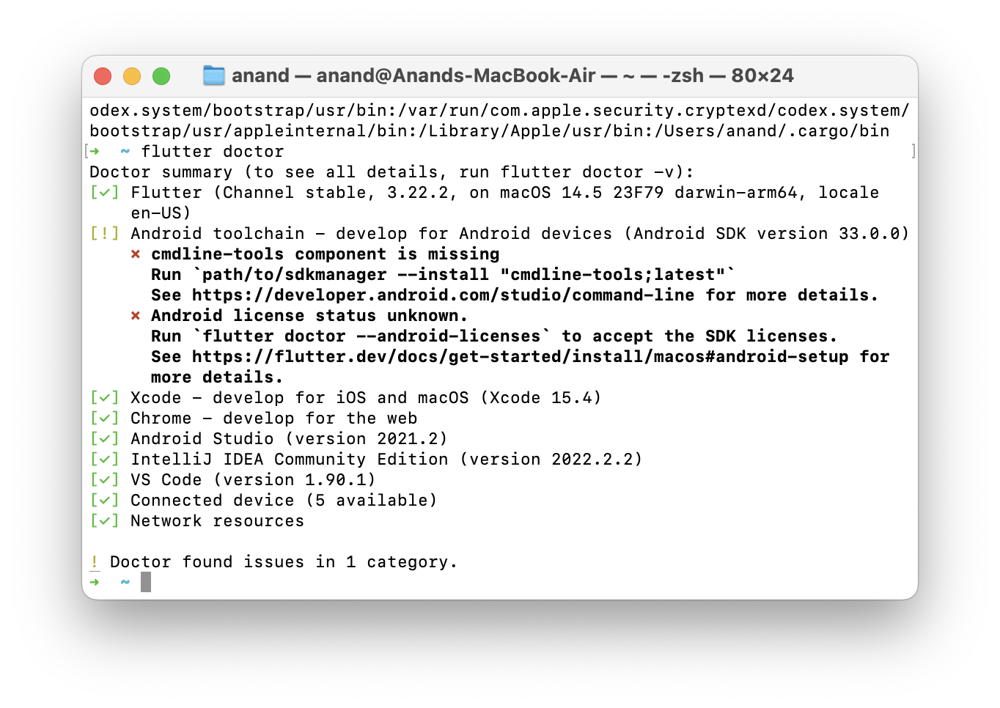
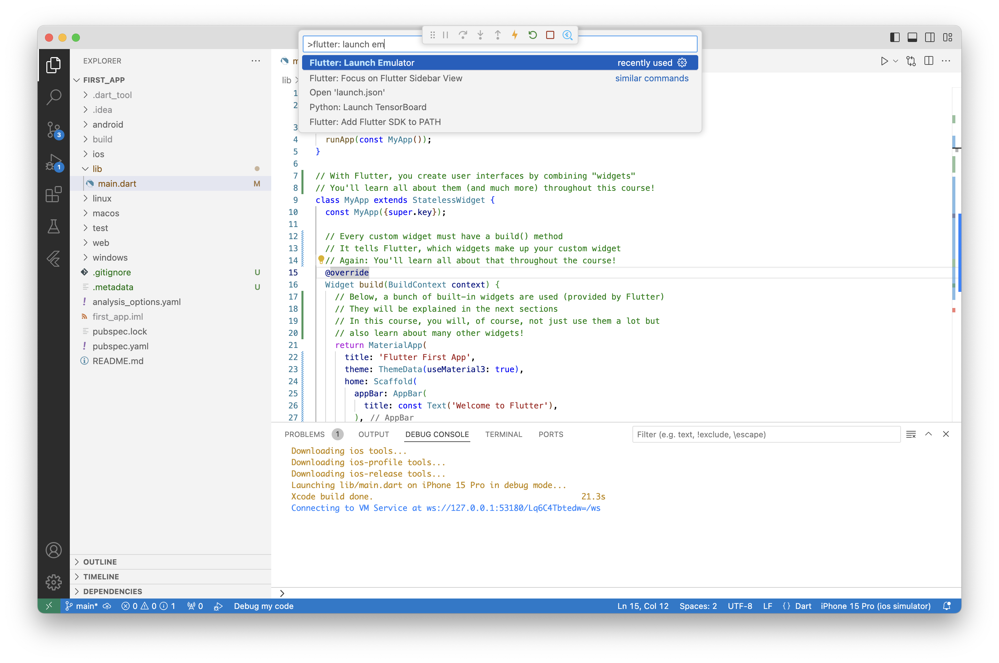
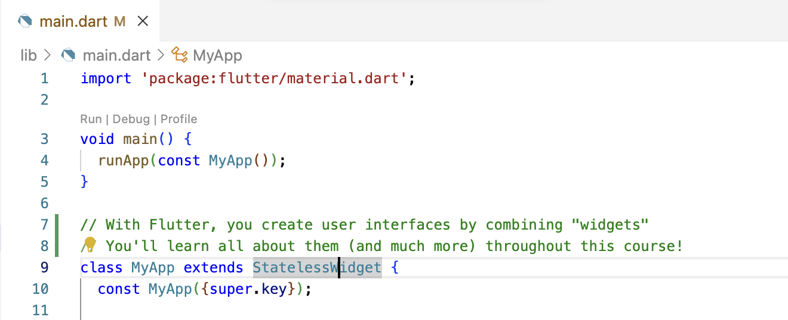
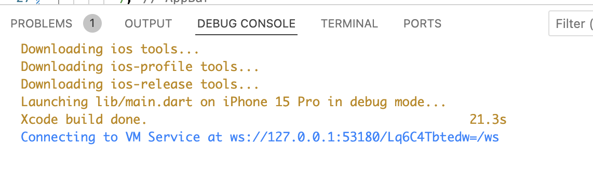
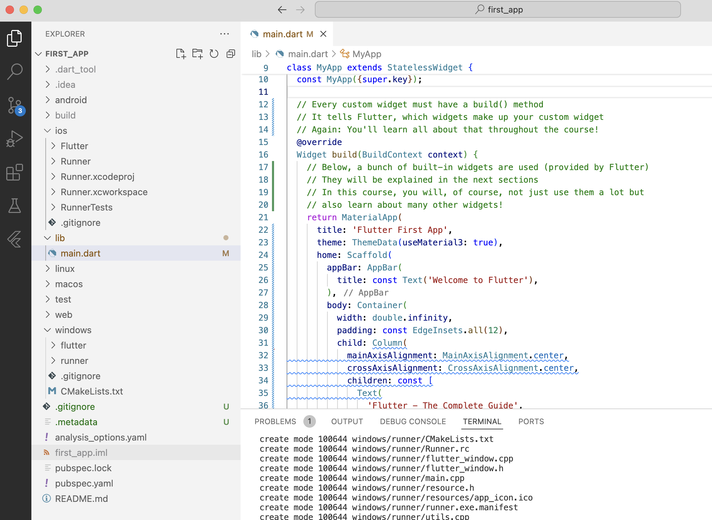
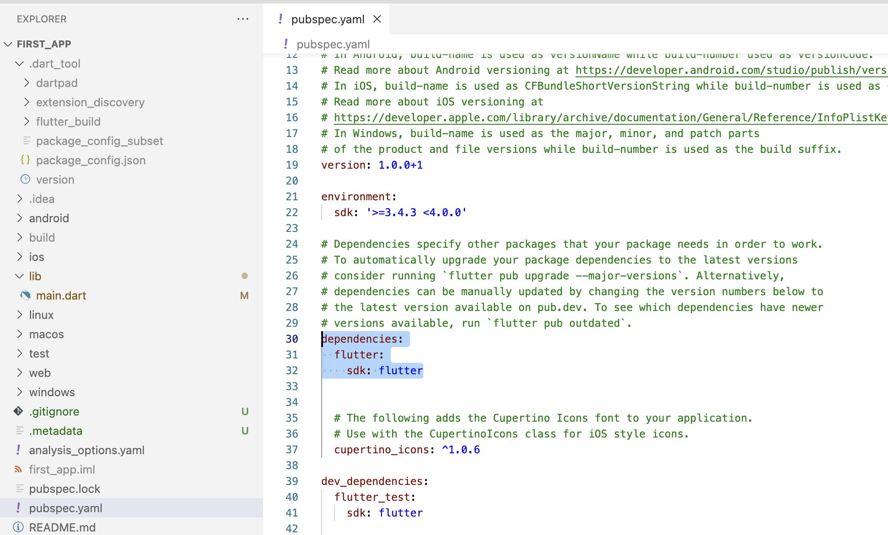

Udemy course - Flutter & Dart - The Complete Guide (2024 Edition)  ([link](https://capitalone.udemy.com/course/learn-flutter-dart-to-build-ios-android-apps/learn/lecture/37142922#overview))
### What is it
With `Flutter`, one codebase can generate products for iOS, Android, Windows, macOS, Linux, Web.

Provides UI framework that can take care of above platforms. Also, has a collection of tools to run the code and debug in above platforms.

The programming language used is `Dart` (provided by Google). It can also be used for things outside Flutter but is mainly used for app development with Flutter.



Xcode is needed to build iOS apps still, and Android Studio to build Android apps.

### Installation

Formal instructions are in https://docs.flutter.dev/get-started/install.

It can either be installed through VS Code using `Flutter extension` or directly through a bundle ([steps](https://docs.flutter.dev/get-started/install/macos/mobile-ios?tab=download#install-the-flutter-sdk)). With VS code, after installing Flutter extension, create a new Flutter project from command palette ('Cmd Shift P' and type 'flutter') and it then asks to download the Flutter SDK, do that (If asks where to save the SDK, select a path such as '~/developer/').

| 1. Install Flutter extension                                   | 2. Download Flutter SDK                                        | 3. Add Flutter path to `$PATH`                                 |
| -------------------------------------------------------------- | -------------------------------------------------------------- | -------------------------------------------------------------- |
|  |  |  |

Running `flutter doctor` confirms if Flutter has been installed.


### Creating and running an app
##### Creating a new app
```
flutter create first_app   ---- Create new Flutter project
```


##### Selecting the run destination

Go to command palette and type `Flutter: Launch Emulator`, it will then give option to select iOS/Android etc. The selected Run Destination also shows up on 


#### Running the app

First launch the run destination using command palette, and then hit the Run button above `main()` of `main.dart` or just run the command `flutter run`. There are also main options which say 'Run', etc,



Console logs while running.


> Running the app on device can be done in usual native Android/iOS way from Android Studio/Xcode as there is an xcodeproj generated too (in case of iOS).
### Project Structure

`lib` - Has the actual code you write.

Platform specific files are there in corresponding folders (ios, android, web, etc.)



`build` folder contains temporary build and output files. `test` folder has the test files. The folders starting with dot contain configuration files. `analysis_options.yaml` file is where several settings can be tweaked. The `.iml` file is another file managed by Flutter. The `pubsec.yaml` file however is an important file that can be used to specify dependencies.

### Some functions, etc.

`runApp()` method in main.dart is likely the entry point to a Flutter app ([link]()).

Dependencies are specified in `pubspec.yaml` > `dependncies`, and then imported as needed in dart files.


| Specify dependencies       | Import dependencies                             |
| -------------------------- | ----------------------------------------------- |
|  |  |

### Some more concepts

`Material Design` - Flutter (rather Google's) UI design standards ([link](https://m3.material.io)). Flutter probably also provides a library with UI elements that adhere to it.

`Widgets` - Something like UIView, that is basic building block for UI. All widgets are Dart objects.

`Widget Tree` - Same thing as view hierarchy.

Flutter's Widget catalog ([official reference](https://docs.flutter.dev/ui/widgets))


`MaterialApp` - The main (root) widget for any app

`Text` - A widget for labels.

`Scaffold` - A widget for showing drawers and bottom sheets.

There is something called 'stateful widgets'.


#### Widget, Element, Render Trees

Developers don't directly deal with `Element Tree` or `Render Tree`, they are Flutter's implementation level constructs.


`build()` function is something that updates the UI.


#### Keys

Some concept related to Element Tree, and can actually be added in the code.


### Using device features

For taking pictures, `image_picker` package ([link](https://pub.dev/packages/image_picker)) needs to be used. It uses `PHPicker` from iOS' PhotoKit.

For working with location, `location` package ([link](https://pub.dev/packages/location)) needs to be used.

For working with SQLite, `sqflite` package ([link](https://pub.dev/packages/sqflite)) needs to be used.

Writing custom platform-specific code ([link](https://pub.dev/packages/sqflite)) - Flutter's builtin platform-specific API support doesn't rely on code generation, but rather on a flexible message passing style. Alternatively, you can use the [Pigeon](https://pub.dev/packages/pigeon) package for sending structured typesafe messages with code generation. So even if Flutter doesn't provide a package for some particular device specific thing, it produces a package for code generation using strings (to give some way still).


As an example -


### Adding Flutter to existing native mobile apps

Its possible to add single screen or even full features (i.e. sequence of screens) to existing app. The former is probably done by importing Flutter pods and then basing view controllers off it, and the latter by exposing the feature built in Flutter as another module using Cocoapods, etc. that can then be consumed in the native mobile app.

Reference ([link](https://docs.flutter.dev/add-to-app/ios/project-setup)) <br>
Medium article ([link](https://dave790602.medium.com/introduction-to-communication-between-flutter-and-native-f746c112513d)) <br>
