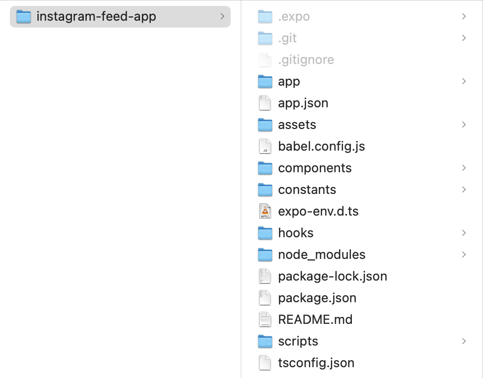
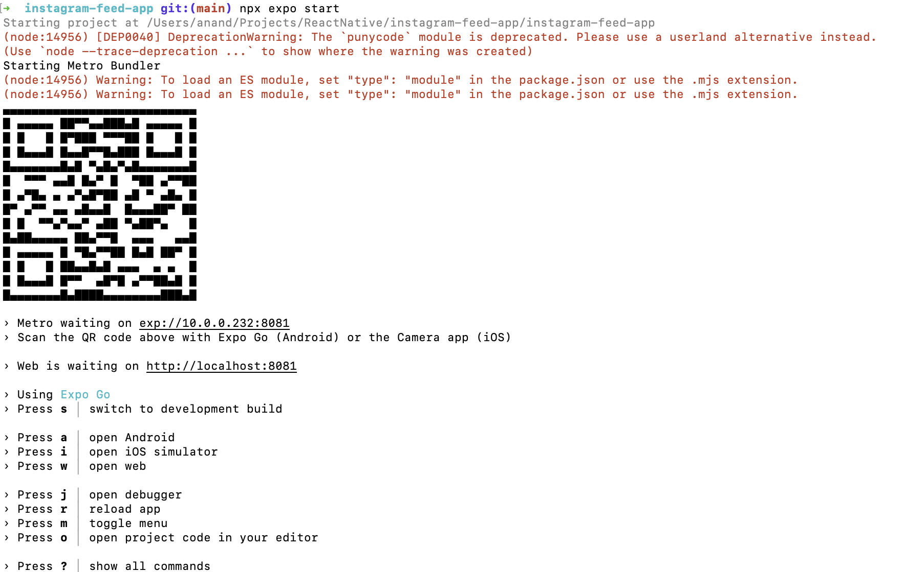
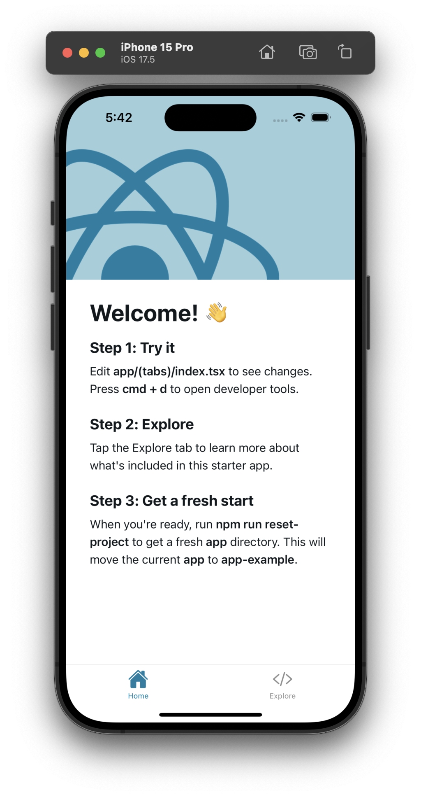
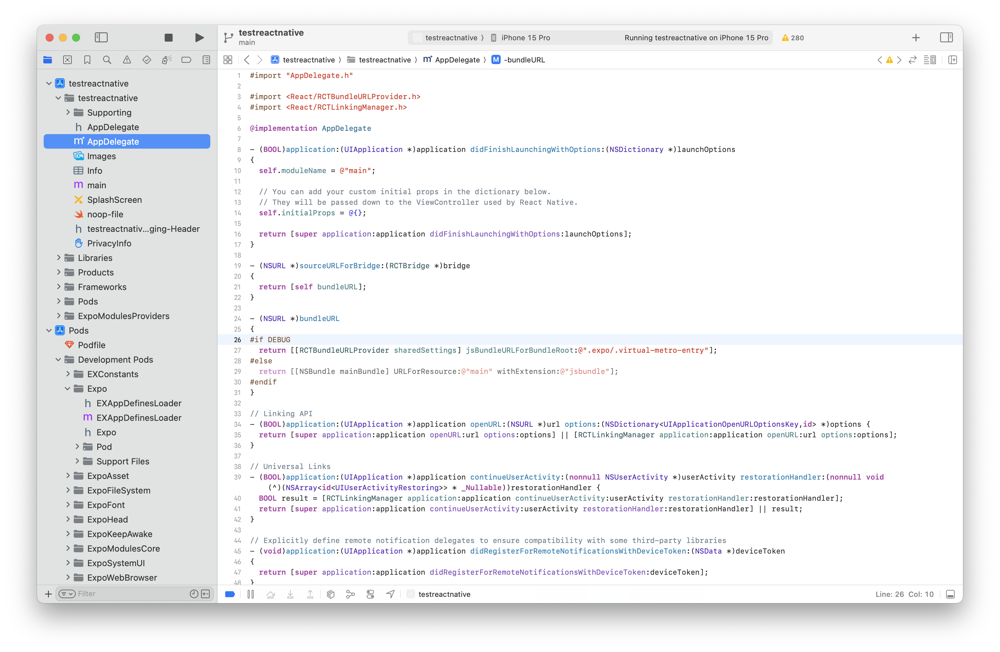
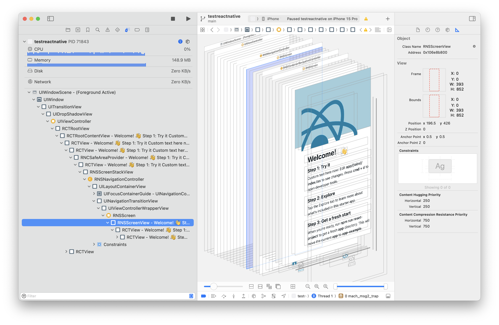

[toc]

`Expo` is a bunch of JS packages and CLI that can be used for various things in RN development  ([link](https://docs.expo.dev/get-started/introduction/)). This includes tools to create new project, start a web server, live preview, develop UI, etc. Any RN app that uses Expo is termed as `Expo app`.

> A RN project doesn't have to use Expo, but it looks like its the most common way to develop RN apps. Well, there is another package named `react-native` ([link](https://www.npmjs.com/package/react-native)),  may be that is what can be used.

#### Creating new app and Testing

```
npx create-expo-app appName
npx expo start
```


`create-expo-app` is a npm package that creates universal React apps ([link](https://www.npmjs.com/package/create-expo-app)). The below command creates a new project.

```swift
npx create-expo-app instagram-feed-app
```

The file system looks like this.




`npx expo start`



Tapping `i` installs Expo Go app on simulator. That app I think has all apps that are built using ReactNative. And then you can go to your apps from the list in it.

| *Home* screen                                                | One of the apps                                              |
| ------------------------------------------------------------ | ------------------------------------------------------------ |
|  |  |

> The QR like code that shows up after 'npx expo start' is something that can be scanned (the shell needs to have a dark theme for it to be scannable) with physical iOS device (have Expo Go app installed from App Store though) and then the app opens up in simulator. It gets the source code using bluetooth from a local server that starts on Mac.


#### Expo CLI

So `create-expo-app` ([link](https://www.npmjs.com/package/create-expo)) and `expo` ([link](https://www.npmjs.com/package/expo)) are two npm packages which can be run using `npx` and they can then do majority of the work.

##### create-expo-app

`npx create-expo-app appName` - Creates project for the mentioned app

##### start

`npx expo start` - Starts a server

##### run

`npx expo run:ios` - Creates a native xcodeproj/xcworkspace, and builds and runs the app. It creates and builds the app (the entire build process logs show up in console), starts the Expo server, and then runs the app through the usual Metro bundler. If some change is made in native code and it has to be reflected here, I think this needs to be done (just starting the server will not suffice).

`npx expo run:android` - The Android equivalent of above.

##### prebuild

The projects can in fact even be created using `npx expo prebuild`.

##### install

`npx expo install xyzPackage` - Used just like 'npm install' to install packages. 'npm install' should not be used in RN projects as it cannot ensure that a package will be comaptible with the RN version being used in the project (npx expo install) does.

##### Structure of created xcodeproject

It uses Cocoapods. Various React related pods are present as 'Development Pods'.



The generated view hierarchy - (Seems to be RN specific subclasses of usual UIKit views.)



The xcworkspace itself can be run too from Xcode, but the server has to be running for UI to show up (that can be done using the usual `npx expo start`).
