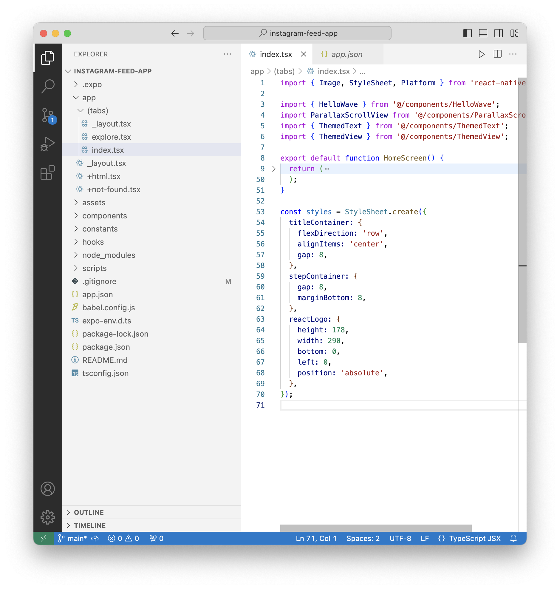

##### File structure of the codebase

`.expo` folder is created when an Expo project is started with `expo start`. Assets are stored in `assets/`. 

`node_modules` has the libraries that are imported with React Native. 

`app.js` is the starting point in JS based projects. For TS based projects its possibly `app/tabs/index.ts`.

Index.ts has a function namd `HomeScreen()` which is probably the starting point and has styles defined too in a variable named styles.

`app.json` has some basic app config.

| index.ts                                                     | app.json                                                     |
| ------------------------------------------------------------ | ------------------------------------------------------------ |
|  |  |

`package.json` has a list of all packages used along with their version numbers.