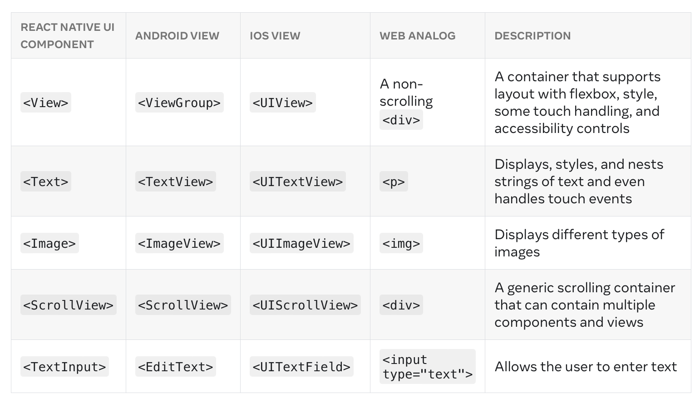
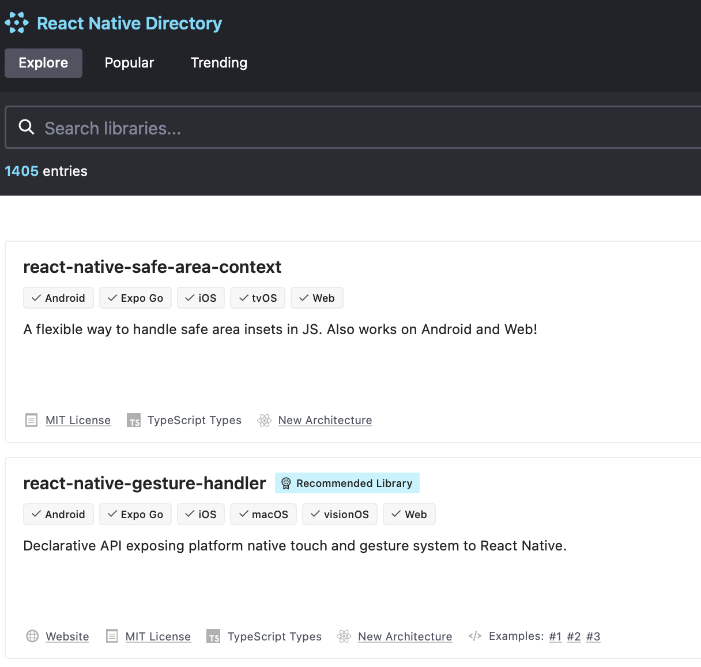

[toc]

### Components

Ar runtime, RN creates the native Android and iOS views. The UI components that correspond to these native platform views that can get rendered are called `Native Components`, and such UI components that come bundled with RN are called `Core Components`. 

#### React Components

React is an open source library of JS UI components (actually meant for web), and React Native is something that runs on top of React. The React components are known as `React Components` and the RN components are known as  `React Native Components`.

`React element` is the same thing as a UI element. Here the entire function is a React Component, and it returns a UI element Text. The entire function component can be exported and used wherever needed.

`````jsx
const Cat = () => {
  return <Text>Hello, I am your cat!</Text>;
};

export default Cat;
`````

##### JSX

`JSX` is a JS extension that lets you write HTML like markup UI elements inside JS ([link](https://react.dev/learn/writing-markup-with-jsx)). The Text element above is written in JSX.

```jsx
<Text>Hello, I am {getFullName('Rum', 'Tum', 'Tugger')}!</Text>
```

##### Props

`Props` (i.e. properties) that components can be initialized with, which then allow some attribute of the UI to be modified.

In the below example, the 'Cat' component takes in a prop, which then gets passed each of the three times it is initialized in the later 'Cafe' component.

```jsx
const Cat = (props: CatProps) => {
  return (
    <View>
      <Text>Hello, I am {props.name}!</Text>
    </View>
  );
};

const Cafe = () => {
  return (
    <View>
      <Cat name="Maru" />
      <Cat name="Jellylorum" />
      <Cat name="Spot" />
    </View>
  );
};
```

##### State and Hooks

State is well the usual state concept, i.e. associated data of a component such that if the data changes the UI also gets automatically updated. You can add state to a component by calling React’s `useState` Hook. A `Hook` is a kind of function that lets you 'hook into' React features ([reference](https://react.dev/reference/react/hooks)).

In the below example, 'isHungry' works as a state by the virtue of `useState` hook.

`````jsx
type CatProps = {
  name: string;
};

const Cat = (props: CatProps) => {
  const [isHungry, setIsHungry] = useState(true);

  return (
    <View>
      <Text>
        I am {props.name}, and I am {isHungry ? 'hungry' : 'full'}!
      </Text>
      <Button
        onPress={() => {
          setIsHungry(false);
        }}
        disabled={!isHungry}
        title={isHungry ? 'Give me some food, please!' : 'Thank you!'}
      />
    </View>
  );
};

const Cafe = () => {
  return (
    <>
      <Cat name="Munkustrap" />
      <Cat name="Spot" />
    </>
  );
};
`````


#### React Native Components

##### Core Components

All the Core Components are listed [here](https://reactnative.dev/docs/components-and-apis).

Here are some of the commonly used Core Components.



##### Custom native components

Custom native components too can be created, many such third party components are available in RN directory ([link](https://reactnative.directory)).



##### Creating custom components

Core components can be nested inside each other to create custom native components. The below example combines `View`, `Text`, `TextInput`.

`````jsx
<View>
  <Text>Hello, I am...</Text>
  <TextInput
    style={{
      height: 40,
      borderColor: 'gray',
      borderWidth: 1,
    }}
    defaultValue="Name me!"
  />
</View>
`````


#### Fabric Native Components

A `Fabric Native Component`  ([link](https://github.com/reactwg/react-native-new-architecture/blob/main/docs/fabric-native-components.md)) is a Native Component rendered on the screen using the Fabric Renderer. Its essentially the component in the New Archietcture. `Fabric` is React Native's new rendering system ([link](https://reactnative.dev/architecture/fabric-renderer)).
