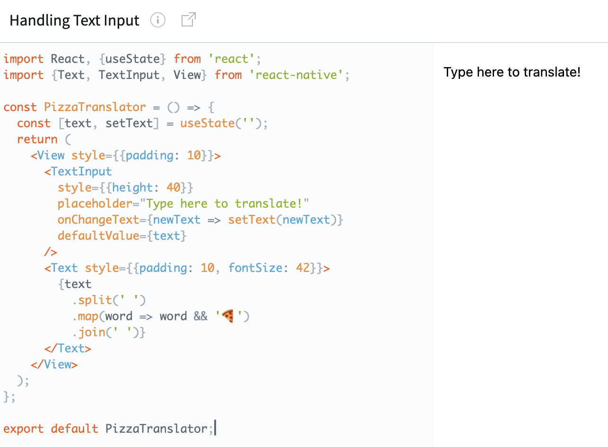
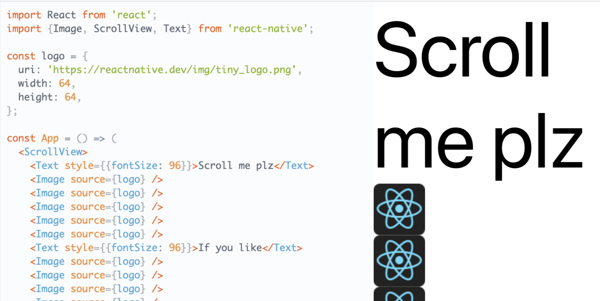
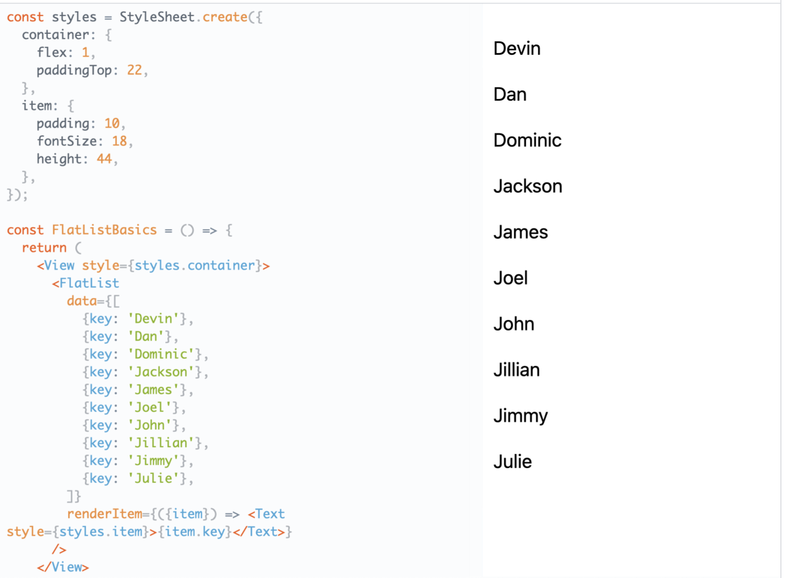
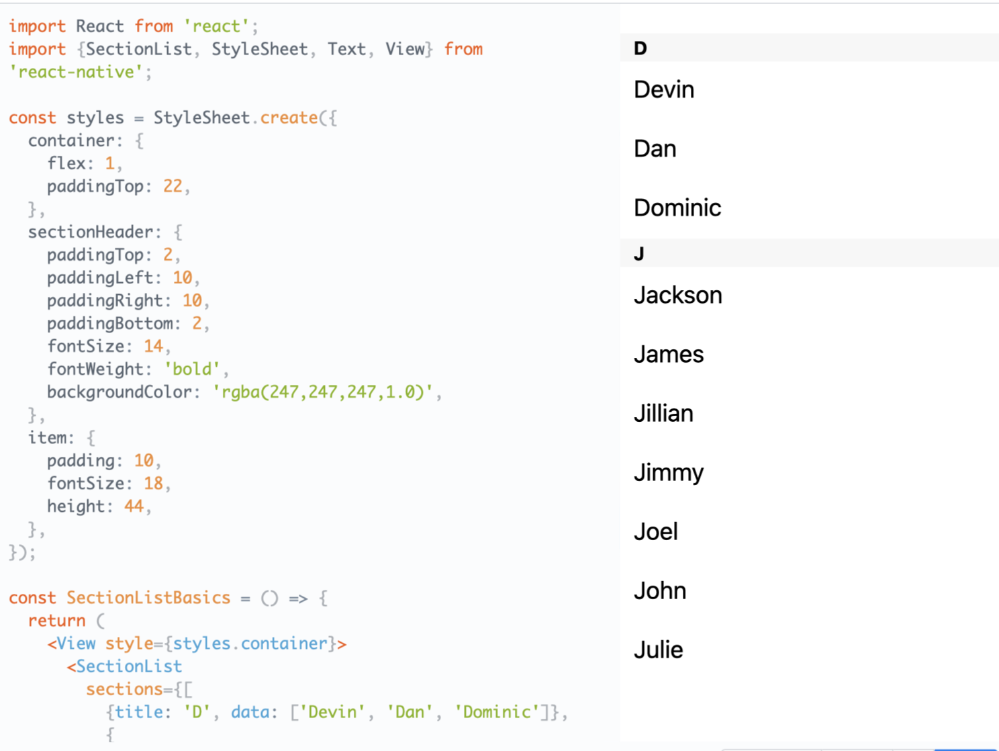

[toc]

#### TextInput

`TextInput` is like a textfield.  Has an `onChangeText` prop that takes a function to be called every time the text changed, and an `onSubmitEditing` prop that takes a function to be called when the text is submitted. ([Reference](https://reactnative.dev/docs/textinput))

#### ScrollView

`ScrolldView` is like a scroll view. ([Reference](https://reactnative.dev/docs/scrollview))

#### List Views (FlatList, SectionList)

These are actually a suite of components that provide a table view like capability.

`FlatList` component displays a scrolling list of changing, but similarly structured, data. `FlatList` works well for long lists of data, where the number of items might change over time. Unlike the more generic `ScrollView`  the `FlatList` only renders elements that are currently showing on the screen, not all the elements at once. ([reference](https://reactnative.dev/docs/flatlist))

It requires two props: `data` and `renderItem`. `data` is the source of information for the list. `renderItem` takes one item from the source and returns a formatted component to render.

` SectionList` is what is used to render the list in separate sections. ([reference](https://reactnative.dev/docs/sectionlist))

Optimizing Flatlist Configuration ([link](https://reactnative.dev/docs/optimizing-flatlist-configuration))