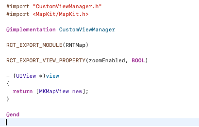
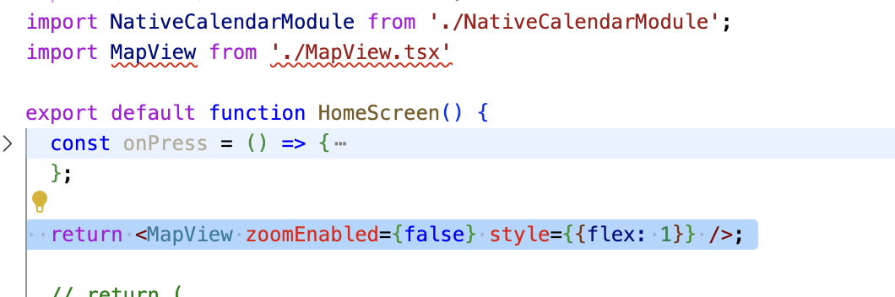

[toc]

[Referecnce](https://reactnative.dev/docs/native-components-ios)

##### What is the idea here

The idea is to create a custom UIView in Xcode, and be able to use it as a RN JS component.

| So something like this in native Xcode                       | Will be usable in RN like this                               |
| ------------------------------------------------------------ | ------------------------------------------------------------ |
|  |  |

> Note though that `Native Components` are being replaced by `Fabric Native Components` ([link](https://github.com/reactwg/react-native-new-architecture/blob/main/docs/fabric-native-components.md)) in the New Architecture ([link](https://reactnative.dev/docs/native-components-ios)). It allows the native code to be written in C++/

##### The technical gist

Native views are created and manipulated by subclasses of `RCTViewManager`. These subclasses are similar in function to view controllers, but are essentially singletons - only one instance of each is created by the bridge (so even if a custom native view is needed across multiple screens, it will still just be only a single instance at work in each of them?). They expose native views to the `RCTUIManager` .

##### How to do it

In Xcode, a manager class needs to be created that conforms to `RCTViewManager`. 

```
#import <React/RCTViewManager.h>

NS_ASSUME_NONNULL_BEGIN
@interface CustomViewManager : RCTViewManager
@end
NS_ASSUME_NONNULL_END
```

In the implementation, `RCT_EXPORT_MODULE` needs to be called and the name by which the native components should be accessible passed there. The view to be returned by it must be returned from its `-view()` method. 

```
#import "CustomViewManager.h"
#import <MapKit/MapKit.h>

@implementation CustomViewManager
RCT_EXPORT_MODULE(RNTMap)
- (UIView *)view
{
  return [MKMapView new];
}
@end
```

Then over in ReactNative project, it can be accessed as a component using `requireNativeComponent()`.

``` 
// MapView.tsx

import {requireNativeComponent} from 'react-native';

// requireNativeComponent automatically resolves 'RNTMap' to 'RNTMapManager'
module.exports = requireNativeComponent('RNTMap');
```

And then it can be consumed from other places in the RN project.

```
import MapView from './MapView.tsx'

export default function HomeScreen() {
  return <MapView zoomEnabled={false} style={{flex: 1}} />;
}
```

> Do not attempt to set the `frame` or `backgroundColor` properties on the `UIView` instance that you expose through the `-view` method. React Native will overwrite the values set by your custom class in order to match your JavaScript component's layout props. If you need this granularity of control it might be better to wrap the `UIView` instance you want to style in another `UIView` and return the wrapper `UIView` instead.

##### Properties

If any property of the native view needs to be exposed in the component, that can be done through `RCT_EXPORT_VIEW_PROPERTY`.

```
RCT_EXPORT_VIEW_PROPERTY(zoomEnabled, BOOL)
```

The propery type needn't be simple things like bools, they can be about anything. Objective-C receives them as JSON and can convert as needed.

> Now we have a `MKCoordinateRegion`type that needs a conversion function, and we have custom code so that the view will animate when we set the region from JS. Within the function body that we provide, `json` refers to the raw value that has been passed from JS. There is also a `view` variable which gives us access to the manager's view instance, and a `defaultView` that we use to reset the property back to the default value if JS sends us a null sentinel. ..... <br> <br>You could write any conversion function you want for your view - here is the implementation for `MKCoordinateRegion` via a category on `RCTConvert`. I

##### JSX Properties

The entire thing can be put in a wrapper of its own, along with JSX props and necessary documentation comments. ([Reference](https://reactnative.dev/docs/native-components-ios#properties))

