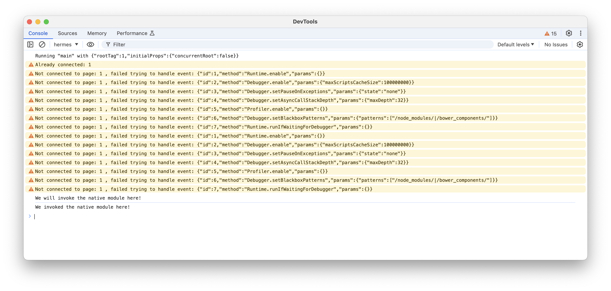
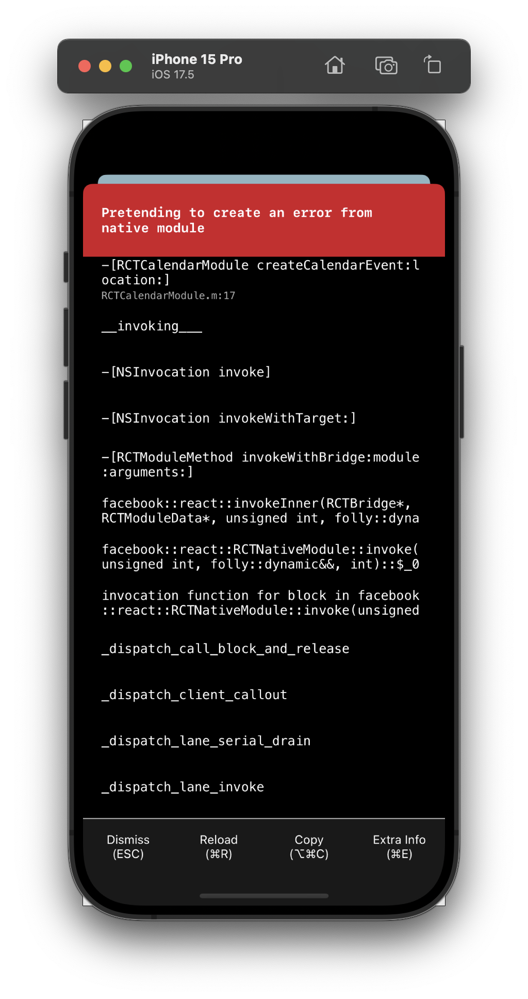
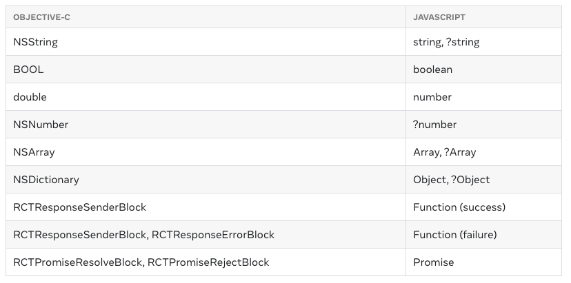

[toc]

Its basically a way to have native code be callable from RN. That's why the term `Native Modules` . In JS, module is a file and these are 'native files'. ([Reference](https://reactnative.dev/docs/native-modules-intro))

> Note though that `Native Modules` is being replaced by `Turbo Native Modules` ([link](https://github.com/reactwg/react-native-new-architecture/blob/main/docs/turbo-modules.md)) in RN's [New Architecture](https://github.com/reactwg/react-native-new-architecture/tree/main). Apart from other improvements, it will even allow to code in C++, reducing the need to duplicate implementations across platforms.

##### What is a Native Module (`RCTBridgeModule` ObjC protocol)

In the generated xcodeproj/xcworkspace in the iOS folder of the RN project, create the desired file in ObjC (i.e. both .h and .m files).

In the interface file (.h), import `React/RCTBridgeModule.h` and have the class conform to `RCTBridgeModule` protocol. 

> And technically that is what the definition of a Native module in iOS is, i.e. its an Objective-C class that conforms to `RCTBridgeModule` protocol. 

```
#import <React/RCTBridgeModule.h>
@interface RCTCalendarModule : NSObject <RCTBridgeModule>
@end
```

Interestingly though the interface doesn't need to have anything in it, and the implementation file is where things happen and yet  the things there do get exposed to the RN JS code. A macro named `RCT_EXPORT_MODULE` needs to be called there.

`````
#import "RCTCalendarModule.h"
@implementation RCTCalendarModule
RCT_EXPORT_MODULE();
@end
`````

This macro automatically registers the native module (i.e. the ObjC file) with the JS bridge when it loads. In fact a string (withour parentheses) can also be passed to it, in which case that is the name by which the module is accessible in JS. If no name is sspecified, the JavaScript module name will match the Objective-C class name, with any "RCT" or "RK" prefixes removed.

```jsx
RCT_EXPORT_MODULE(CalendarModuleFoo);
```

##### What code in Native Module gets exposed to RN

RN does not expose any methods in a native module to JavaScript unless explicitly told to. This is done using macros such as  `RCT_EXPORT_METHOD`.

###### RCT_EXPORT_METHOD

Any method implementation wrapped in `RCT_EXPORT_METHOD` exposes the method to JS. 

For example this in ModuleName.m

``` 
RCT_EXPORT_METHOD(doSomething:(NSString *)aString
                        withA:(NSInteger)a
                         andB:(NSInteger)b)
```

gets exposed in JS as `NativeModules.ModuleName.doSomething`.

Such methods are executed asynchronously and the return type is always void. A result can be communicated using callbacks or by emitting events. For that Declare the last two parameters of your native method to be a resolver block, and a rejecter block. The resolver block must precede the rejecter block.

With

```
RCT_EXPORT_METHOD(doSomethingAsync:(NSString *)aString
                          resolver:(RCTPromiseResolveBlock)resolve
                          rejecter:(RCTPromiseRejectBlock)reject
```

calling `NativeModules.ModuleName.doSomethingAsync(aString)` from JavaScript will return a promise that is resolved or rejected when your native method implementation calls the respective block.

Callbacks ([link](https://reactnative.dev/docs/native-modules-ios#callbacks)) <br>Promises ([link](https://reactnative.dev/docs/native-modules-ios#promises))

###### RCT_EXPORT_BLOCKING_SYNCHRONOUS_METHOD

For having synchronous methods, `RCT_EXPORT_BLOCKING_SYNCHRONOUS_METHOD` should be used. Its executed on the JS thread. The return type of this method must be of object type (id) and should be serializable to JSON. This means that the hook can only return nil or JSON values (e.g. NSNumber, NSString, NSArray, NSDictionary).

 Its however not recommended for use as it can cause threading-related bugs (but why bug if its done properly?). Also, if you choose to use `RCT_EXPORT_BLOCKING_SYNCHRONOUS_METHOD`, your app can no longer use the Google Chrome debugger. This is because synchronous methods require the JS VM to share memory with the app. For the Google Chrome debugger, React Native runs inside the JS VM in Google Chrome, and communicates asynchronously with the mobile devices via WebSockets.

##### Accessing Native Module from RN

Firstly, `NativeModules` must be imported from `react-native`.

```
import {NativeModules} from 'react-native';
```

In JS, the native module can then be accessed. Over here I think its accessed using Object Destructuring, i.e. all properties an object can be assigned to named variables (it doesn't matter if the object has more properties, just the property with the name mentioned in the variable on left side gets extracted and assigned to that named variable.

```
const {CalendarModule} = ReactNative.NativeModules;
```

And then the native method can be invoked.

```
CalendarModule.createCalendarEvent('testName', 'testLocation');
```

To test it, you can just put a button in some component and have it invoked on button tap.

```jsx
const onPress = () => {
  console.log('We will invoke the native module here!');
  CalendarModule.createCalendarEvent('testName', 'testLocation');   <---- NATIVE MODULE CALLED HERE
  console.log('We invoked the native module here!');
};

return (
  <ParallaxScrollView ...>
    <Button title="Test button" color="#841584" onPress={onPress}></Button>
    ...
  </ParallaxScrollView>
);
```

##### Encapsulating native module interface in a separate JS/TSX file

For the above example, the following can be put in a separate TypeScript (.tsx) file so that the full drill need not be done in every RN consumer file.

```
// File name NativeCalendarModule.tsx

import {NativeModules} from 'react-native';

const {CalendarModule} = NativeModules;
interface CalendarInterface {
  createCalendarEvent(name: string, location: string): void;
}
export default CalendarModule as CalendarInterface;   <---- THIS SYNTAX IS DIFFERENT IN JS (TSX SHOWN HERE)
```

And then it can be consumed like this in RN TypeScript files.

```
// The relative path here changes based on where the current file is
import NativeCalendarModule from './NativeCalendarModule';

NativeCalendarModule.createCalendarEvent('foo', 'bar');
```

##### How to run it

The native code then has to be built using `npm expo run:ios`, etc. for it to take effect.

##### Debugging

So if a console message is printed from ObjC method using `RCTLogInfo`

```
RCT_EXPORT_METHOD(createCalendarEvent:(NSString *)name location:(NSString *)location)
{
 RCTLogInfo(@"Pretending to create an event %@ at %@", name, location);
}
```

Its supposed to be viewable in console log of JS console in Chrome, but just couldn't get it show. If however, I log a `RCTLogError` that showed right away in the app. So the native module code is running, but not clear on getting normal log messages to show up.

| RCTLogInfo logs didn't show up in Chrome's JS console        | RCLogError did show up in simulator                          |
| ------------------------------------------------------------ | ------------------------------------------------------------ |
|  |  |

##### Method Argument Type mapping from ReactNative to Native

That is a `number` passed from JS, is received by native as `NSNumber`.



In case of iOS, native module methods can also be written with any argument type that is supported by the `RCTConvert` class ([link](https://github.com/facebook/react-native/blob/main/packages/react-native/React/Base/RCTConvert.h)). The RCTConvert helper functions all accept a JSON value as input and map it to a native Objective-C type or class.

For example, a JSON can be sent from RN and automatically mapped to NSURLRequestCachePolicy in native side.

```
+ (NSURLRequestCachePolicy)NSURLRequestCachePolicy:(id)json;
```

##### NativeModule written in Swift

This basically means writing the code in Swift, exposing it to Objective-C with `@objc` qualifier (and having the bridging header file as is standard), and then creating the ObjC native module using the standard way. So its possible, but indirectly. ([link](https://reactnative.dev/docs/native-modules-ios#exporting-swift))

##### Misc.

###### Exporting constants

Its possible to export constants from native to RN using `constantsToExport`. ([link](https://reactnative.dev/docs/native-modules-ios#exporting-constants))

###### Signaling events

Native modules can signal events to JavaScript without being invoked directly. This is done using `RCTEventEmitter`. JavaScript code can subscribe to these events by creating a new `NativeEventEmitter` instance . ([link](https://reactnative.dev/docs/native-modules-ios#sending-events-to-javascript))

###### Threading

Unless the native module provides its own method queue, it shouldn't make any assumptions about what thread it's being called on. Currently, if a native module doesn't provide a method queue, React Native will create a separate GCD queue for it and invoke its methods there. Please note that this is an implementation detail and might change. If you want to explicitly provide a method queue for a native module, override the (`dispatch_queue_t`) methodQueue method in the native module. ([link](https://reactnative.dev/docs/native-modules-ios#threading))

> There is more here.

###### Dependency Injection(`RCTBridgeDelegate`)

RN create and initialize any registered native modules automatically. This is something to do with doing it manually so that unit testing can be done? ([link](https://reactnative.dev/docs/native-modules-ios#dependency-injection))

##### Resources

Official tutorial ([link](https://reactnative.dev/docs/native-modules-ios#create-a-calendar-native-module))

##### Prev Notes.

> But how are these different from '3. Linking native libraries in RN app'. Is it that in the previous a public pod can be used, here a fresh local library gets used in some way.

###### The Basics

There are 3 ways the `NativeModule` system can be set up.

1. Creating a local library that can be imported in your React Native application.
2. Directly within your React Native application's iOS/Android projects (that is what this note covers)
3. As a NPM package that can be installed as a dependency by your/other React Native applications.

###### Native Modules as NPM Package 

Done using `npx create-react-native-library`. ([link](https://reactnative.dev/docs/native-modules-setup))