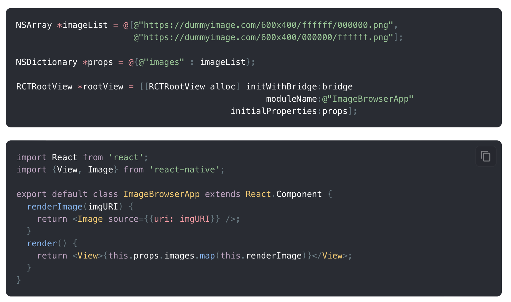

[Link](https://reactnative.dev/docs/communication-ios)

#### Properties

Properties are the most straightforward way of cross-component communication. In order to embed a React Native view in a native component, we use RCTRootView. RCTRootView is a UIView that holds a React Native app. It also provides an interface between native side and the hosted app. 

The main drawback of cross-language properties is that they do not support callbacks.

##### Passing properties from native to React Native

RCTRootView has an initializer that allows you to pass arbitrary properties down to the React Native app. The initialProperties parameter has to be an instance of NSDictionary. The dictionary is internally converted into a JSON object that the top-level JS component can reference.

##### Passing properties from React Native to native

Export properties with RCT_CUSTOM_VIEW_PROPERTY macro in your custom native component, then use them in React Native as if the component was an ordinary React Native component.

#### Calling React Native functions from native (events)

[Link](https://reactnative.dev/docs/communication-ios#calling-react-native-functions-from-native-events)

#### Calling native functions from React Native (native modules)

[Link](https://reactnative.dev/docs/communication-ios#calling-native-functions-from-react-native-native-modules)

#### Layout Computational Flow

[Link](https://reactnative.dev/docs/communication-ios#layout-computation-flow)