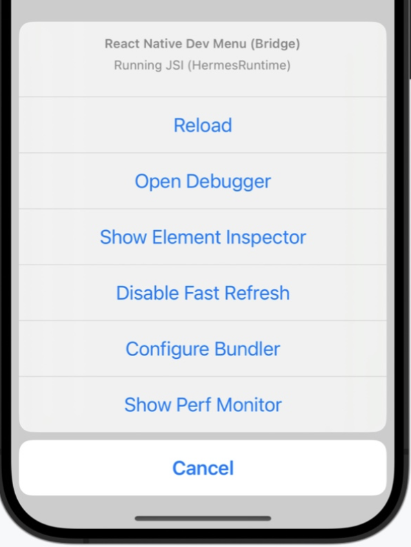
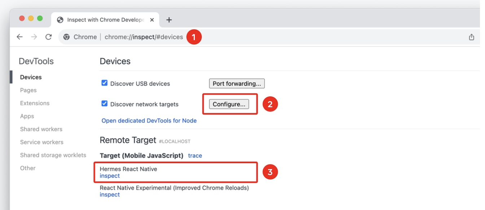
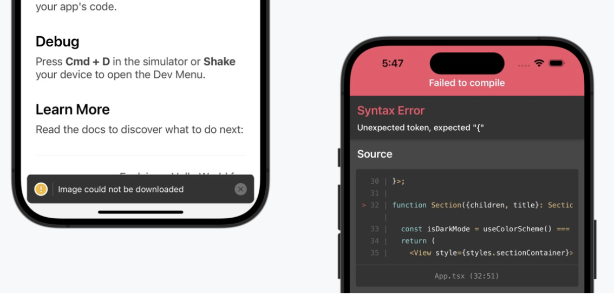

[toc]

##### Dev Menu

These bring up some debug options in simulator.

iOS Simulator: Cmd ⌘ + D (or Device > Shake)
Android emulators: Cmd ⌘ + M (macOS) or Ctrl + M (Windows and Linux)



##### Open Debugger

In case of Hermes (an opensource JS package for better memory usage, and smaller app size) Debugger/Expo, Chrome debugger is accessible. This means Chrome's tools can be used to directly debug JavaScript running on Hermes.



`Flipper` is yet another native debugging tool which provides JavaScript debugging capabilities.

##### React DevTools

Its a package (`npx react-devtools`) that can be used to inpect React element tree, props, and state.

##### LogBox

Errors and warnings in development builds are displayed inside app.



Console errors and warnings are displayed as on-screen notifications with a red or yellow badge. When a JavaScript syntax error occurs, LogBox will open with the location of the error.

##### Native Logs

Console logs for an iOS or Android app by using the following commands in a terminal while the app is running:

`````
# For Android:
npx react-native log-android
# For iOS:
npx react-native log-ios
`````

