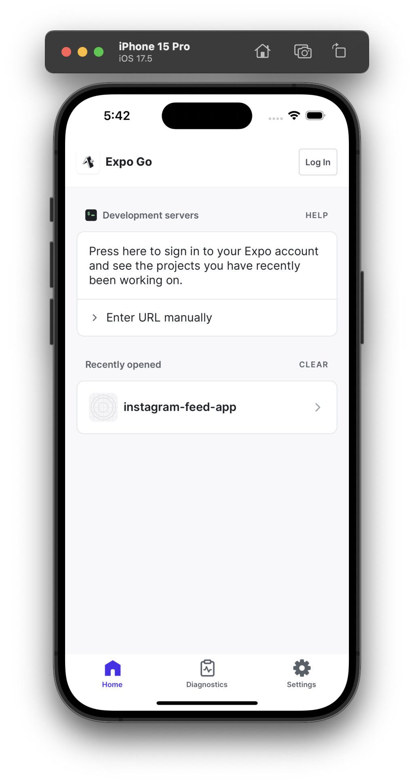
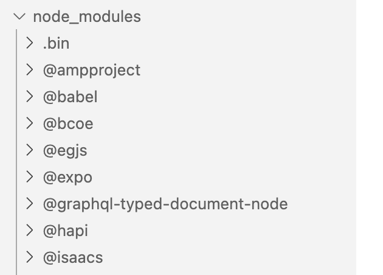
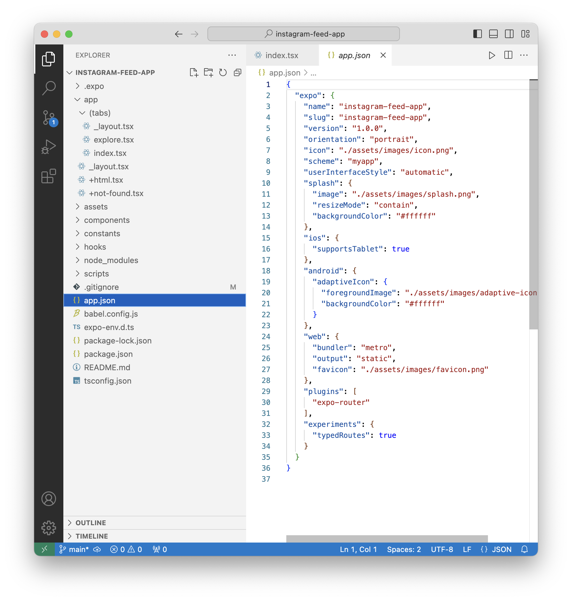
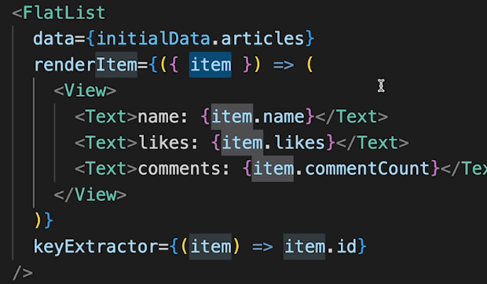

Did the Udemy course 'Build a Mobile Instagram Feed App with React Native and ChatGPT' ([link](https://capitalone.udemy.com/course/the-complete-chatgpt-with-react-native-mobile-application/learn/lecture/35948940#overview)) upto 4.5 chapters and got an idea of what ReactNative is and what its tooling and dev workflow looks like.

Code Visual Studio, save files, and it should refresh. Uses TypeScript now.

No Virtual DOM in it

Testing done in Simulator provided by ExpoGo

ReactNative CLI

Camera can be tested using a QR code

Need - Node.js, ReactNative CLI, Visual Studio Code

Hot restart

------

Installing `nvm` (nvm recommends that it not be installed through Homebrew) [[link](https://github.com/nvm-sh/nvm?tab=readme-ov-file#install--update-script)]

`````
curl -o- https://raw.githubusercontent.com/nvm-sh/nvm/v0.39.7/install.sh | bash
`````

Installing `node` (needs nvm to be installed first)

`````
nvm install node
`````

Updating `npm`

`````
npm install -g npm
`````

`npm list` gives a list of all packages in current directory.

`npm` is a package manager for JavaScript. Its the default package manager for Node.js. It is owned and maintained by GitHub.

`npx` (i.e. `Node Package eXecute`) is NPM package runner, i.e. it can execute any JavaScript package available on NPM registrty without ever installing it. Its probably installed automatically with nvm or npm.

----

`create-expo-app` is a npm package that creates universal React apps ([link](https://www.npmjs.com/package/create-expo-app)).

```swift
npx create-expo-app instagram-feed-app
```

Creates the project. The file system looks like this.


`npx expo start`


Tapping i installs Expo Go app on simulator. That app I think has all apps that are built using ReactNative. And then you can go to your apps from the list in it.

| *Home* screen                                                | One of the apps                                              |
| ------------------------------------------------------------ | ------------------------------------------------------------ |
|  |  |

The QR like code there is something that can be scanned (the shell needs to have a dark theme for it to be scannable) with physical iOS device (have Expo Go app installed from App Store though) and then the app opens up in simulator. It gets the source code using bluetooth from a local server that starts on Mac.

`.expo` folder is created when an Expo project is started with `expo start`. Assets are stored in `assets/`. 

`node_modules` has the libraries that are imported with React Native. 



`app.js` is the starting point in JS based projects. For TS based projects its possibly `app/tabs/index.ts`.

Index.ts has a function namd `HomeScreen()` which is probably the starting point and has styles defined too in a variable named styles.

`app.json` has some basic app config.

| index.ts                                                     | app.json                                                     |
| ------------------------------------------------------------ | ------------------------------------------------------------ |
|  |  |

`package.json` has a list of all packages used along with their version numbers.

-----

`FlatList` is something like a scrollable list view. ([refrence](https://reactnative.dev/docs/flatlist))

JS code



----

Benefits and downsides ([link](https://techexactly.com/blogs/advantages-and-disadvantages-of-using-react-native)) <br>ReactNative downsides ([link](https://blog.back4app.com/react-native-disadvantages/)) <br>

The general theme regarding downsides - Lack of native gestures and animations,  Often needs bridges for device specific capabilities like Map, etc. anyway, Memory management not as good, longer initialization at runtime
