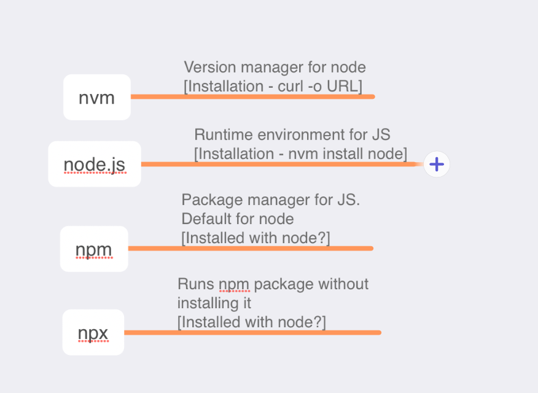

Things to know about a stack -

Know the basic concepts, have the mental model and map understood <br>How to run the app<br>How to debug, etc. <br>

Common issues ([link](https://reactnative.dev/docs/troubleshooting)) <br>`Metro` bundler ([link](https://metrobundler.dev)) - JS bundler for RN, but what does it do. Says loads apps faster, but is that what a JS bundler is <br>

##### Tooling

##### Installing nvm, node



Installing `nvm` (nvm recommends that it not be installed through Homebrew) ([link](https://github.com/nvm-sh/nvm?tab=readme-ov-file#install--update-script))

`````
curl -o- https://raw.githubusercontent.com/nvm-sh/nvm/v0.39.7/install.sh | bash
`````

Installing `node` (needs nvm to be installed first)

`````
nvm install node
`````

Updating `npm`

`````
npm install -g npm
`````

`npm list` gives a list of all packages in current directory.

`npm` is a package manager for JavaScript. Its the default package manager for Node.js. It is owned and maintained by GitHub.

`npx` (i.e. `Node Package eXecute`) is NPM package runner, i.e. it can execute any JavaScript package available on NPM registrty without ever installing it. Its probably installed automatically with nvm or npm.

> `Yarn` is another package manager that is used by some people, it has slighly better installation times and offers some more features such as 'workspaces'.

##### Misc.

Hot loading/restart is where you save a file in Visual Studio and the UI in simulator refreshes <br>
No Virtual DOM in it <br>Camera can be tested using a QR code

The regular JS `Fetch` ([link](https://developer.mozilla.org/en-US/docs/Web/API/Fetch_API)) is used for networking, i.e. REST calls, etc. 

Accessibility resources ([link](https://reactnative.dev/docs/accessibility))

`Expo Router` is what is used to navigate between screens. ([link](https://docs.expo.dev/develop/file-based-routing/))

`react-native-safe-area-context` is an Expo library used to work with safe area real estate. `react-native-reanimated` is the library to work with advanced animations.

`Fast refresh` is the automatic reloading of UI on simulator. Its usually enabled by default. ([link](https://reactnative.dev/docs/fast-refresh))

Timers ([link](https://reactnative.dev/docs/timers))

App Extensions ([link](https://reactnative.dev/docs/app-extensions))

##### Resources

Udemy course 'Build a Mobile Instagram Feed App with React Native and ChatGPT' ([link](https://capitalone.udemy.com/course/the-complete-chatgpt-with-react-native-mobile-application/learn/lecture/35948940#overview)) (Did upto 4.5 chapters and got an idea of what ReactNative is)

Benefits and downsides ([link](https://techexactly.com/blogs/advantages-and-disadvantages-of-using-react-native)) <br>ReactNative downsides ([link](https://blog.back4app.com/react-native-disadvantages/)) <br>Communication between native and React native ([link](# Communication between native and React Native))

The general theme regarding downsides - Lack of native gestures and animations,  Often needs bridges for device specific capabilities like Map, etc. anyway, Memory management not as good, longer initialization at runtime

