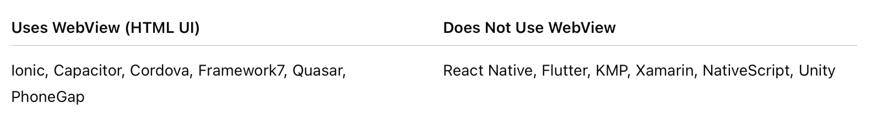
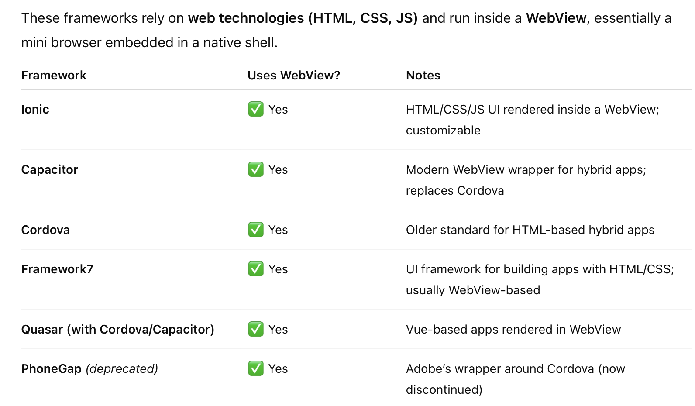

IDE - Language - How to run

|                      | IDE  | Language   | UI Rendering                                                 | How to Run |
| -------------------- | ---- | ---------- | ------------------------------------------------------------ | ---------- |
| ReactNative          |      | TypeScript | Uses high level native UI frameworks                         |            |
| Flutter              |      | Dart       | Skia, a rendering engine built on top of low level native UI frameworks |            |
| Kotlin Multiplatform |      | Kotlin     | UI written natively (by consuming apps?)                     |            |

`React Native` - Facebook's, released in 2015. JS based (actually ReactJS?). Has 'Live Reload', a live preview feature. Facebook [announced](https://developers.facebook.com/blog/post/2021/01/19/introducing-facebook-platform-sdk-version-9/) in 2020 that it will no longer invest in [React Native wrapper for FacebookSDK](https://github.com/facebookarchive/react-native-fbsdk?fbclid=IwAR1PahZg_PBQJRvhZDIHd1GBFUzuHvUk3iBhwzWnFiF6WMQSUliNqqu5zb4) (a different thing from React Native), that SDK was for connecting with Facebook's social media APIs.

[Official site](https://reactnative.dev) [GH repo](https://github.com/facebook/react-native) 

[React official site](https://react.dev)

`Flutter` - Google's, released in 2017. Uses its own language Dart (a combination of Java and Kotlin). Has app size restrictions?

`Ionic` - Released in 2013. AngularJS based.

`Xamarin` - Acquired by Microsoft in 2016. Offers best hardware support? Requires license.  Discontinued in 2024.

`PhoneGap` - Acquired by Adobe in 2011 (was known as `Apache Cordova` before that). JS based. Discontinued in 2020.

##### Frameworks that render UI using HTML in WebViews

##### Non WebView/HTML frameworks based on their rendering mechanism

