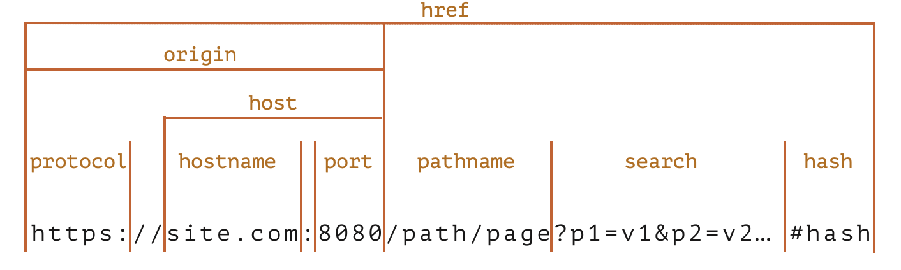

[toc]

#### Fetch

`AJAX` (Asynchronous JavaScript And XML) is the conventional umbrella terms used for network requests made from JavaScript (even now when the serialization format is usually not XML).

`fetch` is the common function to make API calls.

##### Starting a request

```
let promise = fetch(url, [options])
```

Request method, headers, etc. are specified in `options`. The browser starts the request right away and returns a promise.

`fetch` response is usually handled in one of these two ways.

```
let response = await fetch(url, options); // resolves with response headers
let result = await response.json(); // read body as json
```

```
fetch(url, options)
  .then(response => response.json())
  .then(result => /* process result */)
```

##### Common properties/functions.

`response.status` – HTTP code of the response,
`response.ok` – true if the status is 200-299.
`response.headers` – Map-like object with HTTP headers

`response.text()` – Returns the response as text,
`response.json()` – Parses the response as JSON object,

`response.formData()` – Returns the response as `FormData` object ([this thing?](https://developer.mozilla.org/en-US/docs/Web/API/FormData)) (multipart/form-data encoding) 
`response.blob() ` – Returns the response as `Blob` (binary data with type),
`response.arrayBuffer()` – Returns the response as `ArrayBuffer` (low-level binary data).

##### Full list of fetch options

```
let promise = fetch(url, {
  method: "GET", // POST, PUT, DELETE, etc.
  headers: {
    // the content type header value is usually auto-set
    // depending on the request body
    "Content-Type": "text/plain;charset=UTF-8"
  },
  body: undefined, // string, FormData, Blob, BufferSource, or URLSearchParams
  referrer: "about:client", // or "" to send no Referer header,
  // or an url from the current origin
  referrerPolicy: "strict-origin-when-cross-origin", // no-referrer-when-downgrade, no-referrer, origin, same-origin...
  mode: "cors", // same-origin, no-cors
  credentials: "same-origin", // omit, include
  cache: "default", // no-store, reload, no-cache, force-cache, or only-if-cached
  redirect: "follow", // manual, error
  integrity: "", // a hash, like "sha256-abcdef1234567890"
  keepalive: false, // true
  signal: undefined, // AbortController to abort request
  window: window // null
});
```

##### Misc.

The `FormData` interface provides a way to construct a set of key/value pairs representing form fields and their value.

Binary data is represented using `Blob` or `BufferSource` objects.

`Blob` object's `Content-Type` type request header (when used in outgoing requests) is specified in the `toBlob()` function. It is usually something like `image/png`.

[Mozilla reference](https://developer.mozilla.org/en-US/docs/Web/API/Fetch_API/Using_Fetch)<br>[JavaScript.info link -Basics](https://javascript.info/fetch)<br>[JavaScript.info link - More API](https://javascript.info/fetch-api)<br>

#### URL objects

[URL](https://url.spec.whatwg.org/#api) class provides a convenient interface for creating and parsing URLs. 

```
let url1 = new URL('https://javascript.info/profile/admin');
let url2 = new URL('/profile/admin', 'https://javascript.info');

alert(url1); // https://javascript.info/profile/admin
alert(url2); // https://javascript.info/profile/admin
```



`url.searchParams` allows to create a URL with query parameters.

`append(name, value)` – add the parameter by name,
`delete(name)` – remove the parameter by name,
`get(name)` – get the parameter by name,
`getAll(name)` – get all parameters with the same name (that’s possible, e.g. ?user=John&user=Pete),
`has(name)` – check for the existence of the parameter by name,
`set(name, value)` – set/replace the parameter,
`sort()` – sort parameters by name, rarely needed,

`URL` does URL encoding automatically.

> If raw strings are used instead of `URL`, encoding has to be done manually and there are functions for it ([link](https://javascript.info/url#encoding-strings)).