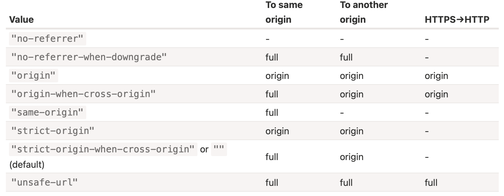

[toc]

#### referrer, referrerPolicy

These options decide how the HTTP `Referer` header is set. Usually that header is set automatically and contains the url of the page that made the request.

##### referrer

`referrer` option allows to set any Referer (within the current origin).

```
fetch('/page', {
  // we can set any Referer header, but only within the current origin
  referrer: "https://javascript.info/anotherpage"
});
```

##### referrerPolicy

Requests are generally classified as one of these 3 types -

1. Request to the same origin
2. Request to another origin
3. Request from HTTPS to HTTP (from safe to unsafe protocol)

Unlike the referrer option that allows to set the exact Referer value, `referrerPolicy` tells the browser general rules for each request type (complete [spec](https://w3c.github.io/webappsec-referrer-policy/)).



The idea is that don't use the full url in Referrer header, if the URL structure shouldn't be known outside the site.

#### mode

`mode` option is a safe-guard that prevents occasional (i.e. accidentally from code?) cross-origin requests.

`cors` – The default, cross-origin requests are allowed.
`same-origin` – Cross-origin requests are forbidden.
`no-cors` – Only safe cross-origin requests are allowed.

#### cache

By default, fetch requests make use of standard HTTP-caching. That is, it respects the `Expires` and `Cache-Control` headers, sends `If-Modified-Since` and so on. 

`cache` options allows to ignore HTTP-cache or fine-tune its usage.

"default" – fetch uses standard HTTP-cache rules and headers,
"no-store" – totally ignore HTTP-cache, this mode becomes the default if we set a header If-Modified-Since, If-None-Match, If-Unmodified-Since, If-Match, or If-Range,
"reload" – don’t take the result from HTTP-cache (if any), but populate the cache with the response (if the response headers permit this action),
"no-cache" – create a conditional request if there is a cached response, and a normal request otherwise. Populate HTTP-cache with the response,
"force-cache" – use a response from HTTP-cache, even if it’s stale. If there’s no response in HTTP-cache, make a regular HTTP-request, behave normally,
"only-if-cached" – use a response from HTTP-cache, even if it’s stale. If there’s no response in HTTP-cache, then error. Only works when mode is "same-origin".

([JavaScript.info link](https://javascript.info/fetch-api#cache))

#### redirect

`redirect` option allows to change the behavior for HTTP-redirects, like 301, 302 etc.

"follow" – the default, follow HTTP-redirects,
"error" – error in case of HTTP-redirect,
"manual" – allows to process HTTP-redirects manually. In case of redirect, we’ll get a special response object, with response.type="opaqueredirect" and zeroed/empty status and most other properies.

#### integrity

`integrity` allows to check if the response matches the known-ahead checksum.

For example, we’re downloading a file, and we know that its SHA-256 checksum is “abcdef” (a real checksum is longer, of course).

We can put it in the integrity option, like this:

```
fetch('http://site.com/file', {
  integrity: 'sha256-abcdef'
});
```

([JavaScript.info link](https://javascript.info/fetch-api#integrity))

#### keepalive

`keepalive` option indicates that the request may outlive the webpage that initiated it. Normally, when a document is unloaded, all associated network requests are stopped. But the `keepalive` option tells the browser to perform the request in the background, even after it leaves the page. Its useful for sending analytics related data, etc.

The body limit for keepalive requests is 64KB.

The server usually sends an empty response to such requests.

([JavaScript.info link](https://javascript.info/fetch-api#keepalive))
