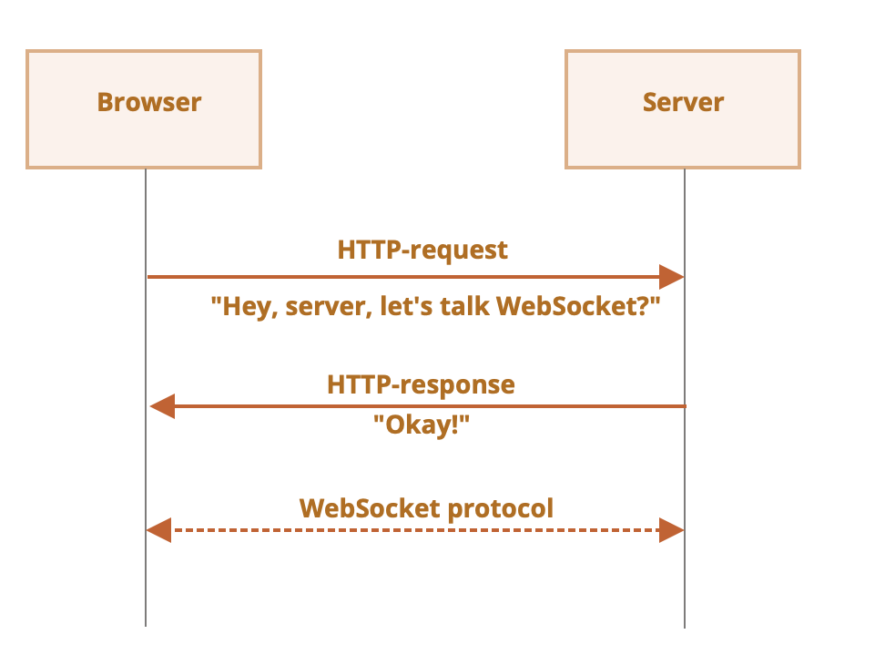

[toc]

##### What is it

The `WebSocket` protocol ([spec](https://datatracker.ietf.org/doc/html/rfc6455)) provides a way to exchange data between browser and server via a persistent connection. The data can be passed in both directions as 'packets', without breaking the connection and the need of additional HTTP-requests. It is useful for services that require continuous data exchange, e.g. online games, real-time trading systems, etc.

##### Basics

Open a new websocket connection. The URL has a special protocol `ws` (there is also a `wss://` protocol which is like HTTPS for websockets).

```
let socket = new WebSocket("ws://javascript.info");
```

Once the connection is created, 4 different events need to be listened to - `open`, `message` (data received), `error`, `close`. If some data has to be sent it is done using `socket.send(data)`.

##### Sample code

```
let socket = new WebSocket("wss://javascript.info/article/websocket/demo/hello");

socket.onopen = function(e) {
  alert("[open] Connection established");
  alert("Sending to server");
  socket.send("My name is John");
};

socket.onmessage = function(event) {
  alert(`[message] Data received from server: ${event.data}`);
};

socket.onclose = function(event) {
  if (event.wasClean) {
    alert(`[close] Connection closed cleanly, code=${event.code} reason=${event.reason}`);
  } else {
    // e.g. server process killed or network down
    // event.code is usually 1006 in this case
    alert('[close] Connection died');
  }
};

socket.onerror = function(error) {
  alert(`[error]`);
};
```

##### Opening a websocket



Sample request headers when new connection request is made.

```
GET /chat
Host: javascript.info
Origin: https://javascript.info
Connection: Upgrade
Upgrade: websocket
Sec-WebSocket-Key: Iv8io/9s+lYFgZWcXczP8Q==
Sec-WebSocket-Version: 13
```

`Connection: Upgrade` indicates that the client would like to change the protocol.<br>`Sec-WebSocket-Key` is a random browser-generated key, used to ensure that the server supports WebSocket protocol. It’s random to prevent proxies from caching any following communication.

> `XMLHttpRequest` or `fetch` can't be used to make this kind of HTTP-request, because JavaScript is not allowed to set these headers.

If the server agrees to switch to WebSocket, it respinds with a status code 101.

```
101 Switching Protocols
Upgrade: websocket
Connection: Upgrade
Sec-WebSocket-Accept: hsBlbuDTkk24srzEOTBUlZAlC2g=
```

Here `Sec-WebSocket-Accept` is `Sec-WebSocket-Key`, recoded using a special algorithm. Upon seeing it, the browser understands that the server really does support the WebSocket protocol.

>  There may be additional headers `Sec-WebSocket-Extensions` and `Sec-WebSocket-Protocol` that describe extensions and subprotocols. ([JavaScript.info link](https://javascript.info/websocket#extensions-and-subprotocols))

##### Data transfer

WebSocket communication consists of `frames` – data fragments, that can be sent from either side, and can be of several kinds.

`text frames` – Contains text data that parties send to each other.
`binary data frames` – Contains binary data that parties send to each other.
`ping/pong frames` - Used to check the connection, sent from the server, the browser responds to these automatically.
There’s also `connection close frame` and a few other service frames.

Browsers only work with text or binary frames.

A call to `socket.send(body)` allows body to be sent in string or a binary format, including Blob, ArrayBuffer, etc. When data is received, text comes as string and binary data can be interpreted as Blob or ArrayBuffer formats.

##### Rate limiting

The `socket.bufferedAmount` property stores how many bytes remain buffered at this moment, waiting to be sent over the network. It can be examined to see whether the socket is actually available for transmission.

```
setInterval(() => {
  if (socket.bufferedAmount == 0) {
    socket.send(moreData());
  }
}, 100);
```

##### Connection close

When a party wants to close the connection (both browser and server have equal rights), they send a “connection close frame” with a numeric code and a textual reason.

```
// closing party:
socket.close(1000, "Work complete");

// the other party
socket.onclose = event => {
  // event.code === 1000
  // event.reason === "Work complete"
  // event.wasClean === true (clean close)
};
```

WebSocket codes are somewhat like HTTP codes, but different. In particular, codes lower than 1000 are reserved, there’ll be an error if we try to set such a code.

##### Connection state

To get connection state, there is `socket.readyState` property with following values -

0 – “CONNECTING”: the connection has not yet been established,
1 – “OPEN”: communicating,
2 – “CLOSING”: the connection is closing,
3 – “CLOSED”: the connection is closed.

##### Misc.

[JavaScript.info link](https://javascript.info/websocket)