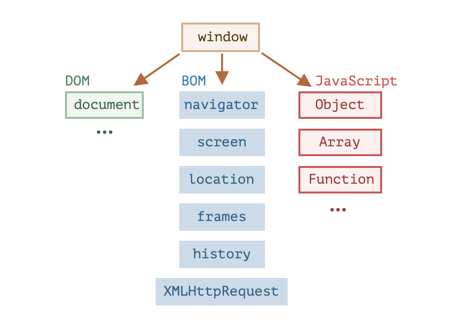

[toc]

##### Host Environment

JavaScript can be run by many different environments. While web browser is most common, it can be run by web servers as well as more things. These are known as `host environment`. Every host environment provides its own objects and functions in addition to the core language.

##### Browser environment API basics



`window` is a global object for JavaScript code and it represents the browser window.

##### DOM (Document Object Model), CSSOM (CSS Object Model), BOM (Browser Object Model)

`Document Object Model (DOM)` represents all page content as objects that can be modified.

```
document.body.style.background = "red";
```

[DOM Living Standard (link)](https://dom.spec.whatwg.org) has the entire reference of things that can be modified using DOM.

DOM is of course used by non-browser platforms too. For example, server side scripts that download or generate HTML content can use DOM to modify the contents.

` CSS Object Model (CSSOM)` ([link](https://javascript.info/browser-environment)) is another specification that is used for for CSS rules and stylesheets, it explains how they are represented as objects, and how to read and write them.

> In practice though, the CSSOM is rarely required. Its rarely needed to modify CSS rules from JavaScript (usually we just add/remove CSS classes, not modify their CSS rules).

` Browser Object Model (BOM)` is something that represents additional objects provided by the browser (host environment) for working with everything except the document (i.e. the webpage). For example, the [navigator](https://developer.mozilla.org/en-US/docs/Web/API/Window/navigator) object provides background information about the browser and the operating system. `navigator.userAgent` for instance tells the current browser. The [location](https://developer.mozilla.org/en-US/docs/Web/API/Window/location) object gives the current URL and can redirect the browser to a new one. 

> BOM specifications are in fact a part of the [HTML specs](https://html.spec.whatwg.org/) itself.
