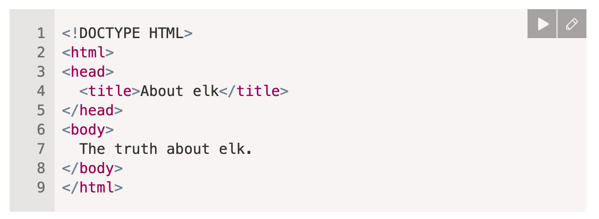
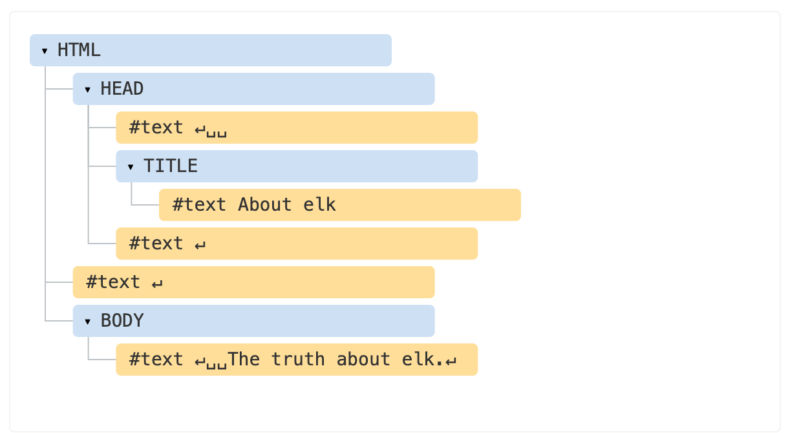
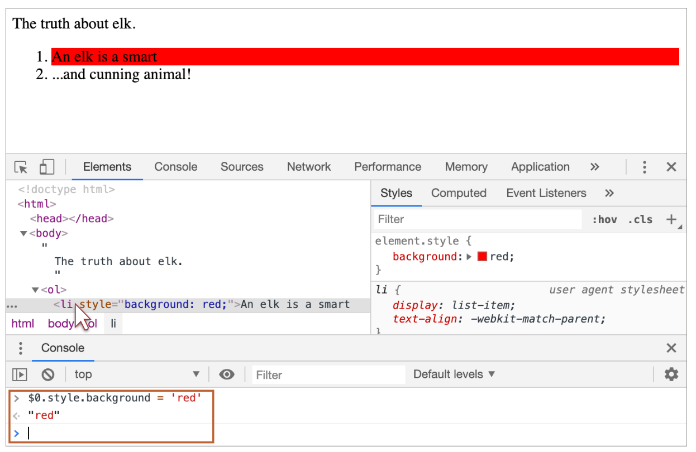

[toc]

#### DOM Basics

In DOM every HTML tag is an object. The text inside a tag is an object as well.

Tags are called `element nodes`. The text (if any) inside a tag are `text nodes`, a text node contains only a string. It may not have children and is always a leaf of the tree.

##### Sample HTML, DOM

| Sample HTML                                                  | Its DOM                                                      |
| ------------------------------------------------------------ | ------------------------------------------------------------ |
|  |  |

##### Spaces and Newlines are represented too

 Everything in the HTML gets represented in the DOM, even whitespaces and newlines between tags. In the example above the `<head>` tag contains some spaces before `<title>`, and that text becomes a `#text` node (it contains a newline and some spaces only). However, spaces and newlines before `<head>` are ignored for historical reasons.

Also, if something is put after `</body>`, then that is automatically moved inside the body, at the end, as the HTML spec requires that all content must be inside `<body>`. So there can’t be any spaces after `</body>`.

> Browser tools however usually do not show spaces at the start/end of the text and empty text nodes (line-breaks) between tags.

##### Autocorrection

If the browser encounters malformed HTML, it automatically corrects it when making the DOM. For instance, the top tag is always `<html>`. Even if it doesn’t exist in the document, it will exist in the DOM, because the browser will create it.

> An interesting special case is tables. By DOM specification alone they must have `<tbody>` tag, but HTML text may omit it (as HTML specs don't require it). Then the browser creates `<tbody>` in the DOM automatically.

##### Different kinds of nodes

Element nodes reprsent HTML tags. <br>Text nodes represent the plain text (if any) between the tags. <br>Comment nodes represent the HTML comments (if any) (i.e. `<!-- comment -->` format) between two nodes.<br>

Even the `<!DOCTYPE...>` directive at the very beginning of HTML is also a DOM node. Its not ever needed for anything though.

Overeall, there are [12 node types](https://dom.spec.whatwg.org/#node) but just the above ones are typically needed to be worked with.

##### Viewing DOMs

There is a [Live DOM Viewer](https://software.hixie.ch/utilities/js/live-dom-viewer/) that can be used to view DOM structure in real time. 

All browsers too provide a DOM viewer in their developer tools. Note however that the DOM structure in developer tools is simplified. Text nodes are shown just as text. And there are no “blank” (space only) text nodes at all. 

##### Misc.

>  Try the things listed at https://javascript.info/dom-nodes#interaction-with-console, they seem to be Chrome specific on how to use the debug console to change DOM on the fly and test.<br><br>

#### Walking the DOM

`<html` - `document.documentElement`<br>`<body>` - `document.body`<br>`<head>` - `document.head`<br>

> A script can't acccess an element that does not exist. The head tag loads before the body tag loads, so any script placed inside the head tag can't access the body tag. Or if there is a script somweher in body tag, it can only access tags declared above it as the rest of the page has not loaded yet.

`childNodes` - Collection list of all child nodes (i.e. only one level deep). Note that it is not an array, but a collection and hence while `for .. in` will work the usual array methods will not.<br>`firstNode`, `lastNode` - Shorthands for children nodes.<br>`parentNode`- Shorthands for children nodes.<br>

> DOM collections are read-only. Also, they should not be iterated using `for .. in` as that will return some undocumented elements that should not be accessed.

`previousSubling`, `nextSibling` - Shorthands for sibling nodes.<br>

Its also possible to do `element-only navigation`, i.e. navigation that does not access any text or comment nodes even if they exist. This can be done using properties such as `children`, `firstElementChild`, `lastElementChild`, `previousElementSinbling`, `nextElementSibling`, `parentElement`.

> `parentElement` and `parentNode` are usually the same: they both get the parent but with the one exception of `document.documentElement`. `parentNode` gives the document tag for it but `parentElement` gives a null as `<document>` is not considered an element node. This trick is commonly used to travel up from an arbitrary element `elem` to `<html>`, but not to the `document`.

##### Accessing table elements

`table.rows` – the collection of <tr> elements of the table.<br>
`table.caption/tHead/tFoot` – references to elements <caption>, <thead>, <tfoot>.<br>
`table.tBodies` – the collection of <tbody> elements.<br>`tbody.rows` – the collection of `<tr>` inside. `<thead>, <tfoot>, <tbody>` elements provide the rows property.<br>

`tr.cells` – the collection of <td> and <th> cells inside the given <tr>.
`tr.sectionRowIndex` – the position (index) of the given <tr> inside the enclosing <thead>/<tbody>/<tfoot>.
`tr.rowIndex` – the number of the <tr> in the table as a whole (including all table rows).
`td.cellIndex` – the number of the cell inside the enclosing <tr>.

#### Querying for elements

> CSS-selector is like a fully qualified HTML identifier for any element(s). For example `ul > li:last-child`.

###### getElementById

`document.getElementById(id)` - Locate the element if its `id` value is known. If there are multiple elements with the same id, then the behavior of methods that use it is unpredictable.

```
<div id="elem-content">Element</div>
.... 
let elem = document.getElementById('elem');
```

There are in fact also global variables having the same name as that of the id value for accessimg the corresponding elements. This is however not an encouraged way to access elements.

```
<div id="elem">
....
elem.style.background = 'red';
```

###### querySelectorAll

Returns all elements inside elem matching the given CSS selector. Very powerful.

```
<ul>
  <li>The</li>
  <li>test</li>
</ul>
<ul>
  <li>has</li>
  <li>passed</li>
</ul>
....
<script>
  let elements = document.querySelectorAll('ul > li:last-child');
  for (let elem of elements) {
    alert(elem.innerHTML); // "test", "passed"
  }  
```

###### querySelector

Returns the first element for the given CSS selector. Same as `elem.querySelectorAll(css)[0]`, but the latter is looking for all elements and picking one, while `elem.querySelector` just looks for one. So it’s faster 

###### matches

`elem.matches(css)` does not look for anything, it merely checks if elem matches the given CSS-selector. 

###### closest

The method `elem.closest(css)` looks for the nearest ancestor that matches the CSS-selector.

```
<div class="contents">
  <ul class="book">
    <li class="chapter">Chapter 1</li>
  ...
let chapter = document.querySelector('.chapter'); // LI
alert(chapter.closest('.book')); // UL
```

###### getElementsBy*

`elem.getElementsByTagName(tag)`, `elem.getElementsByClassName(className)`, `document.getElementsByName(name)`. These were used a lot previously, but `querySelector` is more powerful and is used the most now.

###### Live collections

All methods getElementsBy*` return a live collection. Such collections always reflect the current state of the document and “auto-update” when it changes.

##### Accessing HTML attributes

HTML can have attributes.

```
<body something="non-standard">
```

DOM methods to work with attributes are.

`elem.hasAttribute(name)` – to check for existence.
`elem.getAttribute(name)` – to get the value.
`elem.setAttribute(name, value)` – to set the value.
`elem.removeAttribute(name)` – to remove the attribute.
`elem.attributes` is a collection of all attributes.

They could also be accessed using non-standard DOM properties but that should be avoided.

([link](https://javascript.info/dom-attributes-and-properties))

##### Modifying Styles and Classes

There are generally two ways to style an HTML element - 

1. Create a class in CSS and add it: `<div class="...">`
2. Write properties directly into `style`: `<div style="...">`

JavaScript can modify both classes and style properties, but modifying classes are preferred.

###### Modifying classes

To manage classes, there are two DOM properties:

`className` – the string value, good to manage the whole set of classes.
`classList` – the object with methods add/remove/toggle/contains, good for individual classes.

###### Modifying styles

To change the styles:

The `style` property is an object with camelCased styles. Reading and writing to it has the same meaning as modifying individual properties in the "style" attribute. To see how to apply important and other rare stuff – there’s a list of methods at MDN.

The `style.cssText` property corresponds to the whole "style" attribute, the full string of styles.

To read the resolved styles (with respect to all classes, after all CSS is applied and final values are calculated):

The `getComputedStyle(elem, [pseudo])` returns the style-like object with them. Read-only.

([link](https://javascript.info/styles-and-classes#summary))
