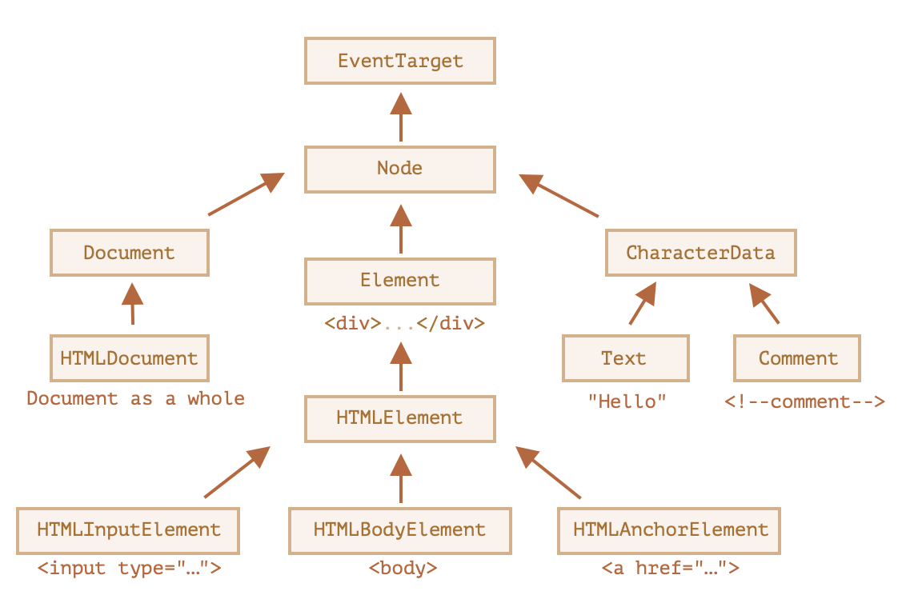

[toc]

##### Basic node classes

([JavaScript.info documentation](https://javascript.info/basic-dom-node-properties#dom-node-classes)) 

Each DOM node belongs to the corresponding built-in class.

The root of the hierarchy is `EventTarget`, that is inherited by `Node`, and other DOM nodes inherit from it.



`Node` – Also an “abstract” class, serving as a base for DOM nodes. It provides the core tree functionality: parentNode, nextSibling, childNodes and so on (they are getters). Objects of Node class are never created. But there are other classes that inherit from it (and so inherit the Node functionality).

`Document`, for historical reasons often inherited by HTMLDocument (though the latest spec doesn’t dictate it) – is a document as a whole.

The document global object belongs exactly to this class. It serves as an entry point to the DOM.

`CharacterData` – an “abstract” class, inherited by:

`Text` – the class corresponding to a text inside elements, e.g. Hello in <p>Hello</p>.
`Comment` – the class for comments. They are not shown, but each comment becomes a member of DOM.
`Element` – is the base class for DOM elements.

It provides element-level navigation like nextElementSibling, children and searching methods like getElementsByTagName, querySelector.

A browser supports not only HTML, but also XML and SVG. So the `Element` class serves as a base for more specific classes: `SVGElement`, `XMLElement` (we don’t need them here) and HTMLElement.

Finally, HTMLElement is the basic class for all HTML elements. We’ll work with it most of the time.

It is inherited by concrete HTML elements -

`HTMLInputElement` – the class for `<input>` elements,
`HTMLBodyElement` – the class for `<body>` elements,
`HTMLAnchorElement` – the class for `<a>` elements.

##### Basic node properties

###### nodeType

`nodeType` property provides an 'old-fashioned' way to get the 'type' of a DOM node. elem.nodeType == 1 for element nodes,
elem.nodeType == 3 for text nodes, elem.nodeType == 9 for the document object.

###### nodeName, tagName

Given a DOM node, we can also read its tag name from nodeName or tagName properties.

```
alert( document.body.nodeName ); // BODY
alert( document.body.tagName ); // BODY
```

###### innerHTML, outerHTML, textContent

The `innerHTML` property ([link](https://w3c.github.io/DOM-Parsing/#the-innerhtml-mixin)) allows to get the HTML inside the element as a string.

> Beware though, `innerHTML+=` does a full overwrite ([link](https://javascript.info/basic-dom-node-properties#beware-innerhtml-does-a-full-overwrite)).

The `outerHTML` property contains the full HTML of the element.

The `textContent` provides access to the text inside the element: only text, minus all <tags>.

###### hidden

The `hidden` attribute and the DOM property specifies whether the element is visible or not.

```
elem.hidden = true;
```

##### Methods to modify the document

There are several methods to modify the document.

Methods to create new nodes - `document.createElement(tag)`, `document.createTextNode(value)`, etc.

Insertion and removal - `node.append(...nodes or strings)`, `node.remove()`, etc.

Given some HTML in html, elem.insertAdjacentHTML(where, html) inserts it depending on the value of where `beforebegin`, `afterBegin`, etc.

To append HTML to the page before it has finished loading - `document.write(html)`

([link](https://javascript.info/modifying-document#summary))


