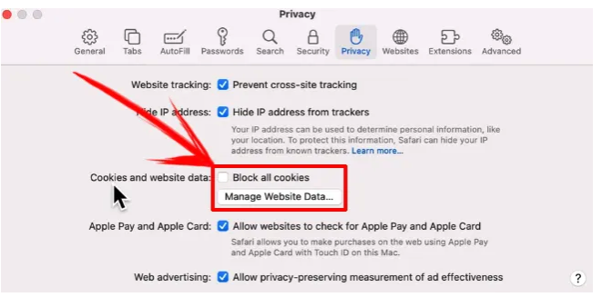

[toc]

#### What are Cookies

Usually set by the server using `Set-Cookie` response header, usually has a session identifier. Subsequent outgoing requests have the previously received cookie sent in `Cookie` request header, this way the server knows who is making the request. 

Can be accessed using `document.cookie` property. A write operation to it updates only cookies mentioned in it. To keep the valid formatting, they should be escaped using a built-in `encodeURIComponent` function.

```
let surname = "Anand Kumar Singh"
document.cookie = "user=" + encodeURIComponent(surname);
```

Any given cookie should not exceed 4KB, and the number of cookies for a given domain is limited to around 20.

There are several 'attributes' that can be set for any cookie when they are set. They are listed after the `key=value`.

```
document.cookie = "user=John; path=/; expires=Tue, 19 Jan 2038 03:14:07 GMT"
```

##### Convenience functions

There are some conveninece functions that can be written for common activities such as getting/setting cookies, attributes, etc. (JavaScript.info [link](https://javascript.info/cookie#appendix-cookie-functions))

#### Some common cookie attributes

> Note that an attribute need not necessarily be a key-value pair.

##### expires, max-age

If a cookie doesn’t have one of these options, it disappears when the browser is closed and are called `Session cookies`.

```
expires=Tue, 19 Jan 2038 03:14:07 GMT  # date must be in this format. date.toUTCString() can do that
max-age=3600   # in seconds
```

If `max-age` set to zero or a negative value, the cookie is deleted.

##### secure

The cookie should be transferred only over HTTPS.

By default, if a cookie is set at http URL for a given site, it also appears at the https URL of that site (and vice-versa). Cookies are domain-based, and do not distinguish between the protocols. This attribute lets it be for https only.

```
document.cookie = "user=Anand; secure";
```

##### samesite

Another security attribute. Designed to protect from XSRF (cross-site request forgery) attacks.

`XSRF` is basically the situation where user has some cookies set for siteA, is later on siteB but the code in siteB tries to access the server for siteA. In such a case by default, the siteA's locally stores cookies get sent in the request even when the user started the task from siteB. This can be exploited by hackers. 

This can be avoided to some extent using the cookie option `samesite`. If `samesite=strict` is set then siteB just cannot have the siteA's cookie sent. If `samesite=lax` is set then siteB can have siteA's cookie sent only if its trying to access siteA using a GET and if its a top-level option (such as user entering a URL in the browser) and not from a form-submission, etc.

Note however that browsers older than 2017 don't support `samesite` and hence all sensitive sites till date continue to have their own server level token implementation (XSRF tokens) to prevent XSRF.

(Javascript.info [link](https://javascript.info/cookie#samesite))

##### httponly

Web-server uses the Set-Cookie header to set a cookie. Also, it may set the `httpOnly` option. This option forbids any JavaScript access to the cookie. We can’t see such a cookie or manipulate it using document.cookie.

> But what if the network is intercepted and the header manipulated to remove this attribute. Well, may be this goes with the premise that intercepting and manipulating traffic is not all that simple to do at scale.

#### Third-party cookies

A cookie is called `third-party` if it’s placed by a domain other than the one belonging to the page the user is visiting. They are traditionally used for tracking and ads services (i.e. when a page from one site has a an ad presented by JS from another site), due to their nature.

Third-party cookies can be blocked by certain browsers. Safari does not allow them at all (this however can be enabled using Safari Settings, the 'all cookies' here basically means 'all third-party cookies').

Firefox blocks third-party cookies for certain pre-identified third-party domains.




#### GDPR

GDPR is a legislation in Europe that enforces a set of rules for websites to respect the users’ privacy. One of these rules is to require an explicit permission for tracking cookies from the user. However that’s only about tracking/identifying/authorizing cookies. So if a cookie just saves some information, but neither tracks nor identifies the user, then its fine.

Websites generally have two variants of following GDPR. If a website wants to set tracking cookies only for authenticated users, its usually included in its Terms and Conditions that the user has to agree to. If however a website wants to set tracking cookies for everyone, the permission for that sought is more prominently for in a modal splash screen from all users.